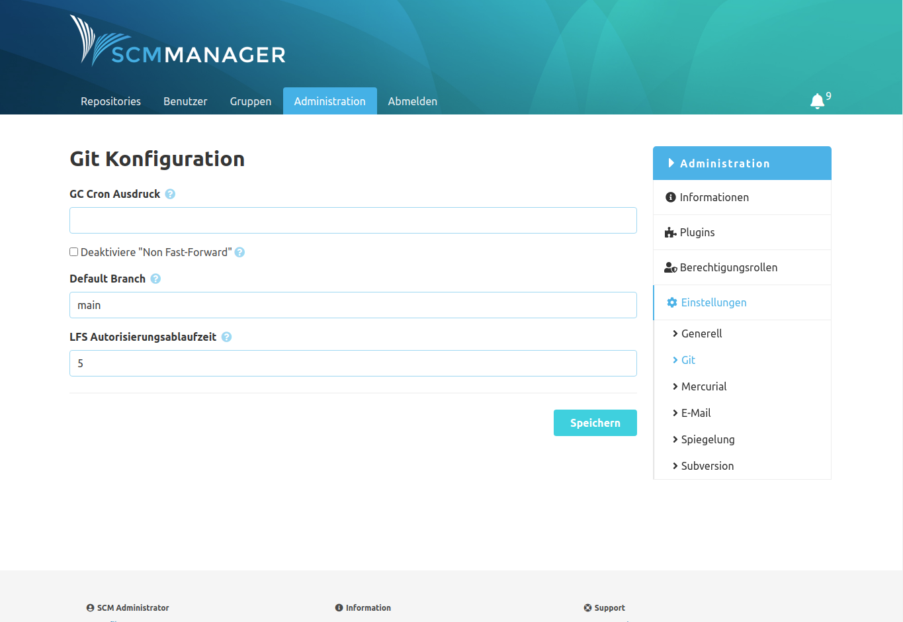

Unter dem Eintrag Git können die folgenden Git-spezifischen Einstellungen vorgenommen werden:

- GC Cron Ausdruck

    Wenn hier ein Wert gesetzt wird, führt der SCM-Manager zu den
    [entsprechenden Zeiten](https://de.wikipedia.org/wiki/Cron)
    eine "Git Garbage Collection" aus.

- Deaktiviere "Non Fast-Forward"

    Wenn dieses aktiviert ist, werden "forcierte" Pushs abgelehnt, wenn diese keine "fast forwards" sind.

- Default Branch

    Der hier gesetzte Branch Name wird bei der Initialisierung von neuen Repositories genutzt.
    Bitte beachten Sie, dass dieser Name aufgrund von Git-Spezifika nicht bei leeren Repositories genutzt
    werden kann (hier wird immer der Git-interne Default Name genutzt, derzeit also `master`).

- LFS Autorisierungsablaufzeit

    Ablaufzeit für den Autorisierungstoken in Minuten, der für LFS Speicheranfragen ausgestellt wird.
    Wenn der SCM-Manager hinter einem Reverse-Proxy mit Zwischenspeicherung (z. B. Nginx) betrieben wird,
    sollte dieser Wert auf die Zeit gesetzt werden, die ein LFS-Upload maximal benötigen kann. Treten
    während eines länger laufenden LFS "Pushs" Autorisierungsfehler auf, sollte dieser Wert erhöht werden.
    Der Default-Wert beträgt 5 Minuten.

