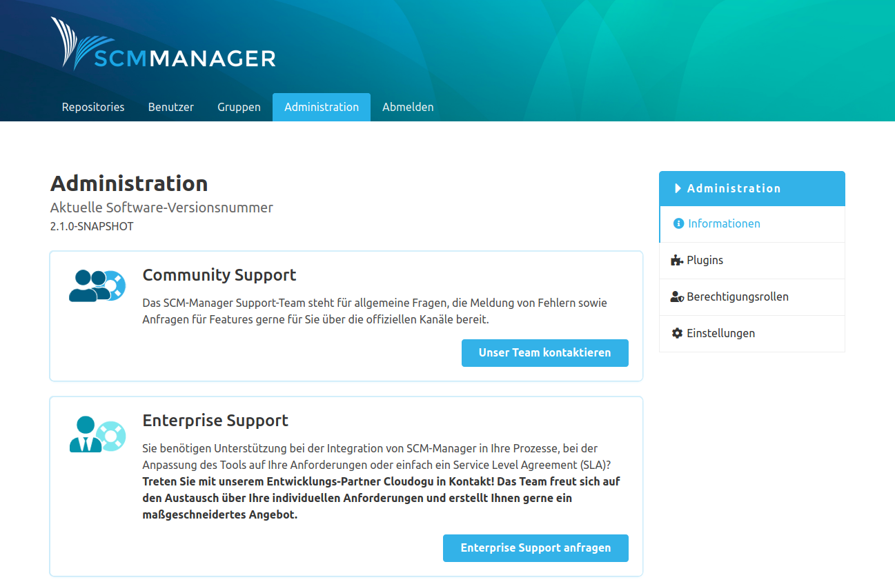

<!--- AppendLinkContentStart -->
Im Bereich Administration kann die SCM-Manager Instanz administriert werden. Von hier können Plugins verwaltet, Berechtigungsrollen festgelegt und angepasst, sowie Einstellungen vorgenommen werden.

* [Plugins](plugins/)
* [Berechtigungsrollen](roles/)
* [Einstellungen](settings/)
<!--- AppendLinkContentEnd -->

### Information
Auf der Informationsseite in der Administration findet man die aktuelle Version der SCM-Manager Instanz und hilfreiche Links zur Kontaktaufnahme mit dem SCM-Manager Support-Team. Falls eine neuere Version des SCM-Managers verfügbar ist, wird der Link zum Download-Bereich der offiziellen Webseite angezeigt. 

