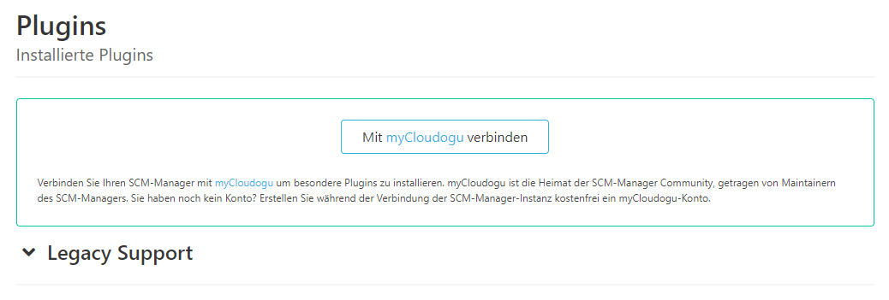
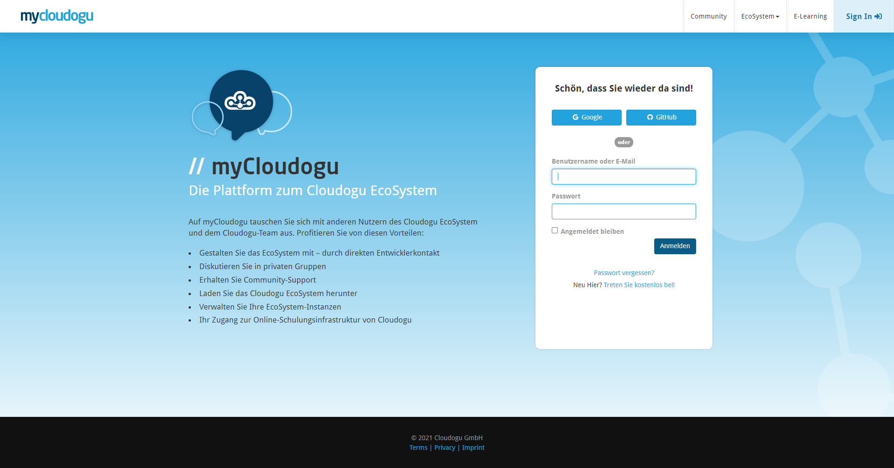
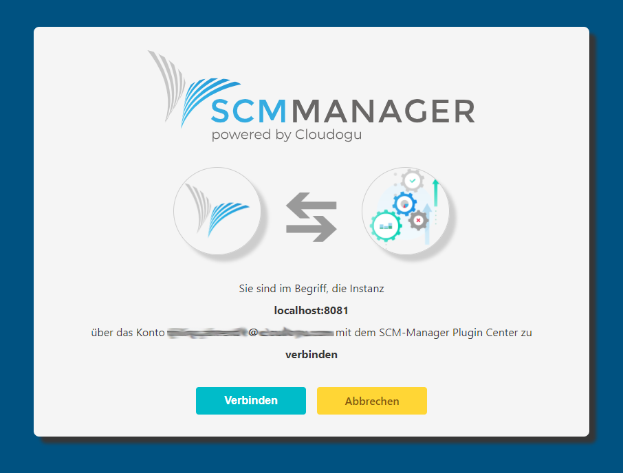
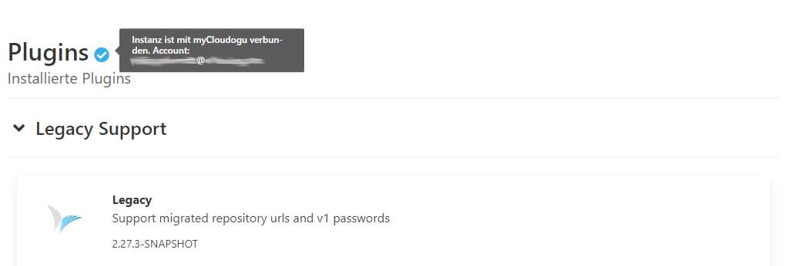
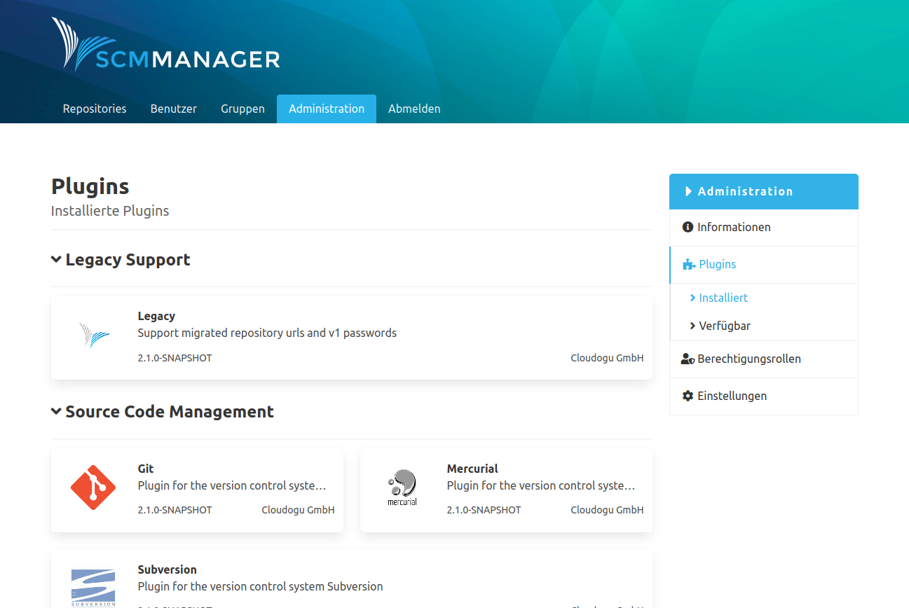
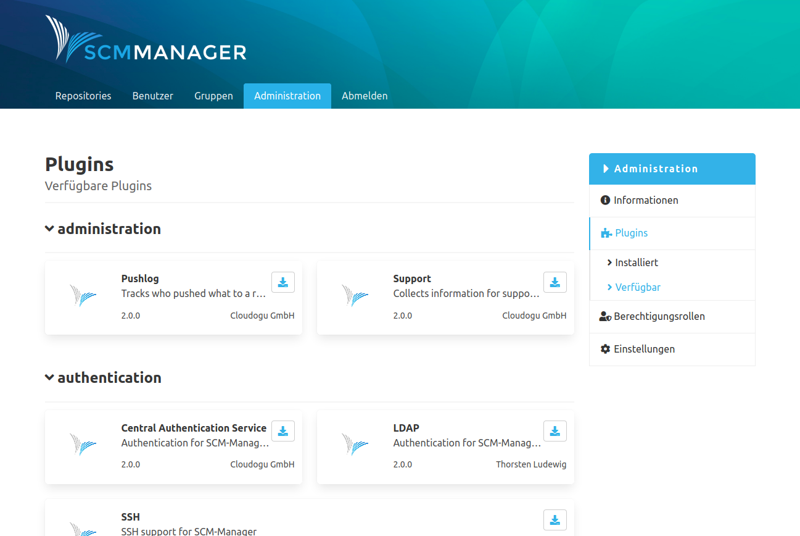

Unter dem Eintrag "Plugins" werden mithilfe des externen Plugin-Centers Plugins für den SCM Manager verwaltet. Die Plugins werden nach installierten und verfügbaren Plugins unterschieden und nach Funktionsschwerpunkt wie bspw. Workflow oder Authentifizierung gruppiert.

Die Plugins können über Aktions-Icons auf den Kacheln verwaltet werden. Systemrelevante Plugins, die der SCM-Manager selbst liefert, können weder deinstalliert noch aktualisiert werden.

Damit Änderungen der Plugins wirksam werden, muss der SCM-Manager-Server neu gestartet werden. Das kann nach jeder einzelnen Aktion erfolgen. Es ist aber auch möglich viele unterschiedliche Aktionen wie Installieren, Aktualisieren und Löschen in eine Warteschlange einzureihen und alle Aktionen mit einem einzigen Neustart auszuführen. Wird eine Aktion (Installieren, Deinstallieren, Aktualisieren) für ein Plugin ausgewählt, erscheinen die Schaltflächen „Änderungen ausführen“ und „Änderungen abbrechen“. Über „Änderungen ausführen“ öffnet sich ein Pop-Up Fenster, in dem die aktuelle Warteschlange (alle ausgeführten Aktionen ohne Neustart) angezeigt werden. Der Anwender hat nun die Möglichkeit zu entscheiden, ob die Änderungen durch einen Neustart ausgeführt werden sollen. Falls Aktionen, die sich bereits in der Warteschlange befinden nicht mehr erwünscht sind, kann die gesamte Warteschlange über den Button „Änderungen abbrechen“ verworfen werden.

### myCloudogu-Plugins
Einige besondere Plugins sind nur für Instanzen des SCM-Managers verfügbar, die mit myCloudogu verbunden sind. Der SCM-Manager kann über den Button „Mit myCloudogu verbinden“ mit myCloudogu verbunden werden.
[Mehr Details zur Datenverarbeitung.](https://scm-manager.org/data-processing)

Sie werden dann zur myCloudogu-Login-Maske weitergeleitet. 

Wenn Sie über ein myCloudogu-Konto verfügen, können Sie sich einloggen. Ansonsten erstellen Sie über einen konföderierten Identitätsanbieter (Google oder github) oder Ihre Email-Adresse ein Konto.
Anschließend werden Sie zurück zum SCM-Manager geleitet und können Details zur verbundenen Instanz und Konto überprüfen. Mit „Verbinden“ bestätigen Sie die Verbindung, mit „Abbrechen“ brechen Sie den Vorgang ab.

Jetzt können Sie im Plugin-Center myCloudogu-Plugins genau wie Basis-Plugins installieren.

Eine Instanz des SCM-Managers muss nur mit einem Konto verbunden werden, damit die myCloudogu-Plugins für die gesamte Instanz zur Verfügung stehen.
Sie können die Verbindung zu myCloudogu jederzeit unter Plugin Center Einstellungen in den Settings lösen.

#### Was ist myCloudogu und warum sollte ich ein Konto erstellen?
myCloudogu ist nicht nur die Heimat der SCM-Manager-Community. Sie können sich auch mit anderen Nutzenden austauschen, Bugs melden oder neue Funktionen im Forum zur Diskussion stellen.
myCloudogu bietet weiter besondere Plugins speziell für die Community an. In der Zukunft folgen weitere nützliche Plugins, die auch gemeinsam mit Partnern bereitgestellt werden.
Nutzen Sie erweiterte Plugin-Funktionen im SCM-Managers, treten Sie mit den Entwicklern in Kontakt und schließen Sie sich [myCloudogu](https://my.cloudogu.com) kostenfrei an!

### Installiert
Auf der Übersicht für installierte Plugins werden alle auf der SCM-Manager Instanz installierten Plugins angezeigt. Optionale Plugins können hier aktualisiert und deinstalliert werden. 

### Verfügbar
Auf der Übersicht der verfügbaren Plugins werden alle kompatiblen Plugins, die über das SCM-Plugin-Center zur Verfügung stehen, aufgeführt. Die Plugins können über den Download-Icon heruntergeladen und mit einem Neustart des SCM-Manager-Servers installiert werden. 

### Manuelle Installation
Plugins sind als `smp` Dateien gepackt. Um ein Plugin mithilfe einer solchen Datei zu installieren, muss diese Datei
einfach in den Ordner `plugins` im SCM-Home Verzeichnis kopiert werden (in diesem Verzeichnis liegen bereits
Verzeichnisse für andere Plugins, z. B. `scm-git-plugin`).
Beim nächsten Start des Servers findet dieser diese Dateien und schließt die Installation ab. Zu beachten ist hierbei,
dass die manuelle Installation gewisse Risiken birgt, da der Server im Vorfeld nicht prüfen kann, ob alle Voraussetzungen
wie z. B. andere Plugins vorhanden sind. Der Start kann bei fehlenden Voraussetzungen abbrechen. Daher sollte das Log
beim Start im Blick bleiben.

Zum manuellen Entfernen eines Plugins reicht es, das entsprechende Verzeichnis, in dem das Plugin vom Server entpackt wurde, zu
löschen. Auch hier ist zu beachten, dass hierdurch gewisse andere Plugins in Mitleidenschaft gezogen werden könne, wenn
diese von dem Plugin abhängen. Die sogenannten Core Plugins (Git, Mercurial, SVN und Legacy) können nicht gelöscht werden.
