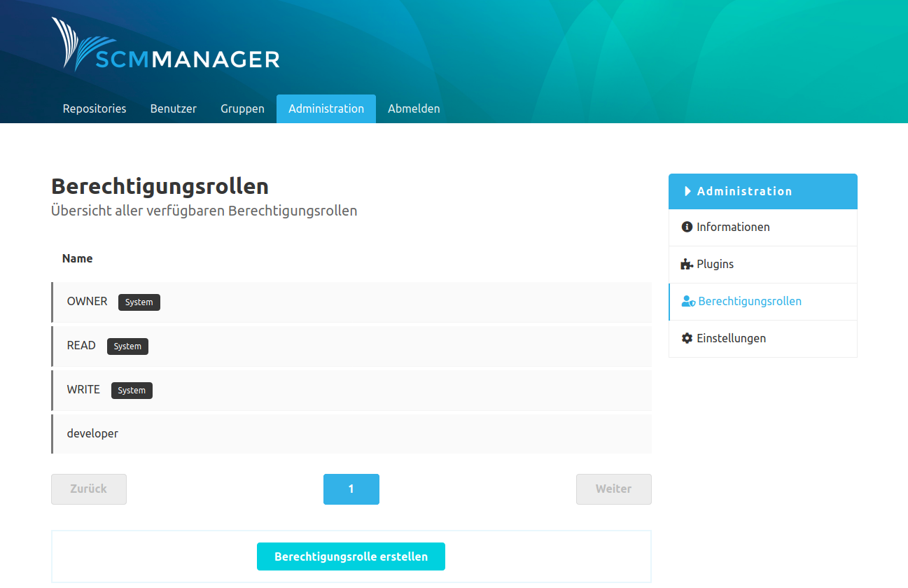

Auf der Seite "Berechtigungsrollen" können unterschiedliche Profile mit Berechtigungen erstellt werden. Einer Rolle werden ein Name und ein Satz an Berechtigungen zugewiesen. Diese Rolle kann dann Nutzern und Gruppen für einzelne Repositories zugewiesen werden.

Es gibt vordefinierte System-Rollen, die nicht verändert oder gelöscht werden können. 

Durch einen Klick auf eine Rolle sieht man die Informationen zur Rolle und welche Berechtigungen dieser Rolle zugewiesen sind. Benutzerdefinierte Rollen können nachträglich editiert und gelöscht werden.

