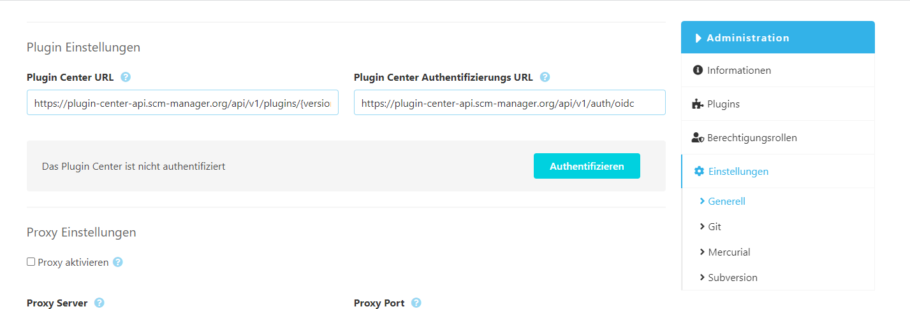
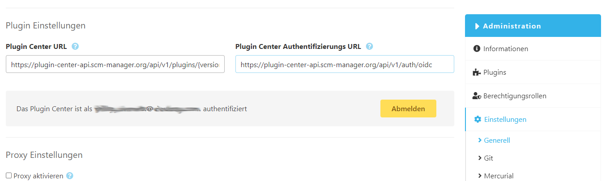

In den Einstellungen findet die globale Konfiguration der SCM-Manager Instanz statt. Viele SCM-Manager-Plugins, die sich konfigurieren lassen, erhalten nach ihrer Installation einen Eintrag unter Einstellungen. Dadurch ist er nach Bedarf maximal konfigurierbar.

### Generell
#### Realm Beschreibung
Im Feld "Realm Beschreibung" kann definiert werden, welcher Authentication Realm für die Anmeldung mit Basic Authentication verwendet wird. 

#### Namespace Strategien
Im SCM-Manager werden die Repositories nach Namespaces gruppiert. Diese Gruppierung kann nach unterschiedlichen Strategien stattfinden:

* Benutzername: Der Benutzername des angemeldeten Benutzers wird verwendet
* Aktuelles Jahr: Das aktuelle Jahr wird verwendet
* Repository Typ: Der Typ (git, hg oder svn) wird verwendet
* Benutzerdefiniert: Der Namespace kann beim Erstellen des Repositories frei gewählt werden

#### Login Info URL 
Auf der Login-Seite des SCM-Managers werden hilfreiche Plugins und Features vorgestellt. Falls man eigene Informationen auf die Login-Seite abbilden möchte, kann diese URL ausgetauscht werden.

#### XSRF Protection aktivieren 
Um Angriffe auf den SCM-Manager mit Cross Site Scripting (XSS / XSRF) zu erschweren. Dieses Feature ist noch experimentell.

#### Plugin-Settings 
Der SCM-Manager kann ein Plugin-Center anbinden, um schnell und bequem Plugins verwalten zu können. Um ein anderes SCM-Plugin-Center als das vorkonfigurierte zu verwenden, reicht es aus diese URL zu ändern. Läuft der SCM-Manager im Cloudogu EcoSystem, kann die Plugin-Center URL über einen Eintrag im etcd gesetzt werden.
Wenn das vorkonfigurierte Plugin-Center verwendet wird, kann der SCM-Manager mit der cloudogu platform verbunden werden. 

Nach der initialen Einrichtung sind folgende Werte standardgemäß hinterlegt:
```markdown
Plugin Center URL: https://plugin-center-api.scm-manager.org/api/v1/plugins/{version}?os={os}&arch={arch}&jre={jre}
Plugin Center Authentication URL: https://plugin-center-api.scm-manager.org/api/v1/auth/oidc
```


So können über das Plugin-Center besondere cloudogu platform-Plugins bezogen werden. Details sind in der Dokumentation des Plugin-Centers aufgeführt. 
Eine bestehende Verbindung zwischen dem SCM-Manager und der cloudogu platform kann hier aufgehoben werden.


### JWT Einstellungen
Benutzer erhalten einen JWT als Authentifizierungstoken nach einem erfolgreichen login.
Administratoren können die Lebensdauer dieser JWTs konfigurieren.
Falls die Lebensdauer verringert wird, wird jeder bisher ausgestellter JWT ungültig.
Sollte in der `config.yml` des Servers die Option "endless JWT" aktiviert sein, dann wird diese Einstellung ignoriert.

#### Anonyme Zugriff
Der SCM-Manager 2 hat das Konzept für anonyme Zugriffe über einen "_anonymous"-Benutzer realisiert. Beim Aktivieren des anonymen Zugriffs wird ein neuer Benutzer erstellt mit dem Namen  "_anonymous". Dieser Nutzer kann wie ein gewöhnlicher Benutzer für unterschiedliche Aktionen berechtigt werden. Bei einem Zugriff auf den SCM-Manager ohne Zugangsdaten wird dieser anonyme Benutzer verwendet.
Ist der anonyme Zugriff nur für Protokoll aktiviert, können die REST API und die VCS Protokolle anonym genutzt werden. Wurde der anonyme Zugriff vollständig aktiviert, ist auch ein Zugriff über den Webclient anonym möglich.

Beispiel: Falls der anonyme Zugriff aktiviert ist und der "_anonymous"-Benutzer volle Zugriffsrechte auf ein bestimmtes Git-Repository hat, kann jeder über eine Kommandozeile mit den klassischen Git-Befehlen ohne Zugangsdaten auf dieses Repository zugreifen. Zugriffe über SSH werden aktuell nicht unterstützt.

#### Release Feed Url
Die URL des RSS Release Feed des SCM-Managers. Darüber wird über die neue SCM-Manager Version informiert. Um diese Funktion zu deaktivieren lassen Sie dieses Feld leer.

#### User converter
Ist der Benutzer Konverter aktiviert, werden alle internen Benutzer beim Einloggen über ein externes System automatisch zu externen Benutzern konvertiert. Nach dem Konvertieren können sich die Benutzer nicht mehr mit dem lokalen SCM-Manager Passwort einloggen, sondern nur noch über das Fremdsystem.

#### Datei Suche
Die Dateisuche ermöglicht es Dateipfade in Repositories zu suchen. Bei sehr großen Repositories kann die Suche zu Speicherproblemen führen. In diesem Fall kann die Suchfunktion hier deaktiviert werden.

#### Fallback E-Mail Domain Name
Dieser Domain Name wird genutzt, wenn für einen User eine E-Mail-Adresse benötigt wird, für den keine hinterlegt ist. Diese Domain wird nicht zum Versenden von E-Mails genutzt und auch keine anderweitige Verbindung aufgebaut.

#### Notfallkontakte
Die folgenden Benutzer werden über administrative Vorfälle informiert (z. B. fehlgeschlagene Integritätsprüfungen).

#### Anmeldeversuche
Es lässt sich konfigurieren wie häufig sich ein Benutzer falsch anmelden darf, bevor dessen Benutzerkonto gesperrt wird. Der Zähler für fehlerhafte Anmeldeversuche wird nach einem erfolgreichen Login zurückgesetzt. Man kann dieses Feature abschalten, indem man "-1" in die Konfiguration einträgt.

#### Timeout bei fehlgeschlagenen Anmeldeversuchen
Falls konfiguriert werden Benutzerkonten bei zu vielen fehlgeschlagenen Anmeldeversuche gesperrt. Über einen Timeout kann gesteuert werden, wie lange diese Konten deaktiviert werden.

#### Base URL
Bei der Base URL handelt es sich um die URL, unter der die SCM-Manager Instanz aufgerufen werden kann. Über eine Checkbox kann konfiguriert werden, ob diese Base URL erzwungen werden soll. Durch das Erzwingen werden Zugriff auf diese Applikation über andere URLs auf die Base URL umgeleitet.

Beispiel: Die Base URL lautet www.scm-manager.com/scm, es gibt aber noch eine zweite URL www.scm-manager.io/scm. Beide zeigen auf dieselbe SCM-Manager Instanz. Wenn die Base URL erzwungen wird, wird der Anwender bei einem Zugriff über www.scm-manager.io/scm direkt auf die Base URL www.scm-manager.com/scm weitergeleitet.

**Achtung:** Wenn die Base URL auf einen falschen Wert gesetzt wird und der Haken bei "Base URL erzwingen" gesetzt wurde, ist die SCM-Manager Instanz nicht mehr erreichbar.

#### Proxy Einstellungen
Falls die SCM-Manager Instanz hinter einem Proxy-Server liegt, kann hier die Verbindung konfiguriert werden.


### Mercurial
Hier können globale Einstellungen zum Arbeiten mit dem Source Control Management Tool "Mercurial", kurz hg, konfiguriert werden.

### Git
Hier können globale Einstellungen zum Arbeiten mit dem Source Control Management Tool "Git" konfiguriert werden.

### Subversion
Hier können globale Einstellungen zum Arbeiten mit dem Source Control Management Tool "Subversion", kurz svn, konfiguriert werden.
