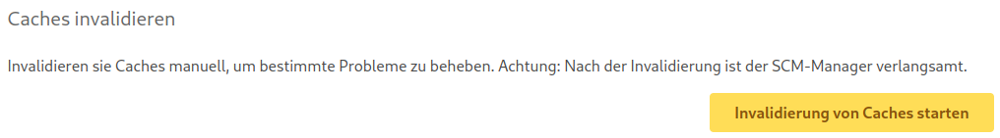
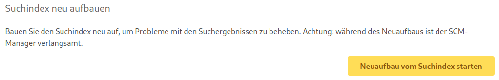

## Caches invalidieren

Um die Performance des SCM-Managers zu verbessern, werden viele Daten zusätzlich als Cache im Arbeitsspeicher gehalten.
Es kann passieren, dass die Daten im Cache nicht invalidiert werden, obwohl sich die zugrundeliegenden Daten geändert
haben. Dies kann zu Fehlern führen, z. B. könnten manche Ansichten versuchen ein Repository zu laden, welches bereits
gelöscht wurde. Um dieses Problem manuell zu lösen, können Administratoren den internen Cache des SCM-Managers
invalidieren. Allerdings kann diese Operation den SCM-Manager für eine Zeit verlangsamen. Dementsprechend sollte diese
Operation nur bedacht genutzt werden.

Die Option zur Invalidierung findet sich in den generellen Einstellungen:

## Suchindex neu aufbauen

Unter hoher Server-Last kann es passieren, dass der Suchindex nicht korrekt invalidiert wird, obwohl sich die
zugrundeliegenden Daten geändert haben. Dementsprechend kann es passieren, dass veraltete Daten gefunden werden. Dies
kann zu Fehlern in der Suchkomponente führen. Um dieses Problem manuell zu lösen, können Administratoren den Suchindex
neu erstellen lassen. Allerdings ist diese Operation zeitaufwändig und könnte den SCM-Manager für eine Zeit
verlangsamen. Dementsprechend sollte diese Operation nur bedacht genutzt werden. Wenn die Probleme bei der Suche nur ein
Repository betrifft, dann sollten Administratoren stattdessen nur den Suchindex für dieses Repository neu aufbauen
lassen. Dies kann in den generellen Einstellungen des Repositories gemacht werden.

Die Option zum Neuaufbau findet sich in den generellen Einstellungen:

