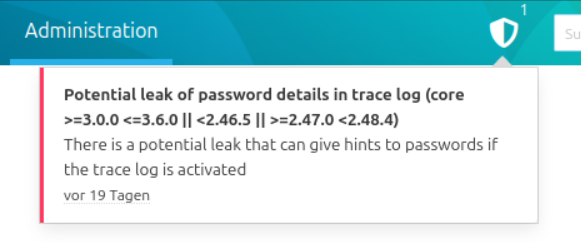

Alerts informieren im SCM-Manager über sicherheitskritische Fehler.

Aktuelle sicherheitskritische Meldungen werden mit einem Schild links neben dem Suchfeld im Kopf des SCM-Managers angezeigt. Eine hochgestellte Zahl zeigt die Anzahl der Alerts. Wenn keine Alerts für die verwendete Version des SCM-Managers bekannt sind, wird das Icon nicht angezeigt. 

Hovern oder Klicken des Schildes öffnet die Liste der Alerts. Die einzelnen Alerts sind in Regel mit weiterführenden Informationen zur Sicherheitslücke oder Fixes verlinkt.

Alerts verschwinden, sobald die Ursache z.B. durch ein Versionsupgrade behoben ist.
