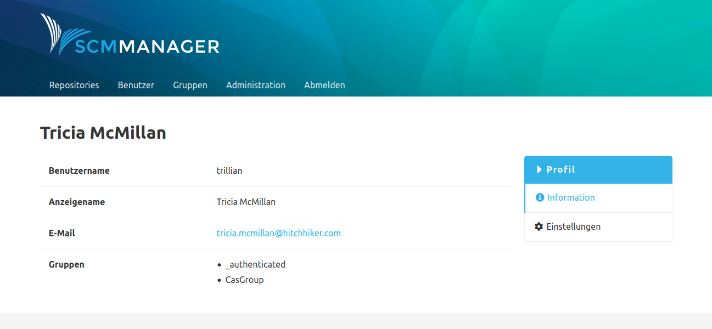

Benutzer, die sich über eine CAS-Instanz (Central Authentication Service) am SCM-Manager anmelden, erhalten zusätzliche Gruppen aus dem CAS. Externe Gruppen können ohne ein manuelles Anlegen im SCM-Manager genutzt werden. Das Hinzufügen, der als "extern" gekennzeichneten Gruppen, bringt jedoch die Vorteile mit sich, dass die angelegten Gruppen bei der Autovervollständigung im SCM-Manager berücksichtigt werden und es können Berechtigungen direkt einer externen Gruppe zugewiesen werden. Welche externen Gruppen einem Benutzer zugewiesen sind, lässt sich über die Profil-Seite eines angemeldeten Benutzers auslesen.

Siehe Beispiel: CasGroup

