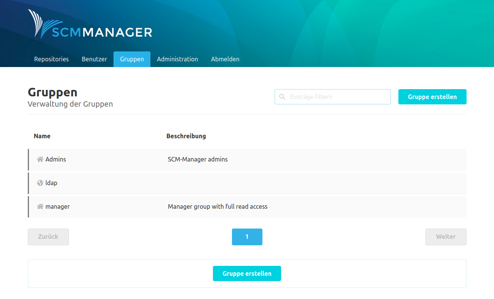
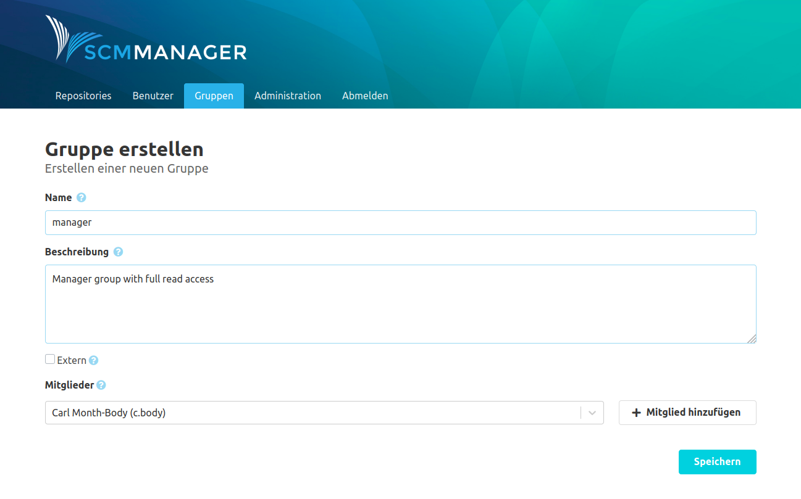
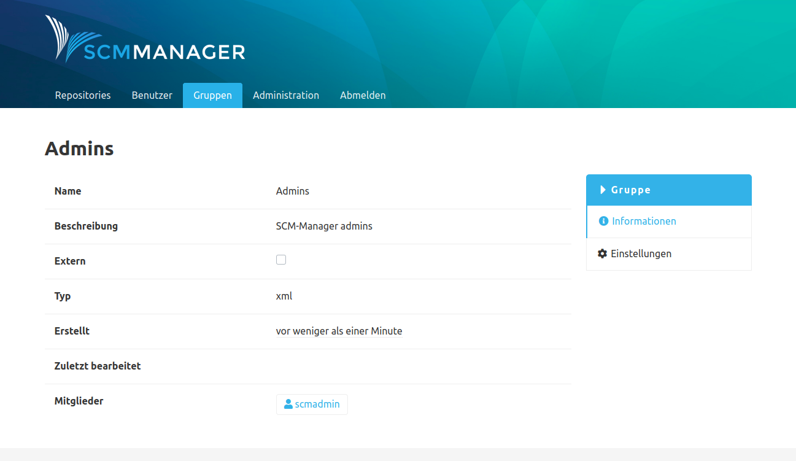

<!--- AppendLinkContentStart -->
Der Bereich Gruppen umfasst alles, was auf einen Zusammenschluss mehrerer Anwender und deren Berechtigungen herunterzubrechen ist.

* [Externe Gruppen (CAS)](external/)
* [Einstellungen](settings/)
<!--- AppendLinkContentEnd -->

Um nicht jeden Benutzer einzeln berechtigen zu müssen, gibt es im SCM-Manager die Möglichkeit Gruppen anzulegen. Diese Gruppen können mit Berechtigungen ausgestattet werden und können beliebig viele Benutzer enthalten.

### Übersicht
Die Gruppenübersicht zeigt eine Liste der existierenden Gruppen an. Die Gruppen werden dabei nach internen Gruppen und externen Gruppen unterschieden. Interne Gruppen werden in der Übersicht durch das Haus-Symbol kenntlich gemacht und sind Gruppen, die im SCM-Manager erstellt wurden. Externe Gruppen wiederum haben das Planeten-Symbol und sind Gruppen, dessen Mitglieder von [externen Quellen](./external.md) wie beispielsweise einer LDAP-Instanz verwaltet werden.

### Gruppe erstellen
Für das Erstellen einer Gruppe wird lediglich ein Name benötigt. Es können aber auch direkt beim Erstellen die Beschreibung und die Mitglieder hinzugefügt werden. Einzig die Berechtigungen der Gruppe müssen nachträglich konfiguriert werden.

### Gruppen Informationen
Die Informationsseite einer Gruppe zeigt neben den Metadaten auch eine Liste der Gruppenmitglieder an.

### Gruppe aller angemeldeten Benutzer
Um Einstellungen oder Berechtigungen für alle regulären Benutzerkonten vorzunehmen (also alle Konten mit Ausnahme von anonymen),
kann die Gruppe `_authenticated` genutzt werden. Diese Gruppe existiert implizit und jedes Benutzerkonto mit Ausnahme
von `anonymous` ist Mitglied dieser Gruppe.
