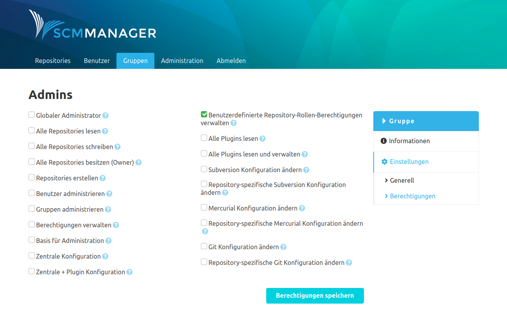

### Generell
In den allgemeinen Einstellungen einer Gruppe können die Beschreibung und die Mitglieder-Liste editiert werden. Ebenso kann die Gruppe hier gelöscht werden. Dieser Vorgang kann nicht rückgängig gemacht werden.

### Berechtigungen
Eine Gruppe kann globale Berechtigung bekommen. Diese Berechtigungen gelten für alle Mitglieder der Gruppe.

