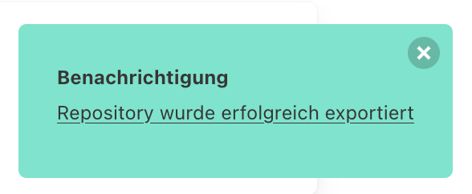
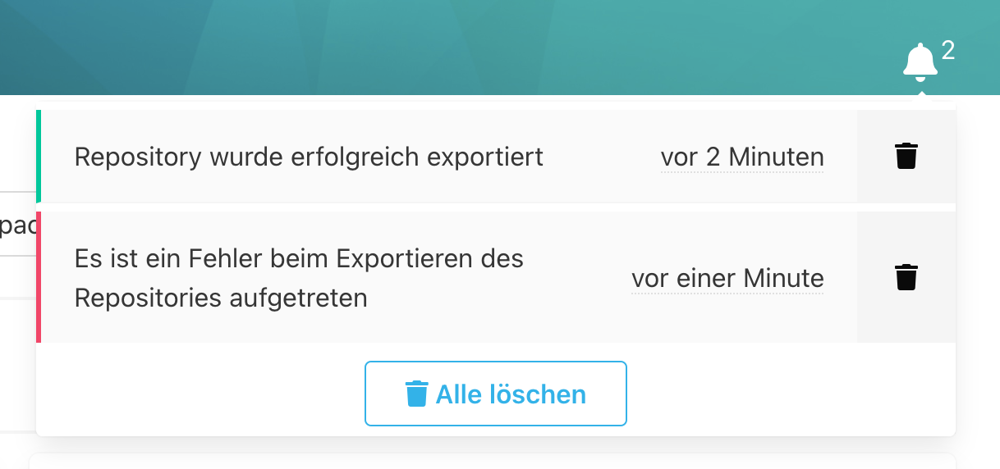

Benachrichtigungen werden in SCM-Manager verwendet, um die Fertigstellung von langlaufenden Prozessen anzuzeigen 
oder um den Benutzer auf Fehler hinzuweisen.  

Aktuelle Benachrichtigungen tauchen in Form einer Toast-Benachrichtigung am unteren rechten Rand auf.

Die Farbe der Benachrichtigung gibt den Typ der Nachricht an:

* Fehler (Rot): Ein Fehler is aufgetreten
* Warnung (Gelb): Es ist ein Problem aufgetreten
* Erfolgreich (Grün): Eine Aktion wurde erfolgreich beendet
* Information (Blau): Zur Information

Die Nachrichten verweisen auf eine Unterseite des SCM-Managers, die sich mit einem Klick auf den Text aufrufen lässt.
Wenn man die Nachricht gelesen hat, kann man sie mit einem Klick auf das X in der oberen Rechten Ecke schließen.
Die Nachrichten können auch nach dem Schließen wieder über das Glockensymbol am oberen rechten Rand geöffnet werden.

Die Zahl neben der Glock gibt an wie viele Nachrichten eingegangen sind.
Wenn man mit der Maus über das Symbol fährt, kann man die Nachrichten lesen.
Der farbige Rand gibt den Typ der Nachricht an, das Datum zeigt an, wann die Nachricht eingegangen ist 
und mit einem Klick auf den Text lässt sich die Seite der Nachricht aufrufen.

Über das Mülleimer-Symbol lässt sich eine einzelne Nachricht löschen.
Alle Nachrichten lassen sich über den "Alle löschen" Button löschen.

Wenn keine Nachrichten mehr vorhanden sind, zeigt das Glocken-Symbol keinen Zähler mehr an.

