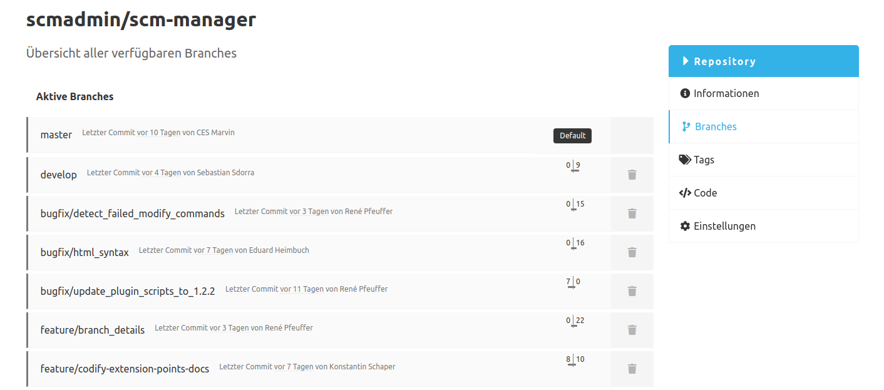
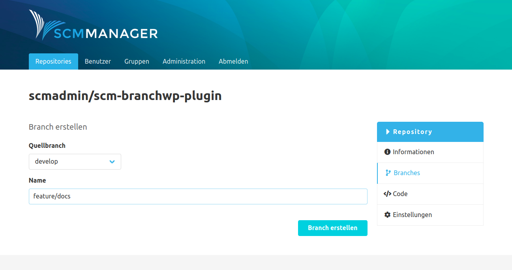
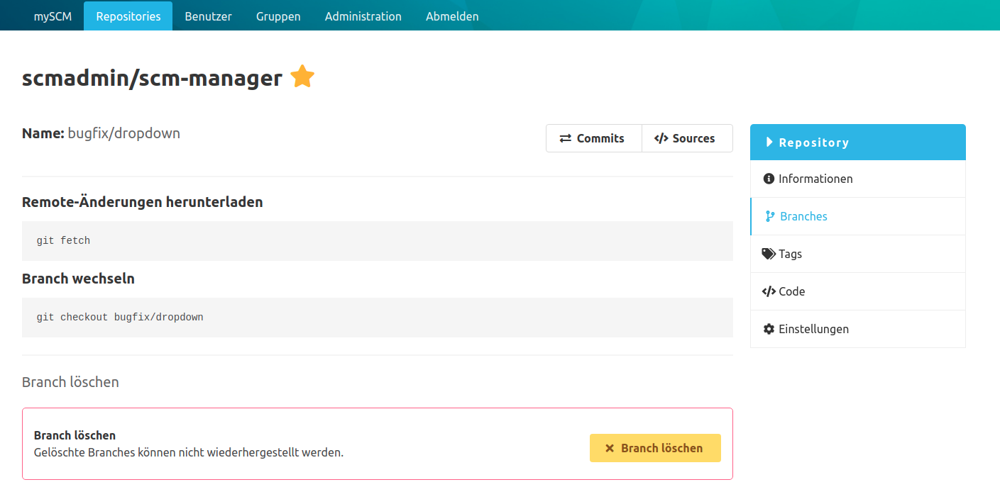

### Übersicht
Auf der Branches-Übersicht sind die bereits existierenden Branches aufgeführt. Bei einem Klick auf einen Branch wird man zur Detailseite des Branches weitergeleitet.
Die Branches sind in zwei Listen aufgeteilt: Unter "Aktive Branches" sind Branches aufgelistet, deren letzter Commit
nicht 30 Tage älter als der Stand des Default-Branches ist. Alle älteren Branches sind in der Liste "Stale Branches" zu finden.
Neben dem Datum der letzten Änderung und dem Autor dieser Änderung werden auch die Anzahl der Commits vor bzw. nach dem Default Branch angezeigt. 
Mit diesen zwei Zahlen wird ersichtlich, wie weit sich dieser Branch vom Default Branch entfernt hat.

Der Tag "Default" gibt an, welcher Branch aktuell als Standard-Branch dieses Repository im SCM-Manager markiert ist. Der Standard-Branch wird immer zuerst angezeigt, sobald das Repository im SCM-Manager geöffnet wird.
Alle Branches mit Ausnahme des Default Branches können über das Mülleimer-Icon unwiderruflich gelöscht werden.

Über den "Branch erstellen"-Button gelangt man zum Formular, um neue Branches anzulegen.

### Branch erstellen
Mit dem "Branch erstellen"-Formular können neue Branches für das Repository erzeugt werden. Dafür muss ausgewählt werden von welchem existierenden Branch der neue Branch abzweigen soll und wie der neue Branch heißen soll. In einem leeren Git Repository können keine Branches erzeugt werden.

### Branch Detailseite
Hier werden einige Befehle zum Arbeiten mit dem Branch auf einer Kommandozeile aufgeführt.
Die Angaben, wie viele Commits der Branch vor bzw. hinter dem Default Branch liegt, finden sich direkt unterhalb des Namens.

Handelt es sich nicht um den Default Branch des Repositories, kann im unteren Bereich der Branch unwiderruflich gelöscht werden.

