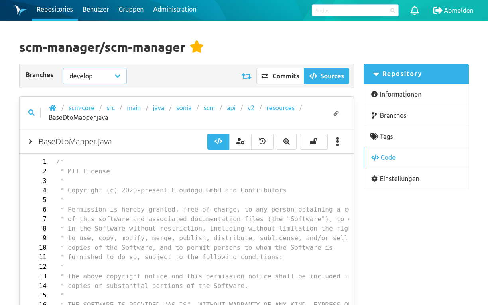
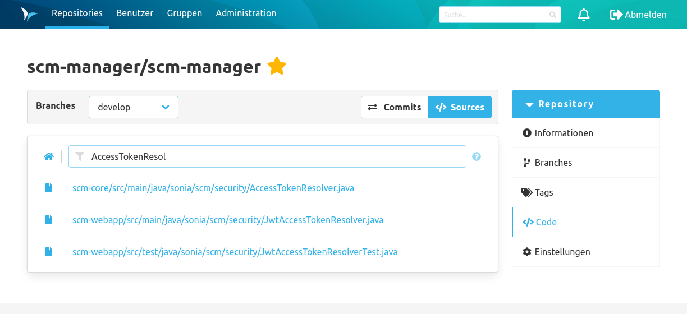
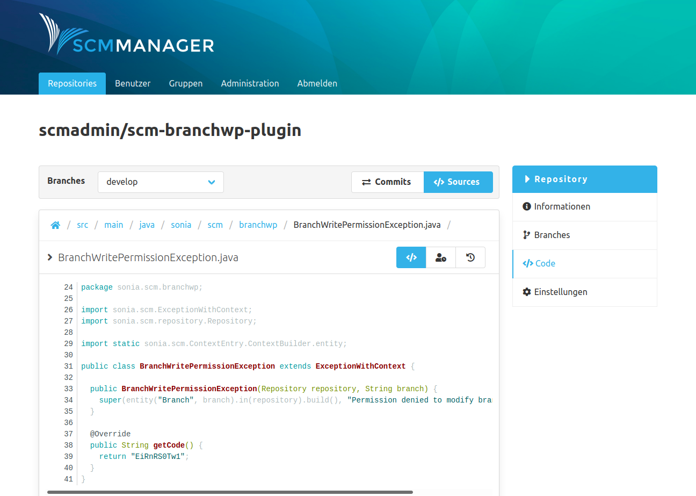

Die Sektion "Code" enthält sämtliche Informationen, die sich auf den Code bzw. Inhalt des Repository beziehen. Oben auf der Seite befindet sich ein Aktionsbalken über den innerhalb der Code-Sektion navigiert werden kann. 

### Sources
Die Übersicht der Sources zeigt die Dateien und Ordner in dem Repository an. Wenn Branches existieren, werden die Sources für den ausgewählten Branch angezeigt. 

Es gibt unter dem Aktionsbalken eine Breadcrumbs Navigation, die den Pfad der angezeigten Dateien darstellt. Durch Klicken auf die einzelnen Pfad-Bestandteile, kann man sich durch die Dateistruktur des Repository (zurück-)navigieren.

#### Dateinamen Suche

Die Dateinamen Suche kann über das Such Icon neben dem Dateipfad geöffnet werden.
Die Suche bezieht sich ausschließlich auf den Dateipfad und nicht auf Dateiinhalte.
Bei der Suche werden Treffer im Dateinamen höher gewertet als Suchtreffer im Dateipfad.
Sobald mehr als ein Zeichen eingegeben wurde, startet die Suche automatisch und zeigt die Ergebnisse unterhalb des Textfeldes an.

#### Verlinkungen

Über den Button rechts neben der Breadcrumb Navigation kann ein permanenter Link 
zum aktuellen Pfad in die Zwischenablage kopiert werden.

#### Subrepository

In der Codeübersicht werden Submodules (Git), Subrepositories (Hg) und Externals (Svn) mit einem Icon eines umrandeten Ordners dargestellt und verlinkt, sofern die URL auflösbar ist.

### Commits
Die Übersicht der Commits zeigt die Änderungshistorie je Branch an. Jeder Listeneintrag stellt einen Commit dar. 

Über den Details-Button kann man sich den Inhalt / die Änderungen dieses Commits ansehen. 

Der Schlüssel Icon zeigt an, ob ein Commit signiert wurde. Um die Signatur zu validieren, können die Benutzer ihre öffentlichen Schlüssel (Public Keys) im SCM-Manager hinterlegen. Ein grüner Schlüssel bedeutet die Signatur konnte erfolgreich gegen einen hinterlegten öffentlichen Schlüssel im SCM-Manager verifiziert werden. Ein grauer Schlüssel heißt, dass die Signatur zu keinem Schlüssel im SCM-Manager passt. Und ein roter Schlüssel warnt vor einer ungültigen (möglicherweise gefälschten) Signatur.

Über den Sources-Button gelangt man zur Sources-Übersicht und es wird der Datenstand zum Zeitpunkt nach diesem Commit angezeigt.

### Commit Details
Auf der Detailseite eines Commits sieht man zusätzlich zu den Metadaten (z. B. Mitwirkende und Parent-Commit) des Commits sämtliche Änderungen (Diffs), die in diesem Commit enthalten sind.
Die Mitwirkenden können zu einer detaillierten Tabelle aufklappt werden und enthalten den Autor, die Co-Autoren, den Committer und den Signierer des Commits.
Diese Angaben hängen von dem Repository-Typ und den installierten Plugins ab.
Die Mitwirkenden können unterschiedliche Zeitstempel haben (z. B. unterschiedliche Zeiten für die Erstellung eines Commits
und eine spätere Commit-Zeit aufgrund von Cherry-Picking in Git).

Auf der linken Seite gibt es einen Dateien-Baum der jede Datei anzeigt die geändert wurde.
Um zu einer bestimmten Datei zu springen ist ist es möglich im Baum diese Datei auszuwählen.
Die Diffs werden dabei im bekannten Format je Datei inklusive Syntax-Highlighting angezeigt. 
Die Diffs können durch Klicken auf den blauen Balken schrittweise oder vollständig erweitert werden.

Falls sich Commit Links im Format "namespace/name@commitId" in der Commit-Beschreibung befinden, werden die zu relativen SCM-Manager Links erweitert.
Beispielsweise wird der Text hitchhiker/HeartOfGold@1a2b3c4 zu einem Link zu dem Commit 1a2b3c4 im Repository hitchhiker/HeartOfGold umgewandelt.

Für den Commit gibt es ein Dropdown Menu mit zwei Optionen:
- Mit der ersten Checkbox können die Whitespaces-Änderungen ein- und ausgeblendet werden.
- Die zweite Checkbox ermöglicht das Ein- und Ausblenden aller Diffs.

Für die Commits gibt es drei Radio-Buttons, um das Layout zu ändern:
- Mit dem ersten Button werden nur die Diffs angezeigt.
- Mit dem zweiten Button werden die Diffs und der Dateibaum angezeigt.
- Mit dem letzten Button wird nur der Dateibaum angezeigt.

Jeder Commit Diff hat mehrere Buttons:
- Der erste Button von Links ermöglicht einen direkten Vergleich der Änderungen.
- Mit der Lupe können die Änderungen über die gesamte Breite des Fensters betrachtet werden.
- Der nächste Button schaltet Leerzeichen und Tabs ein und aus.
- Der letzte Button führt zur Quelldatei.

#### Tags

Alle Tags eines Commits werden in der oberen rechten Ecke der Detailseite angezeigt.

#### Tags erstellen

Neue Tags für ein Commit können direkt in dessen Übersichtsseite erstellt werden.
Es muss lediglich ein gewünschter Name angegeben werden, welcher die gleichen Formatierungsbeschränkungen wie Branches erfüllt.

#### Reverts
In Commits innerhalb von Git-Repositories steht in der oberen rechten Ecke (unter "Tag erstellen") ein Knopf zum Reverten des Commits.

**Hinweis:** Der Revert-Knopf wird nur dann angezeigt, wenn der Commit genau einen Vorgänger hat.
Commits mit mehr als einem Vorgänger (z.B. Merge-Commits) und initiale Commits ohne Vorgänger können nicht zurückgesetzt werden.

Für einen Revert ist nach Drücken des Knopfs ein Branch auszuwählen, auf welchem der Revert angewendet wird.
Gelangt man aus der Commit-Übersicht eines Branches in den Commit, ist die Auswahl automatisch vorgenommen.

Ebenso kann eine Commit-Nachricht für den Revert angegeben werden. 
Sie ist automatisch ausgefüllt; es empfiehlt sich jedoch aus Gründen der Übersichtlichkeit, in dieser den Revert zu begründen.

Mit Drücken von "Revert" wird man auf den neu erstellten Revert-Commit automatisch weitergeleitet, sofern kein Fehler auftritt.

### Datei Details
Nach einem Klick auf eine Datei in den Sources landet man in der Detailansicht der Datei. Dabei sind je nach Dateiformat unterschiedliche Ansichten zu sehen: 

- Bild-Datei: Bild wird gerendert angezeigt. 
- Markdown-Datei: Markdown wird gerendert dargestellt. Die Ansicht kann auf eine nicht gerenderte Textansicht umgeschaltet werden. Im gerenderten Markdown können ebenfalls Commit Links wie bei den Commit Details verwendet werden.
- Text-basierte Datei: Der Text wird angezeigt. Falls verfügbar mit Syntax-Highlighting.
- Nicht unterstützte Formate: Ein Download-Button wird angezeigt.

### Datei Annotate
Ergänzt jede Codezeile mit entsprechenden Informationen, wann und von welchem Autor diese zuletzt geändert wurde. Mit einem Hover auf der linken Seite erscheint ein Popover mit Commit und weiteren Informationen.

### Datei Historie
Bei der Datei Details Ansicht kann man über einen Switch oben rechts auf die Historien-Ansicht wechseln. Dort werden die Commits aufgelistet, die diese Datei verändert haben.

