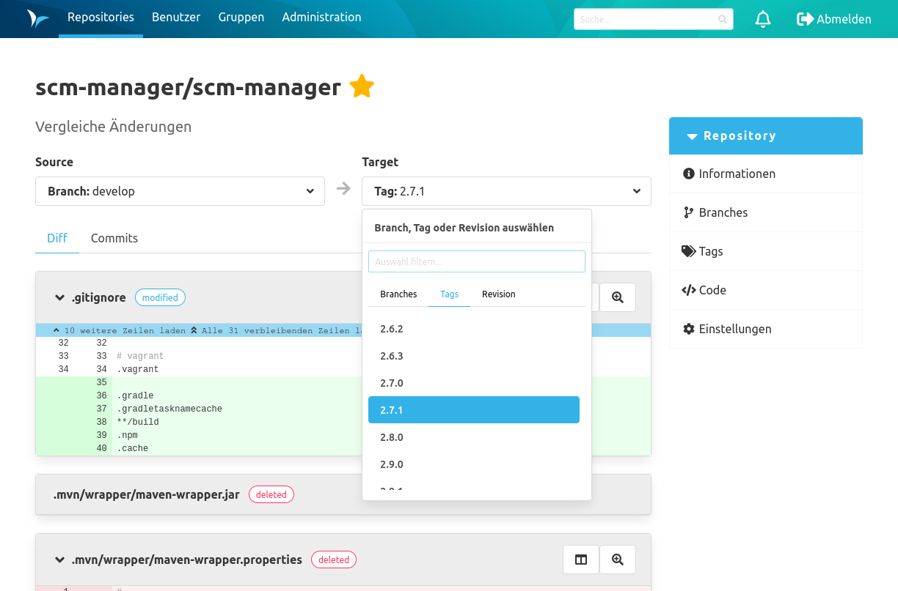

### Vergleich von Branches, Tags und Revisionen

In der Vergleichsansicht können Sie die Diffs und Commits zwischen zwei ausgewählten Repository-Zeigern sehen. 
Wählen Sie einfach die Quelle und das Ziel aus, worauf Sie den Vergleich durchführen möchten.
Dies ist besonders nützlich, wenn Sie sehen möchten, welche Änderungen auf Ihrem Branch vor oder hinter dem Default Branch liegen.
Sie können auch sehen, was sich zwischen zwei Versionen geändert hat.

