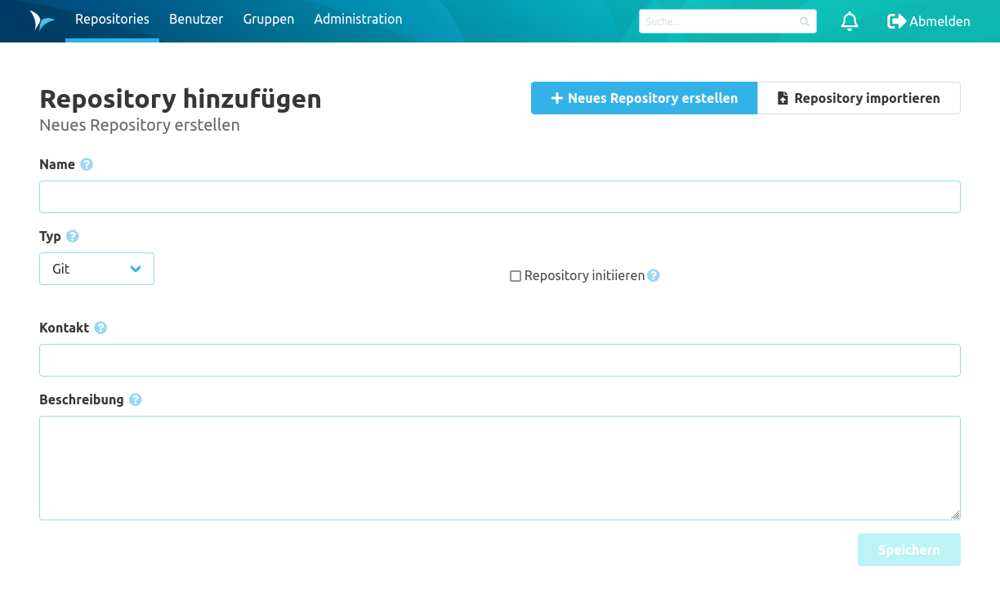

<!--- AppendLinkContentStart -->
Der Bereich Repository umfasst alles auf Basis von Repositories in Namespaces. Dazu zählen alle Operationen auf Branches, der Code und Einstellungen.

* [Branches](branches/)
* [Tags](tags/)
* [Code](code/)
* [Einstellungen](settings/)
<!--- AppendLinkContentEnd -->

### Übersicht
Auf der Übersichtsseite der Repositories werden die einzelnen Repositories nach Namespaces gegliedert aufgelistet. Jedes Repository wird durch eine Kachel dargestellt. Durch einen Klick auf diese Kachel öffnet sich die Readme Seite des jeweiligen Repositories. 

Mithilfe der Auswahlbox oben auf der Seite kann die Anzeige der Repositories auf einen Namespace eingeschränkt werden. Alternativ kann die Überschrift eines Namespace angeklickt werden, um nur Repositories aus diesem Namespace anzuzeigen. Über die Suchleiste neben der Auswahlbox können die Repositories frei gefiltert werden. Die Suche filtert dabei nach dem Namespace, dem Namen und der Beschreibung der Repositories.

Ein bestimmter Tab des Repositories wie Branches, Changesets oder Sources kann über die blauen Icons geöffnet werden. 

Icon             |  Beschreibung
---|---
  |  Öffnet die Branches-Übersicht für das Repository
 | Öffnet die Changesets-Übersicht für das Repository
 | Öffnet die Sources-Übersicht für das Repository
 | Öffnet die Einstellungen für das Repository

Zusätzlich können über das Icon rechts neben den Überschriften für die Namespaces weitere Einstellungen auf Namespace-Ebene vorgenommen werden.

### Repository erstellen
Im SCM-Manager können neue Git, Mercurial & Subersion (SVN) Repositories über ein Formular angelegt werden. Dieses kann über den Button "Repository erstellen" aufgerufen werden. Dabei muss ein gültiger Name eingetragen und der Repository-Typ bestimmt werden. 
 
Optional kann man das Repository beim Erstellen direkt initialisieren. Damit werden für Git und Mercurial jeweils der Standard-Branch (master bzw. default) angelegt. Außerdem wird ein initialer Commit ausgeführt, der eine README.md erzeugt. 
Für Subversion Repositories wird die README.md in einen Ordner `trunk` abgelegt.

Ist die Namespace-Strategie auf "Benutzerdefiniert" eingestellt, muss noch ein Namespace eingetragen werden. Für den Namespace gelten dieselben Regeln wie für den Namen des Repositories. Darüber hinaus darf ein Namespace nicht nur aus bis zu drei Ziffern (z. B. "123") oder dem Wort "create" bestehen. 

### Repository Informationen
Die Informationsseite eines Repository zeigt die Metadaten zum Repository an. Darunter befinden sich Beschreibungen zu den unterschiedlichen Möglichkeiten wie man mit diesem Repository arbeiten kann. In der Überschrift kann der Namespace angeklickt werden, um alle Repositories aus diesem Namespace anzuzeigen.

