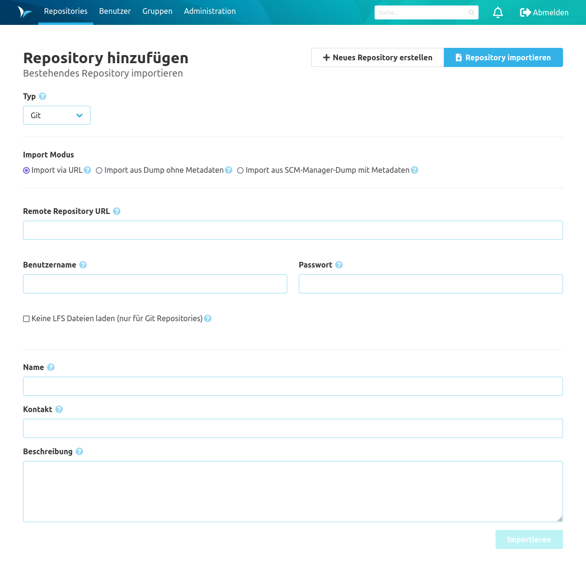

<!--- AppendLinkContentStart -->
Der Bereich Repository umfasst alles auf Basis von Repositories in Namespaces. Dazu zählen alle Operationen auf Branches, der Code und Einstellungen.

* [Branches](branches/)
* [Tags](tags/)
* [Code](code/)
* [Compare](compare/)
* [Einstellungen](settings/)
<!--- AppendLinkContentEnd -->

### Übersicht
Auf der Übersichtsseite der Repositories werden die einzelnen Repositories nach Namespaces gegliedert aufgelistet.

Mithilfe der Auswahlbox oben auf der Seite kann die Anzeige der Repositories auf einen Namespace eingeschränkt werden. Alternativ kann die Überschrift eines Namespace angeklickt werden, um nur Repositories aus diesem Namespace anzuzeigen. Über die Suchleiste neben der Auswahlbox können die Repositories frei gefiltert werden. Die Suche filtert dabei nach dem Namespace, dem Namen und der Beschreibung der Repositories.

Zusätzlich können über das Icon rechts neben den Überschriften für die Namespaces weitere Einstellungen auf Namespace-Ebene vorgenommen werden.

### Repository erstellen
Im SCM-Manager können neue Git, Mercurial & Subersion (SVN) Repositories über ein Formular angelegt werden. Dieses kann über den Button "Repository erstellen" aufgerufen werden. Dabei muss ein gültiger Name eingetragen und der Repository-Typ bestimmt werden. 
 
Optional kann man das Repository beim Erstellen direkt initialisieren. Damit werden für Git und Mercurial jeweils der Standard-Branch (master bzw. default) angelegt. Außerdem wird ein initialer Commit ausgeführt, der eine README.md erzeugt. 
Für Subversion Repositories wird die README.md in einen Ordner `trunk` abgelegt.

Ist die Namespace-Strategie auf "Benutzerdefiniert" eingestellt, muss noch ein Namespace eingetragen werden.
Für den Namespace gelten dieselben Regeln wie für den Namen des Repositories. Darüber hinaus darf ein Namespace
nicht nur aus bis zu drei Ziffern (z. B. "123") oder den Wörter "create" und "import" bestehen.
Bei der Eingabe werden nach den ersten Zeichen bereits bestehende passende Werte vorgeschlagen, sodass diese leichter
übernommen werden können. Ein neuer Namespace muss explizit mit dem entsprechenden Eintrag in der Vorschlagsliste
neu erstellt werden.

### Repository importieren
Neben dem Erstellen von neuen Repository können auch bestehende Repository in SCM-Manager importiert werden.
Wechseln Sie über den Schalter oben rechts auf die Importseite und füllen Sie die benötigten Informationen aus.

Das gewählte Repository wird zum SCM-Manager hinzugefügt und sämtliche Repository Daten inklusive aller Branches und Tags werden importiert.
Zusätzlich zum normalen Repository Import gibt es die Möglichkeit ein Repository Archiv mit Metadaten zu importieren. 
Dieses Repository Archiv muss von einem anderen SCM-Manager exportiert worden sein und wird vor dem Import auf
Kompatibilität der Daten überprüft (der SCM-Manager und alle installierten Plugins müssen mindestens die Version des
exportierenden Systems haben).
Ist die zu importierende Datei verschlüsselt, muss das korrekte Passwort zum Entschlüsseln mitgeliefert werden. 
Wird kein Passwort gesetzt, geht der SCM-Manager davon aus, dass die Datei unverschlüsselt ist.

### Repository Informationen
Die Informationsseite eines Repository zeigt die Metadaten zum Repository an. Darunter befinden sich Beschreibungen zu den unterschiedlichen Möglichkeiten wie man mit diesem Repository arbeiten kann. 
In der Überschrift kann der Namespace angeklickt werden, um alle Repositories aus diesem Namespace anzuzeigen.

