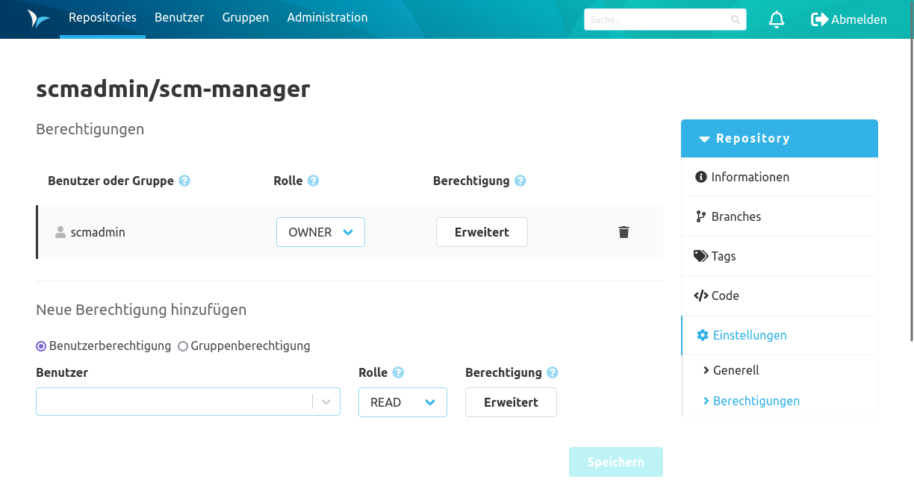

Unter den Repository Einstellungen befinden sich zwei Einträge. Wenn weitere Plugins installiert sind, können es deutlich mehr Unterseiten sein.

### Generell
Unter dem Eintrag "Generell" kann man die Zusatzinformationen zum Repository editieren. Da es sich im Beispiel um ein Git Repository handelt, kann ebenfalls der Standard-Branch für dieses Repository gesetzt werden. Der Standard-Branch sorgt dafür, dass beim Arbeiten mit diesem Repository dieser Branch vorrangig geöffnet wird, falls kein expliziter Branch ausgewählt wurde.

Über den Button unten auf dieser Seite besteht noch die Möglichkeit dieses Repository aus dem SCM-Manager zu löschen. Dieser Vorgang kann nicht rückgängig gemacht werden.

### Berechtigungen
Dank des fein granularen Berechtigungskonzepts des SCM-Managers können Nutzern und Gruppen, basierend auf definierbaren Rollen oder auf individuellen Einstellungen, Rechte zugewiesen werden. Berechtigungen können global und auf Repository-Ebene vergeben werden. Globale Berechtigungen werden in der Administrations-Oberfläche des SCM-Managers vergeben. Unter diesem Eintrag handelt es sich um Repository-bezogene Berechtigungen. 

Die Berechtigungen können jeweils für Gruppen und für Benutzer vergeben werden. Dabei gibt es die Möglichkeiten die Berechtigungen über Berechtigungsrollen zu definieren oder jede Berechtigung einzeln zu vergeben. Die Berechtigungsrollen können in der Administrations-Oberfläche definiert werden.

Für individuelle Berechtigungen kann man über "Erweitert" einen Dialog öffnen, um jede Berechtigung einzeln zu vergeben.

