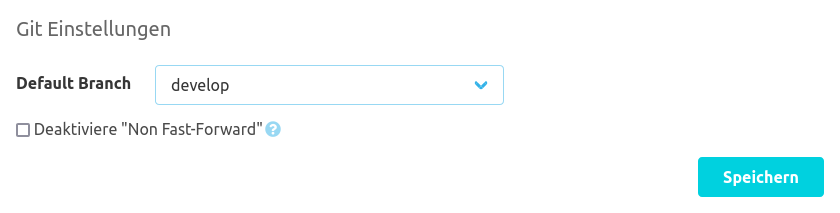
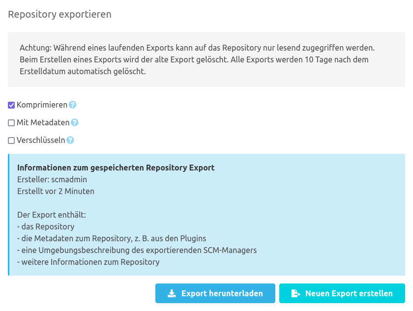
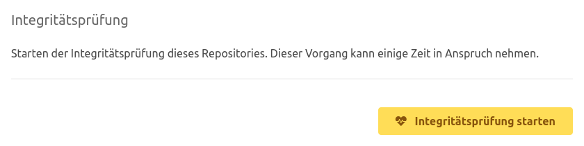
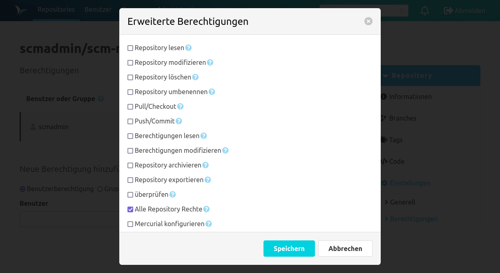

Unter den Repository Einstellungen befinden sich zwei Einträge. Wenn weitere Plugins installiert sind, können es
deutlich mehr Unterseiten sein.

### Generell

Unter dem Eintrag "Generell" kann man die Zusatzinformationen zum Repository editieren. Da es sich im Beispiel um ein
Git Repository handelt, kann ebenfalls der Standard-Branch für dieses Repository gesetzt werden. Der Standard-Branch
sorgt dafür, dass beim Arbeiten mit diesem Repository dieser Branch vorrangig geöffnet wird, falls kein expliziter
Branch ausgewählt wurde.
Außerdem können Git Pushes auf Repository-Ebene abgelehnt werden, die nicht "fast-forward" sind.

Innerhalb der Gefahrenzone unten auf der Seite gibt es mit entsprechenden Rechten die Möglichkeit das Repository
umzubenennen, zu löschen oder als archiviert zu markieren. Wenn in der globalen SCM-Manager Konfiguration die Namespace
Strategie `benutzerdefiniert` ausgewählt ist, kann zusätzlich zum Repository Namen auch der Namespace umbenannt werden.
Ein archiviertes Repository kann nicht mehr verändert werden.

In dem Bereich "Repository exportieren" kann das Repository in unterschiedlichen Formaten exportiert werden.
Während eines laufenden Exports kann auf das Repository nur lesend zugriffen werden.
Der Repository Export wird asynchron erstellt und auf dem Server gespeichert.
Existiert bereits ein Export für dieses Repository auf dem Server, wird dieser vorher gelöscht, da es immer nur einen Export pro Repository geben kann.
Exporte werden 10 Tage nach deren Erstellung automatisch vom SCM-Server gelöscht.
Falls ein Export existiert, wird über die blaue Info-Box angezeigt von wem, wann und wie dieser Export erzeugt wurde.

Das Ausgabeformat des Repository kann über die angebotenen Optionen verändert werden:
* `Standard`: Werden keine Optionen ausgewählt, wird das Repository im Standard Format exportiert.
  Git und Mercurial werden dabei als `Tar Archiv` exportiert und Subversion nutzt das `Dump` Format.
* `Komprimieren`: Das Ausgabeformat wird zusätzlich mit `GZip` komprimiert, um die Dateigröße zu verringern.
* `Mit Metadaten`: Statt dem Standard-Format wird ein Repository Archiv exportiert, welches außer dem Repository noch
  weitere Metadaten enthält. Für diesen Export sollte sichergestellt werden, dass alle installierten Plugins aktuell sind.
  Ein Import eines so exportierten Repositories ist nur in einem SCM-Manager mit derselben oder einer neueren Version
  möglich. Dieses gilt ebenso für alle installierten Plugins.
* `Verschlüsseln`: Die Export-Datei wird mit dem gesetzten Passwort verschlüsselt. Zum Entschlüsseln muss das exakt gleiche Passwort verwendet werden.

Der Bereich „Integritätsprüfung“ bietet die Möglichkeit, eine Integritätsprüfung des Repositories zu starten. Hier
werden (zum Teil ausführliche) Prüfungen ausgeführt, die z. B. sicherstellen, dass die Verzeichnisse korrekt
eingebunden sind. Wenn bei dem Zugriff auf ein Repository Fehler auftreten, sollte zunächst eine solche
Integritätsprüfung gestartet werden. Ein Teil dieser Prüfungen wird bei jedem Start des SCM-Managers ausgeführt.

Werden bei einer dieser Integritätsprüfungen Fehler gefunden, wird auf der Repository-Übersicht sowie auf den
Detailseiten zum Repository neben dem Namen ein Tag „fehlerhaft" angezeigt. In den Einstellungen wird zudem eine Meldung
eingeblendet. Durch Klick auf diese Meldung oder die Tags wird ein Popup mit weiteren Details angezeigt.

Der Server führt immer nur eine Prüfung zur Zeit durch. Es können jedoch für mehrere Repositories Prüfungen in die
Warteschlange gestellt werden, die dann nacheinander durchgeführt werden.

### Berechtigungen

Dank des fein granularen Berechtigungskonzepts des SCM-Managers können Nutzern und Gruppen, basierend auf definierbaren
Rollen oder auf individuellen Einstellungen, Rechte zugewiesen werden. Berechtigungen können global, auf Namespace-Ebene
und auf Repository-Ebene vergeben werden. Globale Berechtigungen werden in der Administrations-Oberfläche des
SCM-Managers vergeben. Unter diesem Eintrag handelt es sich um Repository-bezogene Berechtigungen.

Die Berechtigungen können jeweils für Gruppen und für Benutzer vergeben werden. Dabei gibt es die Möglichkeiten die
Berechtigungen über Berechtigungsrollen zu definieren oder jede Berechtigung einzeln zu vergeben. Die
Berechtigungsrollen können in der Administrations-Oberfläche definiert werden.

Berechtigungen auf Namespace-Ebene können über die Einstellungen für Namespaces bearbeitet werden. Diese sind über das
Einstellungs-Symbol neben den Namespace-Überschriften auf der Repository-Übersicht erreichbar.

Auf Namespace-Ebene vergebene Berechtigungen gelten für den Namespace selber als auch für alle Repositories in diesem
Namespace. Die Berechtigung "Alle Namespace Rechte" zum Beispiel, die entweder über die Rolle "OWNER" oder manuell
gesetzt werden kann, erlaubt konfigurierten Nutzer:innen bzw. Gruppen Zugriff auf alle Einstellungen betreffend des
Namespaces selber (inclusive der Berechtigungen) und darüber hinaus vollen Zugriff auf alle in diesem Namespace
befindlichen Repositories, wiederum mit allen Berechtigungen für Konfigurationen und dem vollen Zugriff auf die
Repository-Daten.

Für individuelle Berechtigungen kann man über "Erweitert" einen Dialog öffnen, um jede Berechtigung einzeln zu vergeben.

