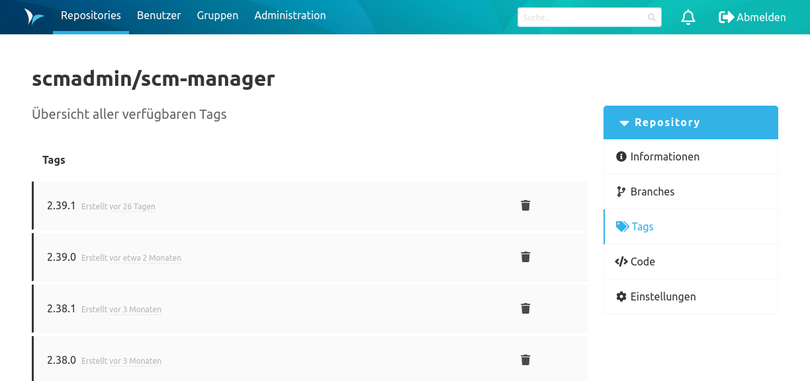
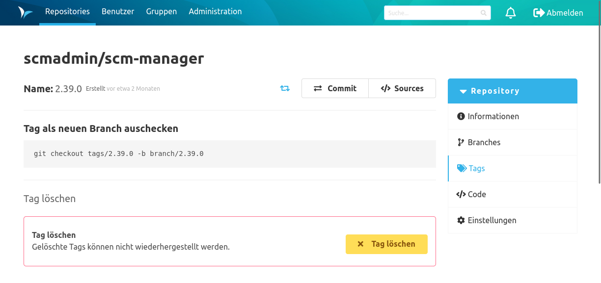

### Übersicht
Auf der Tags-Übersicht sind die existierenden Tags aufgeführt.
Die Tags sind standardmäßig nach Erstelldatum absteigend sortiert, können aber auch alphabetisch sortiert werden.
Bei einem Klick auf einen Tag wird der Benutzer zur Detailseite des Tags weitergeleitet. 

### Tag Detailseite
Hier wird ein Befehl zum Arbeiten mit dem Tag auf einer Kommandozeile aufgeführt.

#### Tag-Signaturen
Wenn mindestens eine Signatur für einen Tag existiert, wird der Verifizierungsstatus des Tags als Schlüsselsymbol hinter dessen Namen in der Detailansicht dargestellt.

Ein Tag kann mehrere Signaturen haben.

Abhängig vom Status der einzelnen Signaturen, wird das Symbol entsprechend eingefärbt:
- wenn mindestens eine Signatur ungültig ist, wird der Schlüssel `rot` dargestellt ANDERNFALLS
- wenn mindestens eine Signatur gültigt ist, wird der Schlüssel `grün` dargestellt ANDERNFALLS
- wird der Schlüssel `grau` dargestellt

Wird der Mauszeiger über das Symbol bewegt, erscheint eine Liste aller Signaturen des Tags.

### Tags löschen
Tags können direkt von der Übersicht aus oder auf der Detailseite gelöscht werden.
