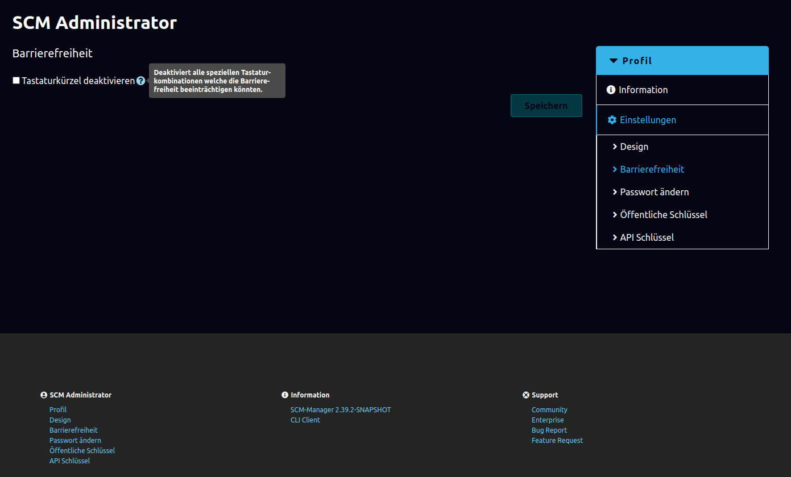

Der SCM-Manager unterstützt Tastaturinteraktion und -navigation durch zusätzliche Tastenkürzel.

### Übersicht

Während Sie den SCM-Manager verwenden, können Sie eine Übersicht aller
verfügbaren Tastenkürzel mittels der `?`-Taste aufrufen.

### Globale Tastenkürzel

| Key Combination | Description                         |
|-----------------|-------------------------------------|
| ?               | Öffne die Tastaturkürzelübersicht   |
| /               | Fokussiere die globale Schnellsuche |
| alt r           | Navigiere zur Repositoryübersicht   |
| alt u           | Navigiere zur Benutzerübersicht     |
| alt g           | Navigiere zur Gruppenübersicht      |
| alt a           | Navigiere zur Administration        |

### Navigation von Listen

Einige Seiten mit Listen erlauben die Navigation per Tastatur.
Wenn die Seite dieses unterstützt, tauchen die Tastaturkürzel in der Übersicht im SCM-Manager
auf (`?`).

| Key Combination | Description                                       |
|-----------------|---------------------------------------------------|
| j               | Bewege den Fokus auf den nächsten Listeneintrag   |
| k               | Bewege den Fokus auf den vorherigen Listeneintrag |

### Repositoryspezifische Tastenkürzel

| Key Combination | Description                  |
|-----------------|------------------------------|
| g i             | Wechsel zur Repository-Info  |
| g b             | Wechsel zu den Branches      |
| g t             | Wechsel zu den Tags          |
| g c             | Wechsel zum Code             |
| g s             | Wechsel zu den Einstellungen |

### Tastenkürzel aus Plugin

Plugins können selbst neue Tastenkürzel definieren.
Diese können global oder repository-spezifisch sein oder in einem komplett anderen Kontext angewandt werden.
Sie werden automatisch in der Übersicht im SCM-Manager mit aufgelistet.
Um die Tastenkürzel eines Plugins innerhalb der Benutzerdokumentation zu finden, verweisen wir hier auf die
Dokumentation des jeweiligen Plugins.

### Barrierefreiheit

Das oben beschriebene System kann in den Profileinstellungen unter "Barrierefreiheit" deaktiviert werden.

