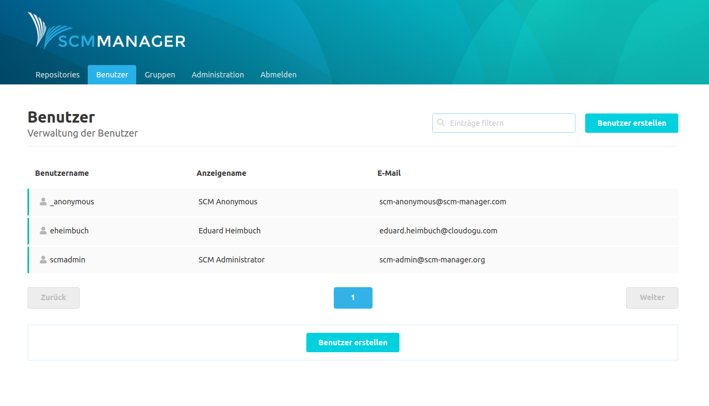
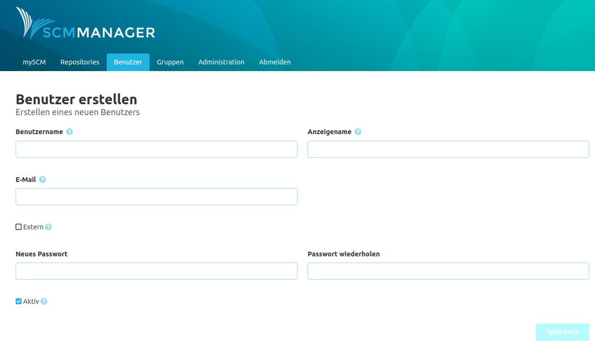
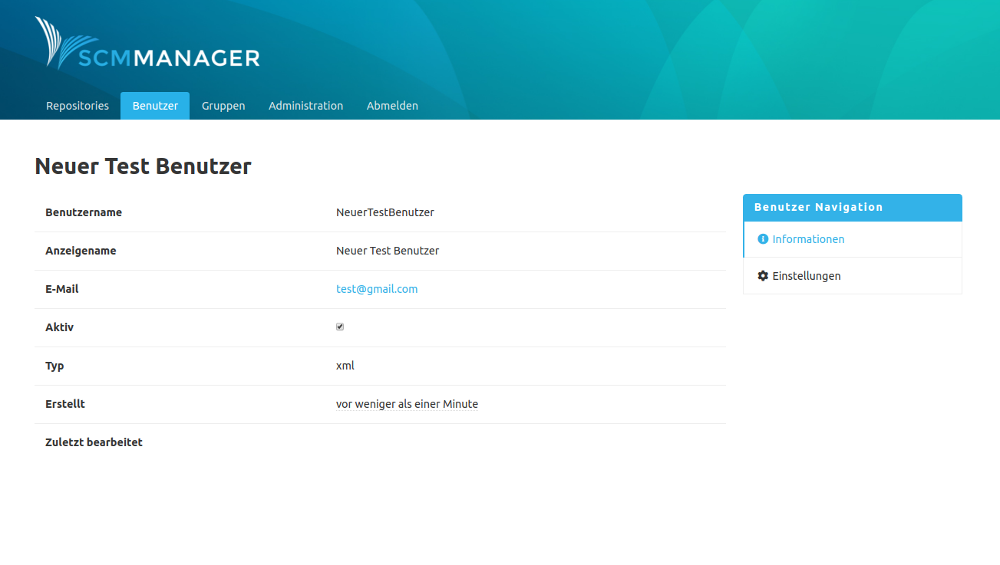
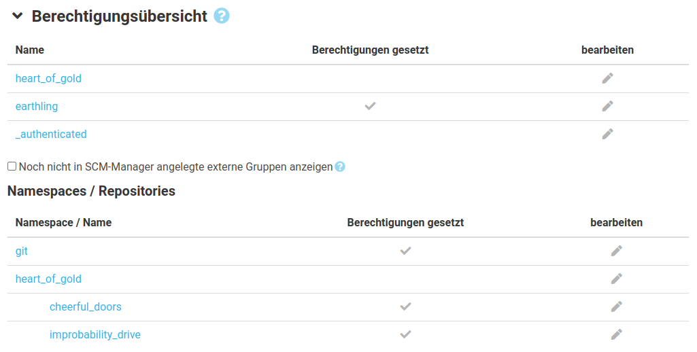

<!--- AppendLinkContentStart -->
Der Bereich Benutzer umfasst alles, was auf einen einzelnen Anwender und dessen Berechtigungen herunterzubrechen ist.

* [Einstellungen](settings/)
<!--- AppendLinkContentEnd -->

### Übersicht
Auf der Benutzer Übersichtsseite wird eine Liste der existierenden Benutzer angezeigt. Durch Klicken auf einen Benutzer gelangt man zu dessen Detailseite. Über die Schaltfläche "Benutzer erstellen" können neue Benutzer angelegt werden.

### Benutzer erstellen
Mithilfe des "Benutzer erstellen"-Formulars können neue Benutzer im SCM-Manager angelegt werden. Neue Benutzer haben noch keine Berechtigungen und sollten direkt nach dem Anlegen konfiguriert werden.

### Benutzer Detailseite
Die Detailseite eines Benutzers zeigt die Informationen zu diesem an. 

Über den "Aktiv"-Marker sieht man, ob dies ein aktivierter Benutzer des SCM-Managers ist. Wird ein Benutzer auf inaktiv gesetzt, kann er sich nicht mehr am SCM-Manager anmelden.
Die Checkbox `Extern` zeigt an, ob es sich um einen internen Benutzer handelt oder der Benutzer von einem Fremdsystem verwaltet wird.

### Berechtigungsübersicht
Am unteren Ende der Detailseite kann für einen Benutzer eine Berechtigunsübersicht geladen werden.
Diese Übersicht listet alle Gruppen, denen der Benutzer im SCM-Manager zugewiesen ist.
Hat sich der Benutzer bereits mindestens einmal angemeldet, so werden darüber hinaus auch alle
Gruppen berücksichtigt, die durch externe Berechtigungssysteme (wie z. B. LDAP oder CAS) mitgegeben
wurden. Gruppen mit konfigurierten Berechtigungen sind mit einem Haken markiert.
Externe Gruppen, die im SCM-Manager noch nicht angelegt sind, können separat gelistet werden.

Darunter werden alle Namespaces und Repositories gelistet, bei denen für den Benutzer oder
eine seiner Gruppen eine Berechtigung konfiguriert ist.

Die einzelnen Einstellungsseiten für die Berechtigungen können direkt über die Stifte angesprungen
werden. Bei bisher noch nicht bekannten Gruppen können diese direkt erstellt werden.

