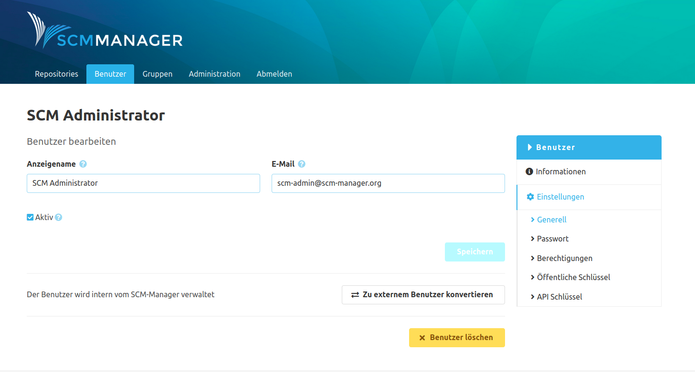
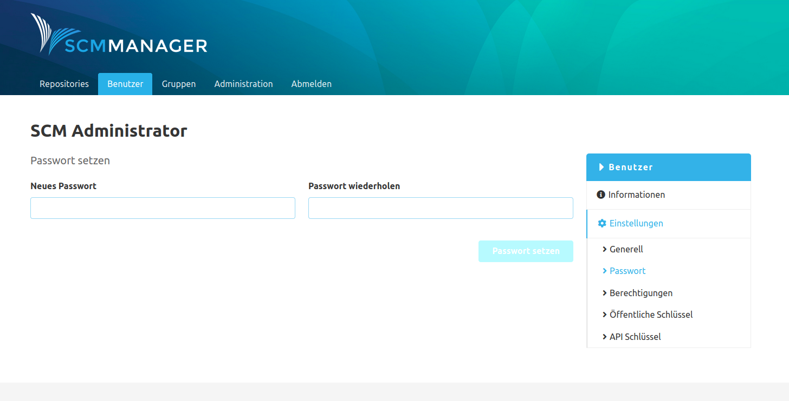
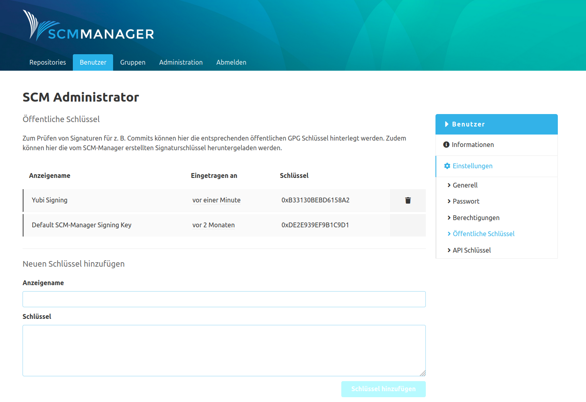

### Generell
In den generellen Einstellungen des Benutzers können der Anzeigename, die E-Mail-Adresse, der "Extern"-Status und der Aktivitätsstatus des Kontos editiert werden.

Wird ein interner Benutzer zu einem externen Benutzer konvertiert, wird das SCM-Manager Passwort des Benutzers entfernt. Soll ein externer Benutzer zu einem internen Benutzer umgewandelt werden, wird nach einem neuen Passwort für diesen Benutzer gefragt.

Über die Schaltfläche unten kann der Benutzer auch komplett gelöscht werden. Dieser Vorgang kann nicht rückgängig gemacht werden.

### Passwort
Unter dem Eintrag "Passwort" kann das Login-Passwort des Benutzers geändert werden. Falls ein Benutzer sein Passwort selbst ändern möchte, kann er das machen indem er sich einloggt und ganz unten in der Fußzeile der Seite auf seinen Namen klickt. Dann gelangt er in die Kontoeinstellungen kann unter anderem ein neues Passwort vergeben.

### Berechtigungen
Hier werden die globalen (nicht-Repository-bezogenen) Berechtigungen für einen Benutzer konfiguriert.
Für die einzelnen Rechte sind Tooltips verfügbar, welche Auskunft über die Auswirkungen der jeweiligen Berechtigung geben.

### Öffentliche Schlüssel
Es können öffentliche Schlüssel (Public Keys) zu Benutzern hinzugefügt werden, um die Changeset Signaturen damit zu verifizieren.

### API Schlüssel
Zur Nutzung in anderen Systemen wie z. B. CI Systemen können sogenannte API Schlüssel erstellt werden. Sie können für den Zugriff auf Repositories über die REST API sowie über SCM-Clients genutzt werden. Weitere Informationen zu API Schlüsseln befinden sich im [Abschnitt Profil](../../profile/#api-schlüssel).

