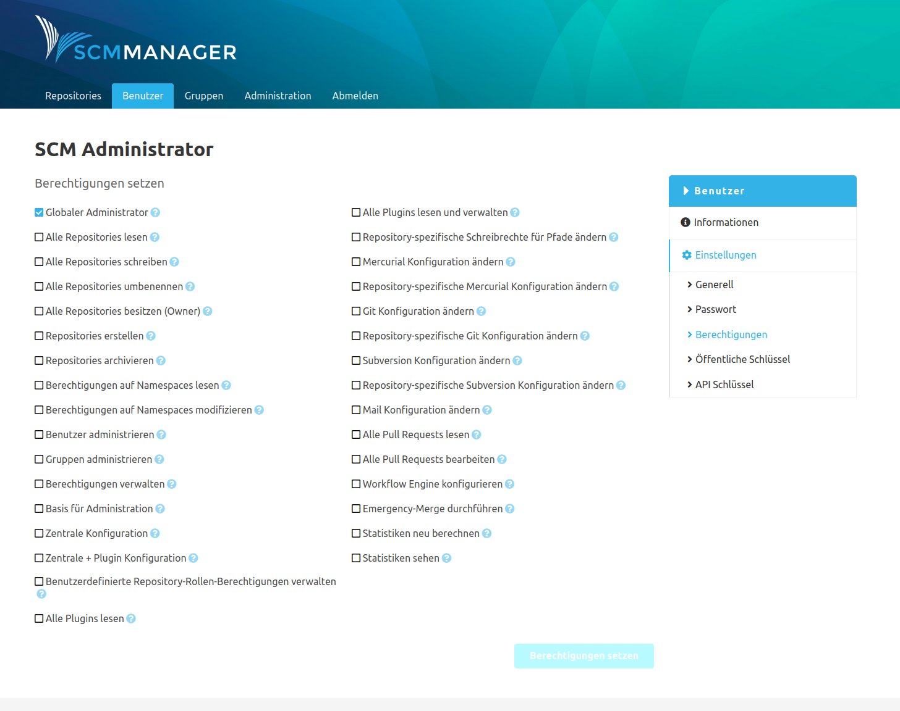

### Generell
In den generellen Einstellungen des Benutzers können der Anzeigename, die E-Mail-Adresse und der Aktivitätsstatus des Kontos editiert werden.

Über die Schaltfläche unten kann der Benutzer auch komplett gelöscht werden. Dieser Vorgang kann nicht rückgängig gemacht werden.

### Passwort
Unter dem Eintrag "Passwort" kann das Login-Passwort des Benutzers geändert werden. Falls ein Benutzer sein Passwort selbst ändern möchte, kann er das machen indem er sich einloggt und ganz unten in der Fußzeile der Seite auf seinen Namen klickt. Dann gelangt er in die Kontoeinstellungen kann unter anderem ein neues Passwort vergeben.

### Berechtigungen
Hier werden die globalen (nicht-Repository-bezogenen) Berechtigungen für einen Benutzer konfiguriert.
Für die einzelnen Rechte sind Tooltips verfügbar, welche Auskunft über die Auswirkungen der jeweiligen Berechtigung geben.

