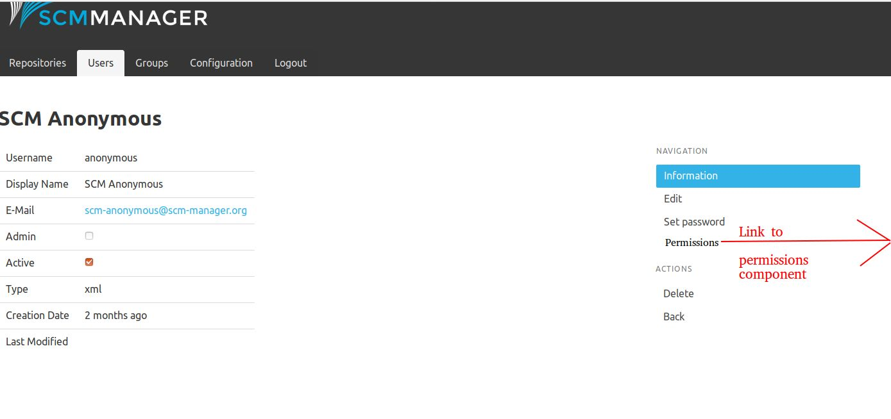
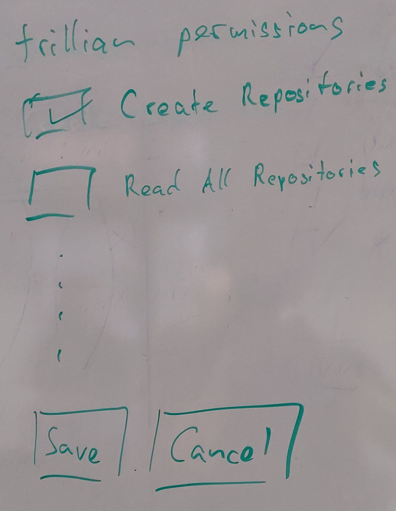
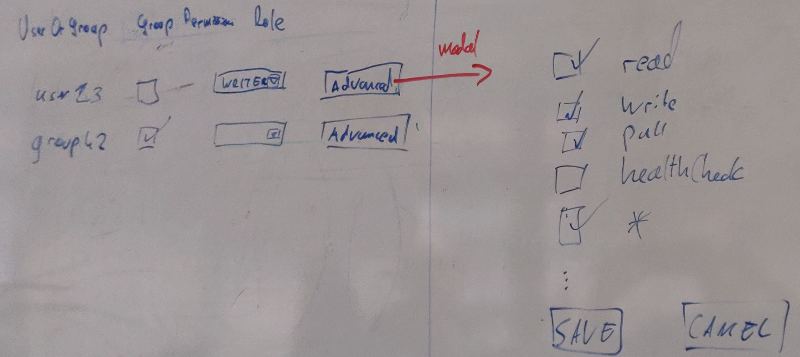

This documents describes a concept for a fine-grained permission managing via the SCMMv2 UI.

## Requirements

* Provide at least the features of SCMMv1 including the scm-groupmanager and scm-userrepo plugins.
* In addition, the permissions on repositories should be more fine-grained, for example a user that does not have the
  permission to check out a repository, but read its meta data.
* An ideal solution would be generic. That is, not implementing explicit features such as the groupmanager or userrepo.  
  SCMMv2 already evaluates fine-grained permissions, so why not allow our users to assign them?

## Technical Foundations

### Status Quo SCMv1

SCMMv1 's permissions are only related to Repositories:

* Users can either have the Permission READ, WRITER or OWNER
* globally (for all repositories) or
* per Repository.

All other permissions are handled by distinguishing administrators from ordinary users.
Admins can do everything, users nothing except for their repository permissions.

Some more permission-related features are added by plugins:

* [scm-groupmanager-plugin](https://bitbucket.org/triologygmbh/scm-groupmanager-plugin/): Allows users to administer groups
* [scm-userrepo-plugin](https://bitbucket.org/sdorra/scm-userrepo-plugin/): Allows users to create repositories

### SCMMv2 Permission fundamentals

SCMMv2 introduces much more fine-grained permission checks under the hood. 
In the code permissions for all kinds of operations are designed as follows:

* convention: `subject:verb:item`,
* for example: `configuration:read:git`
* or `repository:write:42`,  
* where item is the technical ID of the subject. 

In addition, there are permissions that do not relate to an item, which are called "global permissions", for example 
`configuration:list`.

The challenge solved by this document is to provide a concept that allows SCMMv2 users to manage these permissions. 
That is, to assign those permissions to users and groups via the UI or REST API.

### SCMMv2 implementation details

This is not a core part of the concept but might be interesting when implementing it.

SCMM uses the Apache Shiro security framework that allows for assigning permission strings (such as `subject:verb:item`) 
to users. These can also contain wildcards (`*`). For example

* the permission `*` realizes the administrator, 
* `user:read:*` means reading is allowed on all users,
* `user:*:arthur` means all operations are allowed on a specific user.

Then the application can check if a user has a permission. 
For example: 

* Does user admin have the permission for reading repository 42?
* Admin has permission `*`
* So: does he have permission `user:read:*`? Yes!

In order to get a little more type safe, SCM-Manager uses the 
[Shiro-static-permissions (ssp) library](https://github.com/sdorra/Shiro-static-permissions) that scans the classpath for 
annotations such as the following

```java
 @StaticPermissions(
  value = "user",
  globalPermissions = {"create", "list", "autocomplete"},
  permissions = {"read", "modify", "delete", "changePassword"})
```
and creates `*Permissions` classes that contain methods for checking each permission, for example like so

```java
UserPermissions.read().check(id);
```

When a user logs in, all different kinds of permissions (`*` if admin, permissions for repositories, 
from groups, some additional technical permissions such as `autocomplete`, etc.)  are collected and added to the Shiro 
subject in the `DefaultAuthorizationCollector` class.

### SCMMv2 Core permissions

Here are some more examples of permissions existing in SCMMv2 core, at the time of writing.
Look for `@StaticPermissions` and note that there the annotation also declares defaults for `permissions` and `globalPermissions`.

* Configuration
    * Global: list
    * Permissions: read,write
    * Items are global (core), git, hg, config (core plugins) and will be extended by further plugins.
* Plugin 
    * Global: read, manage
* Group
    * Global: create, list, autocomplete
    * Permission: read, modify, delete
* User
    * Global: create, list, autocomplete
    * Permissions:  read, modify, delete, changePassword
    * Items are the user name of dynamically added users
* Repository 
    * Global: create
    * Permissions: read, modify, delete, healthCheck, pull, push, permissionRead, permissionWrite
    * Items are the technical ID of dynamically added repositories

## Repository and global permissions

In order to fulfill the requirements, this concept describes

* how to extend the existing repository permissions to be more fine-grained
* a new dialog to assign global permissions on user or group level

## UI / UX

### Global permissions

The global permission component can be reached from **either user and groups** components navigations. The following mockup 
shows this in the user component:



The layout of the permission component UI could look like this:



The UI 
* queries all available global permissions from the REST API (shiro strings),
* gets the display name and descriptions using the shiro strings as keys (see i18n),
* displays descriptions as tooltips,
* and queries all user/group permissions to populate the check boxes.  

### Repository permissions

The repository permission are already implemented and can be reached via Repositories | Permissions. Right now, it 
allows for assigning the roles READ, WRITE, OWNER as in SCMMv1 (see above). Internally they are mapped to shiro 
permissions (see `PermissionType`).

The UI is extended like so:



#### Existing repository dialog

* queries all available repository permissions (shiro strings) and roles from the REST API,
* queries all user/group permissions of the repository (shiro strings) and aggregates them to roles to populate the 
  drop downs.  
* Note that the permissions are always stored as shiro strings not roles.  
* A new `Advanced` button per user or group entry opens a modal dialog

#### New modal dialog

* The modal dialog shows all available repository permissions (shiro strings)
* via the shiro string the display name and descriptions are found (see i18n),
* displays descriptions as tooltips,
* the individual user/group permission of the repo are used to populate the check boxes 

## REST API

Note that the examples here are not specified in HAL/HATEOAS for brevity.

### Global permissions

Assigning global permissions must be implemented for **either user and groups**!
Both use the same available permissions.

The following shows user as an example.

#### Available global permissions

* URL: `/globalPermissions`
* HTTP Method: GET
* Payload example: 

```json
{
  "permissions": [
        "configuration:read:git",
        "configuration:write:git",
        "configuration:read",
        "configuration:write",
        "plugin:read",
        "plugin:write",
        "group:read",
        "user:read",
        "repository:read"
    ]
}
```

#### Assigned global permissions

* URL: `/users/{id}/permissions/`
* HTTP Method: GET/PUT
* Payload example: 

```json
{
  "permissions": [
        "configuration:read:git",
        "configuration:write:git",
        "configuration:read",
        "configuration:write",
        "plugin:read",
        "plugin:write",
        "group:read",
        "user:read",
        "repository:read"
    ]
}
```

### Repository permissions

#### Available repository permissions

* URL: `/repositoryPermissions` (similar to `/repositoryTypes`)
* HTTP Method: GET
* Payload example: 

```json
{
  "roles": [
    {
      "name": "Reader",
      "verbs": [ "read", "pull" ]
    },
    {
      "name": "Owner",
      "verbs": [ "*" ]
    }
  ],
  "verbs": [ "read", "pull",  "push", "..", "*" ]
}
```

#### Assigned repository permissions

Already implemented in `PermissionRootResource`. Needs to be adpated from roles (`WRITE`) to shiro permissions 
(`repository:read:42`). 

* URL: `/repositories/{namespace}/{name}/permissions`
* HTTP Method: GET
* Payload example: 

```json
{
  "permissions": [
    {
      "name": "trillian",
      "permissions": [ "read", "pull" ],
      "groupPermission": false
    },
    {
      "name": "owners",
      "permissions": [ "*" ],
      "groupPermission": true
    }
  ]
}
```

This example shows the user `trillian`  having the `READER` role and the group `owners` having the `OWNER` role. 
Note that 
* the `*` permission also implies all new permissions (e.g. defined by plugins or added in future versions)
 and therefore has different semantics as listing all currently available permissions.
* the permissions passed to the REST API correspond to the verbs of the repository permission. It is stored as 
   `repositories:<verb stored via REST API>:<ID of the repository identified by namespace and name>`. 
* GET also returns links to individual URIs (e.g. `/repositories/{namespace}/{name}/permissions/trillian`) that can be 
  used for updating permissions via PUT requests.
* On PUT, the REST API needs to **validate** that each entry in `permissions` does not contain `:`!  
  Otherwise we might allow for "permission injection", allowing to set permissions on other or all repositories.

## Java API

The biggest technical challenges for this concept are the questions:

* Where do we get the available permission from?
* How do we assign these permissions? 
* How are these permissions evaluated?

Where each questions needs to be answered for 

* global and
* repository

permissions.

### Global permissions


In order to implement this for global permissions an existing mechanism of SCM-Manager can be used: 
The `SecuritySystem`, implemented by the `DefaultSecuritySystem`. 

#### List available permissions

The `DefaultSecuritySystem` reads all `permissions.xml` files from classpath, which also works for plugins (see 
[Proof Of Concept](https://bitbucket.org/sdorra/scm-manager/commits/4ed74bf266106c48db77d21558452b0c968884cb?at=feature/global_permissions#chg-scm-plugins/scm-git-plugin/src/main/resources/META-INF/scm/permissions.xml)).

These can be queried using `securitySystem.getAvailablePermissions()`.

For SCMMv2 we could extend this mechanism by

* simplifying the `permissions.xml` to contain only `<permission><value>`, because `<display-name>` and `<description>` 
  need to be internationalized, see i18n.
* extend the `ssp library` to generate `permissions.xml` files from `@StaticPermissions` annotations.
  The annotations should be extended to support a list of permissions that are not written to `permissions.xml` 
  (e.g. `user:autocomplete`)

#### Assign permissions

The `SecuritySystem` also provides means to assign, store and load permissions to users or groups using Shiro string
 permissions like so: 

```java
AssignedPermission groupPermission = new AssignedPermission("configurers", true,"configuration:*");
securitySystem.addPermission(groupPermission);
AssignedPermission userPermission = new AssignedPermission("arthur", "group:*");
securitySystem.addPermission(userPermission);
log.info("All permissions: {}", securitySystem.getAllPermissions()); // Contains the permissions just added
```

See also the [Proof Of Concept](https://bitbucket.org/sdorra/scm-manager/src/4a88315d8f3ce0ad9a7c428da1081fb7e4967fe3/scm-webapp/src/main/java/sonia/scm/api/v2/resources/GlobalPermissionPocResource.java?at=feature/global_permissions).

#### Evaluating permissions

The evaluation of permissions assigned via the `SecuritySystem` is already implemented in the 
`DefaultAuthorizationCollector`.

#### Dynamically add new items to available permissions

Adding items (e.g. new users) dynamically during runtime is not implemented by the `SecuritySystem` and in order to 
keep this simple we do not plan to support it, yet. See considered alternatives.

### Repository Permissions

For repository permissions we need to implement a new mechanism for discovering available permissions .
Assigning is already implemented (on role level, e.g. `WRITE`), which needs to be adapted to shiro permission level 
(e.g. `repository:read:42`).

#### List available permissions

We need to implement a new mechanism for discovering available permssions. Let's call it `RepositoryPermissionResolver`.
It can work similar to the `DefaultSecuritySystem` (see global permissions). It reads all `repository-permissions.xml`
 files from classpath, which makes it extensible for plugins.

This obsoletes the `PermissionType` enum.
 
```xml
<permissions>
  
  <permission>read</permission>
  <permission>write</permission>
   
   <role>
        <name>WRITER</name>
        <permission>read</permission>
        <permission>pull</permission>
        <permission>push</permission>
   </role>
</permissions>  
```

#### Assign permissions

This is already implemented in `RepositoryManager`s. Needs to be adapted from roles (`WRITE`) to shiro permissions 
(`repository:read:42`). 

#### Evaluating permissions

Same here: Already implemented in `DefaultAuthorizationCollector`. Needs to be adapted from roles to shiro permissions.

### The Admin flag/role

In addition to the fine-grained permission management described in this concept, we could just keep the admin flag 
(or role) that add the permission `*` to a user.
It's already implemented and a well-known concept from SCMMv1.

### Permission for managing permissions

Once permissions can be managed, an additional permission is necessary that answers the question: Who is allowed to 
manage permissions?

This permission has to be checked before permissions are read or written. It should be implemented in the 
`DefaultSecuritySystem`, instead of the `assertIsAdmin()` method. 

For now, it is sufficiently to create a `Permission` permission (using `@StaticPermissions`) with global verbs `read` 
and write. That is, 

* `permission:read`
* `permission:write`

## i18n

Internationalization can be handled using the following conventions:

* All permission i18n are described in `plugins.json` (also for core), see [i18n for Plugins](../plugins/i18n-for-plugins)
* That way the UI for users and groups can find all the translation in the same file
* Convention for i18n keys: `permissions.<shiro-String>`, containing `displayName` and `description` each.

Example:

```json
{
  "permissions": {
    "repository:read": {
      "displayName": "All Repositories (read)",
      "description": "Read access to all repositories"
    }
  }
}
```

## Group Manager Plugin

One shortcoming of limiting the global permission concept to verbs (not items) is that the functionality of the 
`scm-groupmanager-plugin` is not included.
That is, we need to migrate our implement it for SCMMv2. Most likely it's less effort to implement a new plugin, 
because we need a new SCMMv2 UI and can use the SecuritySystem` to set the `group:*:<id>`.

The following needs to be implemented:

* UI (core): Provide an extension point in the groups UI Navigation
* UI: Use the extension point to add link to new dialog for adding group managers
* UI: New Dialog similar to the repository permission dialog that allows for adding user as group managers
* REST API for CRUD of group admins
* Extend the available group plugins by a permission `group:manage` permission (`permission.xml`) including i18n in 
  `plugins.json`.
* Check if the user has this permission! Unfortunately this cannot be done with `GroupPermissions` (generated via ssp),
  but via `SecurityUtils.getSubject().checkPermission(permission);`
* For storing the permission, make use of the `SecuritySystem` to set the `group:*:<id>` permissions.


## Considered alternatives

This chapter documents some other approaches that were considered but rejected and the reasons for rejecting them.

* Manage subject, verbs *and* items.  
  This is the most flexible approach from a user perspective and SCMMv2 provides a mechanism for evaluating permissions 
  on the fine-grained `subject:verb:item` level, why not allow our users to make use of it?   
  The [first approach of this concept](https://bitbucket.org/sdorra/scm-manager/wiki/commits/4af3c47d7cce530e3707bb1915b7b269ebb692cc)
  followed this approach, but it was considered to cause to much effort during implementation. So we decided to keep it
  more simple, and skip the `item` part. This suffices most use cases. 
* A global permissions page (not per user, similar to the Jenkins Matrix Authorization Strategy Plugin).  
  Leads to a crowded UI, when there are a lot of subjects and verbs (see Jenkins). When adding items would cause an 
  Microsoft Excel-like UX, which is not desirable.
* Manage only subjects and verbs, not items.  
  Would simplify the UI and reduce the effort but the also the features and would not fulfill our requirements in terms 
  of userrepo or groupmanager plugins. Those could still be implemented separately. Still, as SCMMv2 provides a 
  mechanism for evaluate permissions on the fine-grained `subject:verb:item` level, why not allow our users to make use of it?
   
## Implemented Permissions

This chapter documents the permissions implemented in SCM-Manager core and a lot of plugins that can be assigned to users and groups
using the GUI/API.
Be aware, that this is only a snapshot and may not track each change in a plugin or the core. To get the concrete list of permissions
for a concrete version of the core or a plugin, take a look at the corresponding `permissions.xml`, `repository-permissions.xml` and
`plugins.json` files.

### Global Permissions

| plugin | permission | description |
|--------|------------|-------------|
| core | `repository:read,pull:*` | read all repositories |
| core | `repository:read,pull,push:*` | write all repositories |
| core | `repository:*` | own all repositories |
| core | `repository:create` | Create repositories |
| core | `user:*` | administer users |
| core | `group:*` | administer groups |
| core | `configuration:list` | basic permission for all configuration permissions; needed to see config menu item |
| core | `configuration:read,write:global` | administer core configuration |
| core | `configuration:read,write:*` | administer overall configuration (including all plugins) |
| git | `configuration:read,write:git` | administer global git settings |
| git | `repository:git:*` | administer repository specific git settings |
| hg | `configuration:read,write:hg` | administer global mercurial settings |
| hg | `repository:hg:*` | administer repository specific mercurial settings |
| svn | `configuration:read,write:svn` | administer global subversion settings |
| svn | `repository:svn:*` | administer repository specific subversion settings |
| authormapping | `repository:authormapping:*` | read and modify author mappings for all repositories |
| auth-ldap | `configuration:read,write:ldap` | administer ldap server |
| cas | `configuration:read,write:cas` | administer cas server |
| statistic | `repository:computeStatistics:*` | recompute statistics for all repositories |
| jenkins | `configuration:read,write:jenkins` | administer global jenkins server |
| jenkins | `repository:jenkins:*` | administer repository specific jenkins servers |
| jira | `configuration:read,write:jira` | administer global jira server |
| jira | `repository:jira:*` | administer repository specific jira servers |
| pathwp | `repository:pathwp:*` | administer write protected paths for all repositories |
| branchwp | `repository:branchwp:*` | administer write protected paths for all repositories |
| tagprotection | `configuration:read,write:tagprotection` | administer globally protected tags |
| script | `script:read,modify,execute` | read, modify and execute scripts |
| webhook | `configuration:read,write:webhook` | administer web hooks |
| webhook | `repository:webhook:*` | administer web hooks for all repositories |
| redmine | `configuration:read,write:redmine` | administer global redmine server |
| redmine | `repository:redmine:*` | administer repository specific redmine servers |
| notify | `repository:notify:*` | administer notify settings for all repositories |
| support | `support:information` | read support relevant information |
| support | `support:information,logging` | read support relevant information and enable trace log |
| mail | `configuration:read,write:mail` | administer mail server |
| groupmanager | `group:manage:*` | assign group managers |
| ssh | `user:readAuthorizedKeys:*` | read authorization keys for all users |
| ssh | `user:readAuthorizedKeys,writeAuthorizedKeys:*` | configure authorization keys for all users |

### Repository Permissions

| plugin | verb | description |
|--------|------|-------------|
| core | `read` | read metadata of repository |
| core | `modify` | modify metadata of repository |
| core | `delete` | delete repository |
| core | `pull` | pull/checkout repository |
| core | `push` | push/commit to repository |
| core | `permissionRead` | read permissions of repository |
| core | `permissionWrite` | modify permissions for repository |
| core | `*` | change everything for repository ("owner") |
| git | `git` | administer git settings for repository |
| hg | `hg` | administer mercurial settings for repository  |
| svn | `svn` | administer subversion settings for repository  |
| review | `createPullRequest` | create pull requests |
| review | `readPullRequest` | read pull requests |
| review | `commentPullRequest` | write comments in pull requests and delete/edit own comments |
| review | `modifyPullRequest` | edit/delete pull requests and comments |
| review | `mergePullRequest` | merge/reject pull requests |
| authormapping | `authormapping` | modify author mappings |
| jenkins | `jenkins` | administer jenkins server for repository |
| jira | `jira` | administer jira server for repository |
| pathwp | `pathwp` | administer write protected paths for repository |
| redmine | `redmine` | administer redmine server for repository |
| notify | `notify` | administer notify settings for repository |
| branchwp | `branchwp` | administer write protected paths for repository |
| webhook | `webhook` | administer web hools for repository |

### Repository Roles

The verbs for roles are merged internally, so that a resulting role will have all verbs specified by any plugin.
Mind that a `OWNER` has overall permissions, including all possible permissions for all plugins.

| plugin | role | verbs |
|--------|------|-------|
| core | `READ` | `read`, `pull` |
| core | `WRITE` | `read`, `pull`, `push` |
| core | `OWNER` | `*` |
| review | `READ` | `readPullRequest` |
| review | `WRITE` | `createPullRequest`, `readPullRequest`, `commentPullRequest`, `mergePullRequest` |
| statistic | `READ` | `readStatistics` |
