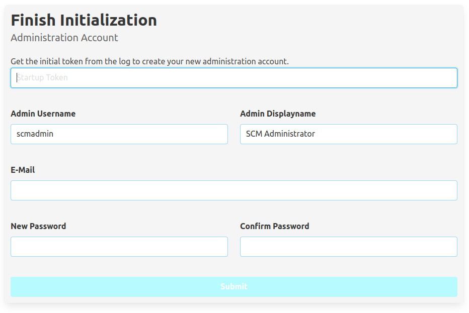
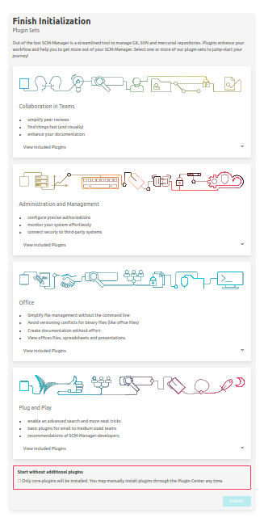

# First Startup

On first startup, you have to create the initial administration user. Therefore, you need the token from the log.
This log looks something like this:

```
2021-06-22 09:19:43.166 [main] [          ] WARN  sonia.scm.lifecycle.AdminAccountStartupAction - ====================================================
2021-06-22 09:19:43.166 [main] [          ] WARN  sonia.scm.lifecycle.AdminAccountStartupAction - ==                                                ==
2021-06-22 09:19:43.166 [main] [          ] WARN  sonia.scm.lifecycle.AdminAccountStartupAction - ==    Startup token for initial user creation     ==
2021-06-22 09:19:43.166 [main] [          ] WARN  sonia.scm.lifecycle.AdminAccountStartupAction - ==                                                ==
2021-06-22 09:19:43.166 [main] [          ] WARN  sonia.scm.lifecycle.AdminAccountStartupAction - ==              LAh8BzNE68y2fj8Hj9lZ              ==
2021-06-22 09:19:43.166 [main] [          ] WARN  sonia.scm.lifecycle.AdminAccountStartupAction - ==                                                ==
2021-06-22 09:19:43.166 [main] [          ] WARN  sonia.scm.lifecycle.AdminAccountStartupAction - ====================================================
```

When you open the SCM-Manager URL in a browser, you will see the creation form:



Enter the token from the log in the first input field and specify the username, the display name, the email address and
the password for the administration user and click the "Submit" button. When the administration user has been created,
the page will reload, and you will see the login dialog of SCM-Manager.

The password of the administration user cannot be recovered.

# Bypass User Creation Form

For automated processes, you might want to bypass the initial user creation. To do so, you can set the initial password
in an environment variable `SCM_WEBAPP_INITIALPASSWORD`. If this is present, a user `scmadmin` with this password will be created,
if it does not already exist. To change the name of this user, you can set this with the environment variable `SCM_WEBAPP_INITIALUSER` in addition.

When set, this also causes the initialization to skip the Plugin Wizard.

# Plugin Wizard

Once an initial user is created, the Plugin Wizard is going to appear.
Here you can select a series of pre-defined sets of plugins to kickstart
your development experience with the SCM-Manager. To install the selected
plugins, the server has to restart once.


