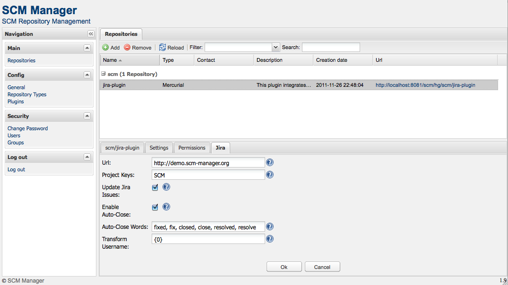
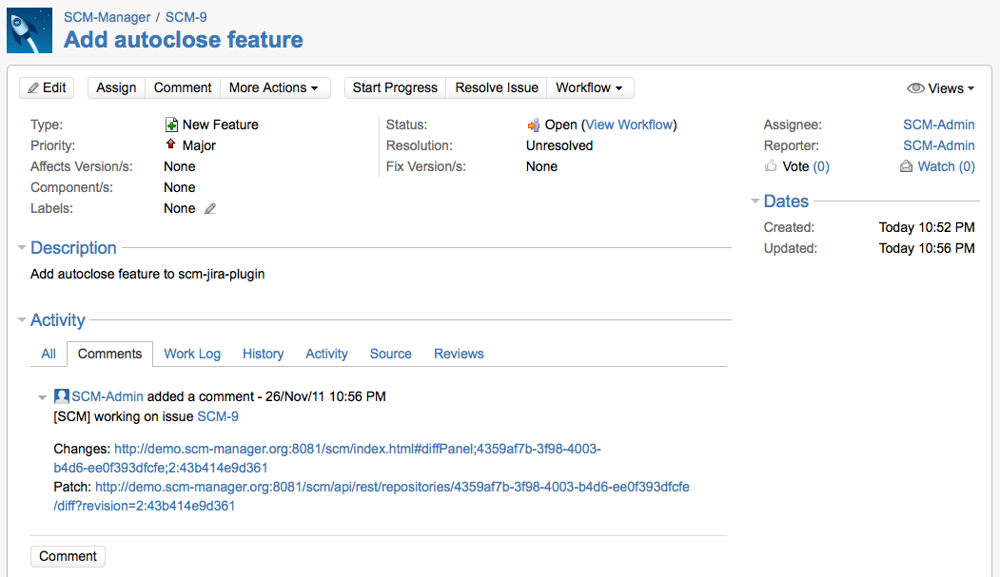

The plugin enables the following features to integrate Atlassian JIRA to
SCM-Manager:

-   Turn issue keys in changeset descriptions to links for jira
-   Updates a Jira issue if the issue key is found in a changeset
    description
-   Close a Jira issue if the issue key and a auto close (close, fix,
    resolve, \...) word is found in the changeset description

### Installation and configuration

1.  Enable remote api calls in jira
    (https://developer.atlassian.com/display/JIRADEV/JIRA+XML-RPC+Overview)
2.  Install scm-jira-plugin over the plugin center in scm-manager
3.  Be sure that your jira installation accepts remote calls

4.  Configure the plugin, select a repository to enable the scm-jira-plugin for this repository

5.  **Note**: For the auto close and update feature it is necessary
    that users have the same names and passwords in SCM-Manager and Jira

### Auto Close Words (Since v. 1.17)

From version 1.17 the plugin offers the possibility of mapping auto
close words with transition that are configured in JIRA.

-   Auto Close Words are a comma separated list
-   Auto Close Words are not case sensitive
-   Auto Close Words can contain spaces
-   If the Auto Close Word is identical to the transition name, just add
    the transition name to the list (e.g. transition name = start
    progress \--\> Auto Close Word = start progress)
-   If the Auto Close Word is different from the transition name you
    have to use the mapping function (e.g. transition name = start
    progress, Auto Close Word = begin \--\> you have to add \'begin =
    start progress\' to the configuration of the plugin.

### Screenshots

