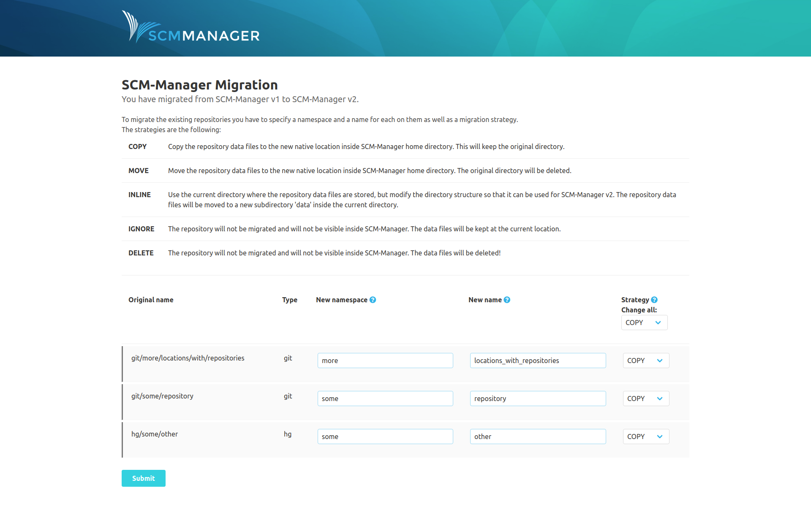

# Preparation

It is possible to upgrade SCM-Manager from version directly to version 3. To do so, some changes have to be made according the home directory of the SCM-Manager. So before you start, **make sure that you have an up to date backup of your SCM home folder!**

Before the migration process can be started, the last running version of SCM-Manager had to be (at least) 1.60. Data of older versions cannot be migrated automatically. If this is the case, you can stop version 1 and start a version 3 SCM-Manager (make sure that you have configured the same SCM home folder).
 
# Repository migration
 
When SCM-Manager starts for the first time, you have to choose how to migrate your existing repositories. The background of this is the following:

While in version 1 of SCM-Manager the repositories were stored in a directory according to their type (`git`, `hg` or `svn`) and their name, from version 2 on the directory is independent of the type and name. Therefore, a repository is no longer named with an arbitrary number of name parts devided by slashes (`/`), but it has a namespace and a name (both of which must not contain slashes). The namespace should be used to group your repositories (for example you can use this to distinguish between the types of repositories like *git* and *hg* like version 1 or to assign them to different projects or users).

To specify the new names (and namespaces), the SCM-Manager version 3 starts a migration wizard when it is first started with a home directory of a version 1 SCM-Manager. You can see an according message in the log:

```
2019-12-05 14:01:35.109 [main] [          ] INFO  sonia.scm.update.MigrationWizardModule - ==========================================================
2019-12-05 14:01:35.110 [main] [          ] INFO  sonia.scm.update.MigrationWizardModule - =                                                        =
2019-12-05 14:01:35.110 [main] [          ] INFO  sonia.scm.update.MigrationWizardModule - =             STARTING MIGRATION SERVLET                 =
2019-12-05 14:01:35.110 [main] [          ] INFO  sonia.scm.update.MigrationWizardModule - =                                                        =
2019-12-05 14:01:35.110 [main] [          ] INFO  sonia.scm.update.MigrationWizardModule - =   Open SCM-Manager in a browser to start the wizard.   =
2019-12-05 14:01:35.110 [main] [          ] INFO  sonia.scm.update.MigrationWizardModule - =                                                        =
2019-12-05 14:01:35.110 [main] [          ] INFO  sonia.scm.update.MigrationWizardModule - ==========================================================
```

You can open this wizard in an internet browser using the URL of your installation (eg. http://localhost:8080/scm/). 



In the figure you can see an example of the page. We tried to guess meaningful names, but for sure you want to make some changes here. Beside choosing new namespaces and names you have to select a migration strategy for each repository. The strategies are described on the page as follows:

|Strategy|Action|
|---|---|
|*COPY*	|Copy the repository data files to the new native location inside SCM-Manager home directory. This will keep the original directory.|
|*MOVE*	|Move the repository data files to the new native location inside SCM-Manager home directory. The original directory will be deleted.|
|*INLINE*	|Use the current directory where the repository data files are stored, but modify the directory structure so that it can be used for SCM-Manager v2. The repository data files will be moved to a new subdirectory 'data' inside the current directory.|
|*IGNORE*	|The repository will not be migrated and will not be visible inside SCM-Manager. The data files will be kept at the current location.|
|*DELETE*	|The repository will not be migrated and will not be visible inside SCM-Manager. The data files will be deleted!|

The probably most safe strategy (but also the most costly) is *COPY*. The old folder of the repository will be kept and all data will be copied to the new default folder (so this also is the default). *MOVE* and *INLINE* are more efficient. When you have a lot of repositories, maybe you will take the chance to clean them up and *IGNORE* or even *DELETE* old stuff.

# Migration of other data

For version 2 of SCM-Manager we introduced a new way to store data for repositories. We did our best to migrate old data like settings in plugins, so that nothing will be lost during update. What we did **not** do is to automatically install the new versions of your plugins. When you start your new instance, you will get a clean instance. You can install your new plugins from the administration page. Any plugin related data or settings will be migrated automatically.

# Manual plugin installation

If however you have to install plugins manually (for example because you cannot log in without the LDAP plugin), you can download them from the [plugins section](https://scm-manager.org/plugins/#categories) on our homepage. The download can be found in the "Releases" section of each plugin. Just store the `smp` file in the `plugin` directory of your SCM home and restart your server.

# Huge number of repositories

If you have more than 100 Repositories to migrate, you may have to adapt some configuration and increase the limit of jetty form keys. You can do this by setting the `maxFormKeys` and `maxFormContentSize` in your `conf/config.yml` file. You have to add the keys at top level of the yaml file:

```
# base server config
##  Address to listen 0.0.0.0 means on every interface
addressBinding: 0.0.0.0
port: 8080
contextPath: /scm

## Additions for the huge number of repositories:
maxFormContentSize: 1000000
maxFormKeys: 5000

...
```

The value for `maxFormKeys` should be the count of your repositories * 3 + 10. The `maxFormContentSize` depends on the length of your repository namespace and name, but you should be safe with repository count * 100.
