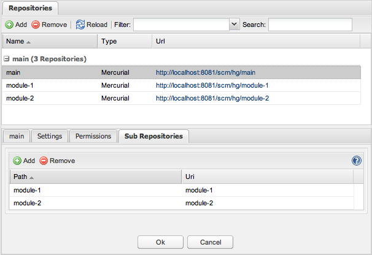

In the following examples i will use the [scm-cli-client](../administration/command-line-client)
to create the repositories, but you can also use the web interface to
create the repositories.

The best way to use subrepositories with scm-manager is the following.
Create a main repository and for each subrepository a mercurial
repository in scm-manager. Than add the subrepositories with the
complete url to the .hgsub file.

```bash
java -jar scm-cli-client.jar create-repository -t hg -n main
java -jar scm-cli-client.jar create-repository -t hg -n module-1
java -jar scm-cli-client.jar create-repository -t hg -n module-2
hg clone http://localhost:8081/scm/hg/main
cd main
echo 'module-1 = http://localhost:8081/scm/hg/module-1' > .hgsub
echo 'module-2 = http://localhost:8081/scm/hg/module-2' >> .hgsub
hg add .hgsub
hg commit -m 'added module-1 and module-2 as subrepositories'
hg push
```

### Mercurial nested repositories

If you already have nested repositories, you have to redirect the nested
repository to a real scm-manager repository. This work is done by the
[scm-hgnested-plugin](https://bitbucket.org/sdorra/scm-hgnested-plugin).
Install the
[scm-hgnested-plugin](https://bitbucket.org/sdorra/scm-hgnested-plugin)
from the plugin-center (requires scm-manager version 1.10 or higher).
Create a repository for the main repository and for each nested
repository. Configure the
[scm-hgnested-plugin](https://bitbucket.org/sdorra/scm-hgnested-plugin)
as shown here:



### Further reading

- <https://bitbucket.org/sdorra/scm-manager/issue/67/add-support-for-mercurial-subrepos>
- <https://www.mercurial-scm.org/wiki/Subrepository>
- <https://www.mercurial-scm.org/pipermail/mercurial-devel/2011-October/034728.html>
