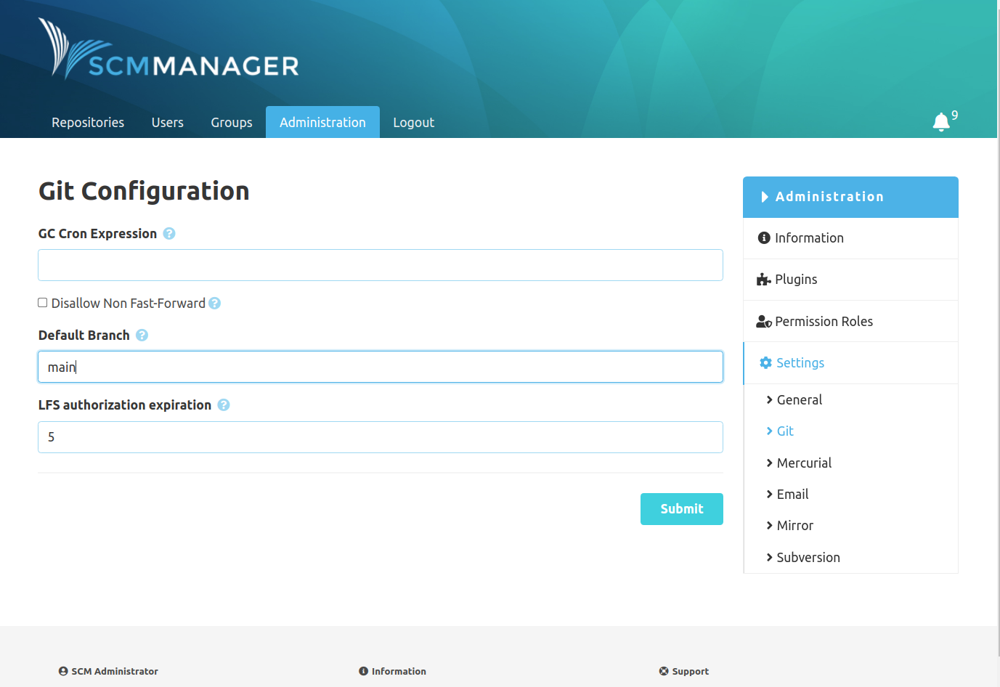

In the git section there are the following git specific settings:

- GC Cron Expression

    If this is set, SCM-Manager will execute a git garbage collection matching the given
    [cron expression](https://en.wikipedia.org/wiki/Cron#CRON_expression).

- Disable Non Fast-Forward

    Activate this to reject forced pushes that are not fast forwards.

- Default Branch

    The branch name configured here will be used for the initialization of new repositories.
    Please mind, that due to git internals this cannot work for empty repositories (here git
    will always use its internal default branch, so at the time being `master`).

- LFS authorization expiration

    Sets the expiration time of the authorization token generated for LFS put requests in minutes.
    If SCM-Manager is run behind a reverse proxy that buffers http requests (eg. Nginx), this
    should set up to the time, an LFS upload may take at maximum. If you experience errors during
    long-running LFS push requests, this may have to be increased. The default value is 5 minutes.

