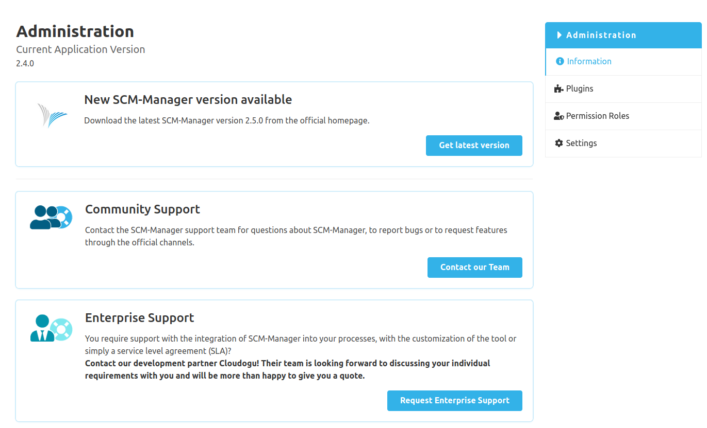

The SCM-Manager instance can be administered in the Administration area. From here, plugins can be managed, permission roles can be defined and adjusted, and settings can be made.

* [Plugins](plugins/)
* [Permission Roles](roles/)
* [Settings](settings/)
* [Git](git/)
* [Troubleshooting](troubleshooting/)

### Information
On the information page in the administration area you can find the version of your SCM-Manager instance and helpful links to get in touch with the SCM-Manager support team. If there is a newer version for SCM-Manager, it will be shown with the link to the download section on the official SCM-Manager homepage.

