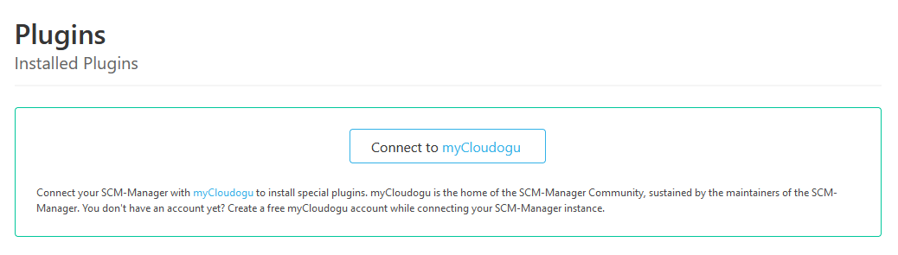
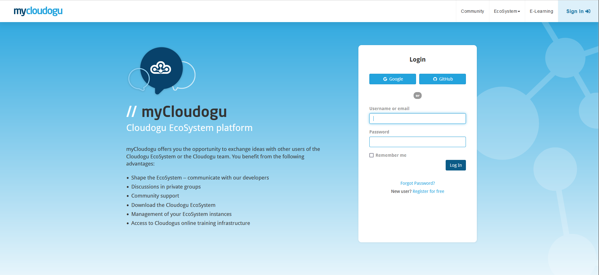
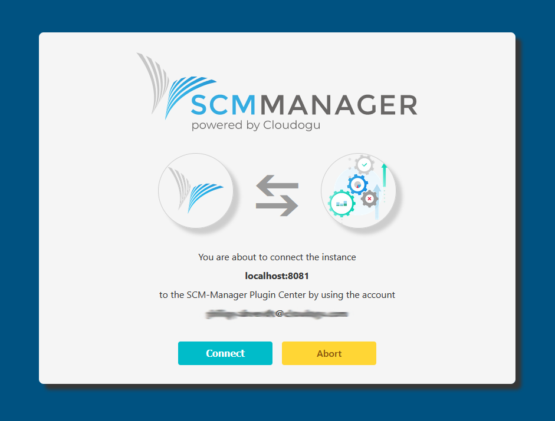
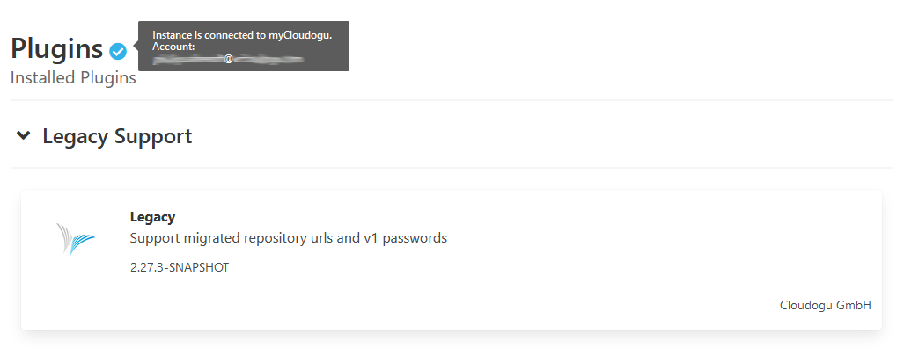
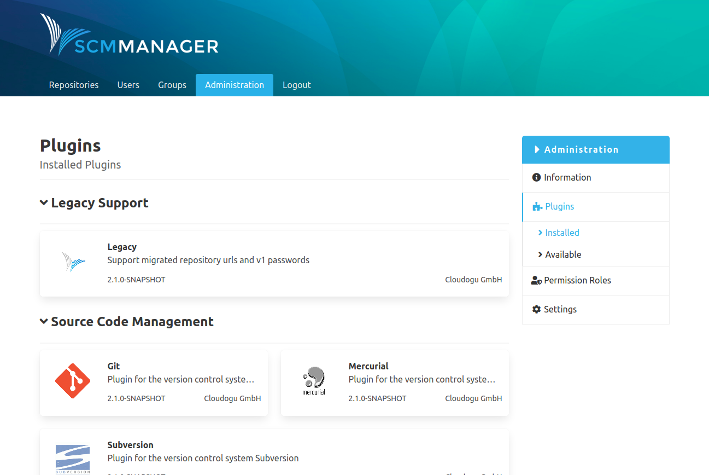
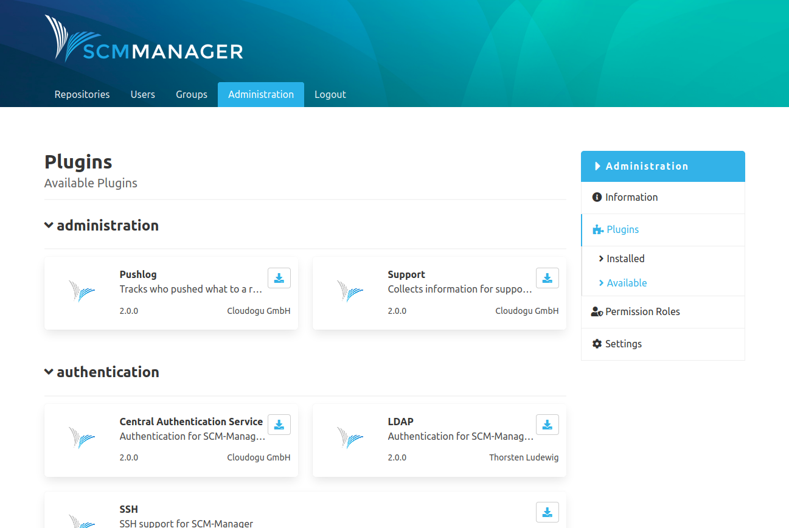

In the plugins section, plugins for SCM-Manager can be managed with the help of the external plugin center. Plugins are distinguished between installed and available plugins. They are grouped based on their main functionality like for example workflow or authentication.

Plugins can be managed by action icons on the tiles. System relevant plugins that come with SCM-Manager by default cannot be uninstalled or updated.

In order for changes to plugins to become effective, the SCM-Manager server needs to be restarted. That can be done after every single action. It is also possible to queue several actions like the installation of a new plugin, updates or the deletion of a plugin and to perform all actions with one restart. If an action (installation, uninstallation, update) for a plugin was performed, the buttons "Execute changes" and "Abort changes"  appear. If you choose to execute  the changes, a popup window that shows the current queue (all actions without a restart) appears. Now the user can decide whether to execute the changes by restarting the server. If there are actions in the queue that are no longer desired, the queue can be emptied with the abort changes button.

### myCloudogu plugins
Some special plugins are only available to instances of SCM-Manager that are connected to myCloudogu. You may connect your instance by clicking the button “Connect to myCloudogu”.
[More details on data processing.](https://scm-manager.org/data-processing)

You will be redirected to a myCloudogu login form. 

If you already have an account you simply log in. Otherwise you can create an account either by using a confederate identity provider (Google or github) or with your email.
After a successful login you will return to the SCM-Manager. Here you can review the instance and account to connect. By clicking the button “Connect” you approve the connection and return to the plugin center. 

Now you can install myCloudogu plugins like basic plugins.

Only one user with sufficient permissions needs to connect the instance with myCloudogu. The myCloudogu plugins can than be installed by every user with suitable permissions.
You can always sever the connection in the plugin center settings in global settings of your instance.

#### What is myCloudogu and why should you create an account?
myCloudogu is not only the home of the SCM-Manager community. You can connect to other users, get help and express feature requests in the forum. 
myCloudogu also serves special plugins to provide more value for our community. In the future myCloudogu will offer exiting plugins developed in cooperation with our partners.
To unlock the full power of SCM-Manager and to hang out with our developers, join [myCloudogu](https://my.cloudogu.com/) for free! 

### Installed
The overview for installed plugins shows all plugins that are currently installed on the SCM-Manager instance. Optional plugins can be uninstalled or updated here.

### Available
The overview of all available plugins shows all plugins that are compatible with the current version of the SCM-Manager instance that are available through the SCM-plugin-center. The plugins can be downloaded by clicking on the icon and will be installed after a restart of the SCM-Manager server.
Special myCloudogu-plugins can be installed the same way if your instance of SCM-Manager is connected to myCloudogu as described above.

