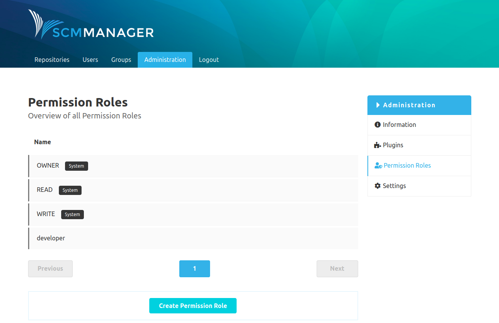

The page "Permission Roles" can be used to create profiles with certain permissions. Each role gets a name and a set of permissions. Roles can be assigned to users and groups for repositories.

There are a few predefined system roles which cannot be changed or deleted.

By clicking on a role you can see the information about it and which permissions the role has. User-defined roles can be edited or deleted at any time.

