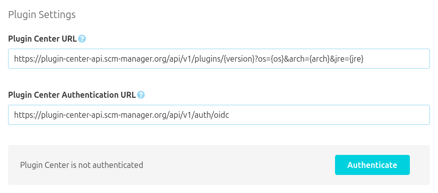
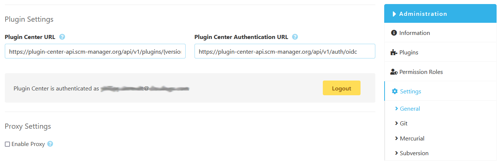
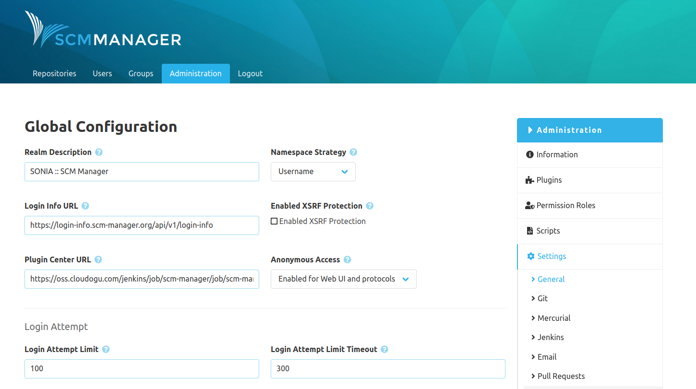

The settings area is where the global configuration of SCM-Manager happens. Many SCM-Manager plugins that need some kind of configuration get an area in the settings. This makes it maximally configurable if required.

### General
#### Realm Description
The field "Realm Description" is used to set the authentication realm for logins with basic authentication.

#### Namespace Strategy
SCM-Manager groups repositories by namespaces. This grouping can be based on different strategies:

* Username: The username of the user that creates the repository is used. 
* Current year: The current year is used.
* Repository type: The type (Git, HG, SVN) is used.
* Custom: The namespace can be freely set when creating the repository.

#### Login Info URL
The login screen of SCM-Manager shows helpful plugins and features. If you want to show your own information in the login screen, you can change the URL here.

#### Enable XSRF Protection
Activate this option to make attacks using cross site scripting (XSS / XSRF) on SCM-Manager more difficult. This feature is still in an experimental state.

#### Plugin-Settings
A plugin center can be used to conveniently manage plugins. If you want to use a plugin center that is not the default one, you only have to change this URL. If SCM-Manager is operated as part of a Cloudogu EcoSystem, the plugin center URL can be changed in the etcd.
If the default plugin center is used, the SCM-Manager may be connected to the cloudogu platform to receive special cloudogu platform-Plugins. Details can be found in the plugin-center documentation.

After the initial setup, the following values are set by default:
```markdown
Plugin Center URL: https://plugin-center-api.scm-manager.org/api/v1/plugins/{version}?os={os}&arch={arch}&jre={jre}
Plugin Center Authentication URL: https://plugin-center-api.scm-manager.org/api/v1/auth/oidc
```


An existing connection between a SCM-Manager and the cloudogu platform may be severed here.


#### JWT settings
Users receive a JWT as an authentication token, after a successful login.
Administrators can configure the amount of hours until a JWT expires.
If the amount of hours get reduced, each created JWT will be invalidated.
This setting will be ignored, if the endless JWT option is set to true in the server `config.yml`.

#### Anonymous Access
In SCM-Manager 2 the access for anonymous access is realized by using an "_anonymous" user. When the feature is activated, a new user with the name "_anonymous" is created. This user can be authorized just like any other user. This user is used for access to SCM-Manager without login credentials.
If the anonymous mode is protocol only you may access the SCM-Manager via the REST API and VCS protocols. With fully enabled anonymous access you can also use the webclient without credentials.

Example: If anonymous access is enabled and the "_anonymous" user has full access on a certain Git repository, everybody can access this repository via command line and the classic Git commands without any login credentials. Access via SSH is not supported at this time.

#### Release Feed Url
The url of the RSS Release Feed for SCM-Manager. This provides up-to-date version information. To disable this feature just leave the url blank.

#### User Converter
Internal users will automatically be converted to external on their first login using an external system. After conversion the users may only log in using the external system.

#### File Search
File paths can be searched inside repositories. For very big repositories, the search may lead to memory issues. In this case, the search function can be disabled here.

#### Fallback Mail Domain Name
This domain name will be used to create email addresses for users without one when needed. It will not be used to send mails nor will be accessed otherwise.

#### Emergency Contacts
The following users will be notified of administrative incidents (e.g. failed health checks).

#### Login Attempt Limit
It can be configured how many failed login attempts a user can have before the account gets disabled. The counter for failed login attempts is reset after a successful login. This feature can be deactivated by setting the value "-1".

#### Login Attempt Limit Timeout
If the deactivation of accounts after too many unsuccessful login attempts is activated. This timeout can be used to set for how long accounts will be disabled.

#### Base URL
The base URL represents the URL that a SCM-Manager instance is available at. The checkbox "Force Base URL" can be used to force redirects to the base URL. If activated, access to this application through different URLs are redirected to the base URL.

Example: The base URL is www.scm.manager.com/scm but there is a second URL www.scm-manager.io/scm. Both URLs point to the same SCM-Manager instance. If the redirect to the base URL is forced, access via www.scm-manager.io/scm is redirected directly to www.scm-manager.com/scm.

**Warning:** If the base URL is set to a faulty value and "Force Base URL" is activated, the SCM-Manager instance is no longer accessible. 

#### Proxy Settings
If the SCM-Manager instance is behind a proxy server, the connection can be configured here.



### Mercurial
The global settings for the source code management tool "Mercurial", hg for short, can be configured here.

### Git
The global settings for the source code management tool "Git", can be configured here.

### Subversion
The global settings for the source code management tool "Subversion", svn for short, can be configured here.
