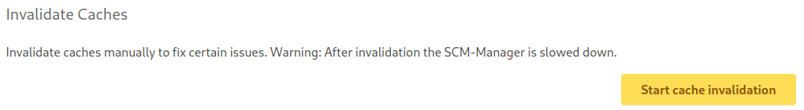
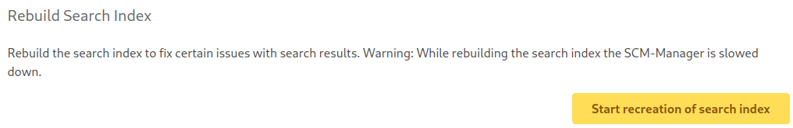

## Invalidate Caches

To improve the performance of the SCM-Manager, many data is additionally kept as cache in the main memory. It can happen
that the data in the cache is not invalidated, although the underlying data has changed. This can lead to errors, e.g.
some views could try to load a repository that has already been deleted. To solve this problem manually, administrators
can invalidate the internal cache of the SCM-Manager. However, this operation can slow down the SCM-Manager for a while.
Accordingly, this operation should only be used with caution.

The option for invalidation can be found in the general settings:

## Rebuild Search Index

Under high server load, it can happen that the search index is not invalidated correctly, although the underlying data
has changed. Accordingly, it can happen that outdated data is found. This can lead to errors in the search component. To
solve this problem manually, administrators can have the search index rebuilt. However, this operation is time-consuming
and could slow down the SCM-Manager for a while. Accordingly, this operation should only be used with caution. If the
problems with the search only affect one repository, then administrators should instead have the search index for this
repository rebuilt. This can be done in the general settings of the repository.

The option for rebuilding can be found in the general settings:

