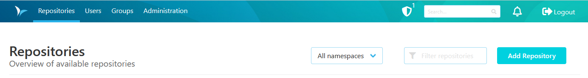
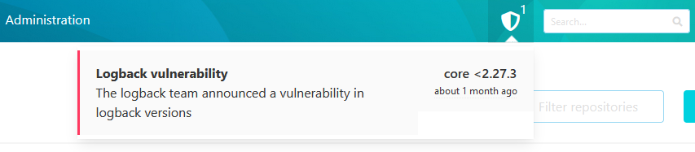

Alerts are used in SCM-Manager to alarm users and administrators to vulnerabilities in SCM-Manager. 

Current alerts are indicated by a shield icon with a number to the left of the search box in the header of SCM-Manager. The number indicates the number of issues. If there are no known vulnerabilities for the installed version SCM-Manager the icon will not be displayed.

Hovering or clicking the shield icon opens a list of issues. Issues are linked to a related resource. This resource usually describes the vulnerability and steps to address the issue.

Alerts are removed as soon as the issue is resolved in your instance, e.g. by upgrading to a fixed version.

