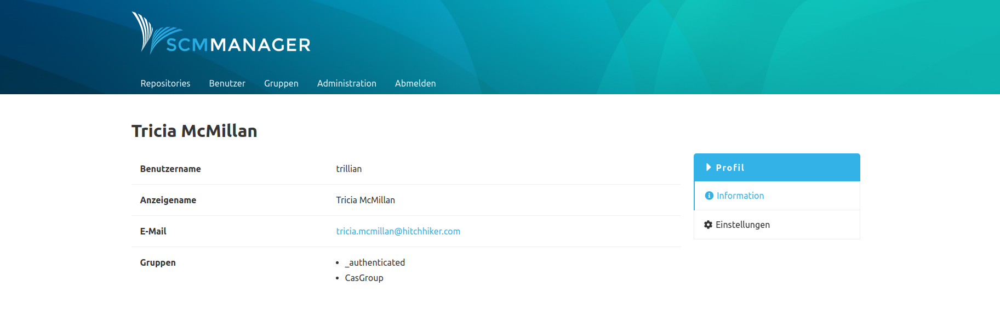

Users who log on to SCM-Manager via a CAS (Central Authentication Service) instance receive additional groups from the CAS. External groups can be used without manual creation in SCM-Manager. However, adding the groups marked as "external" has the advantages that the groups created are taken into account in the auto-completion and authorizations can be assigned directly to an external group. Which external groups are assigned to a user can be read out on the profile page of a registered user.

See example: CasGroup

