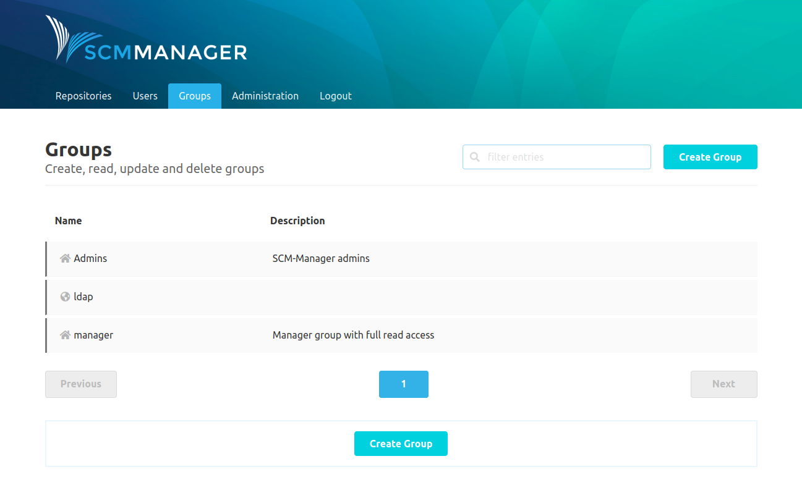
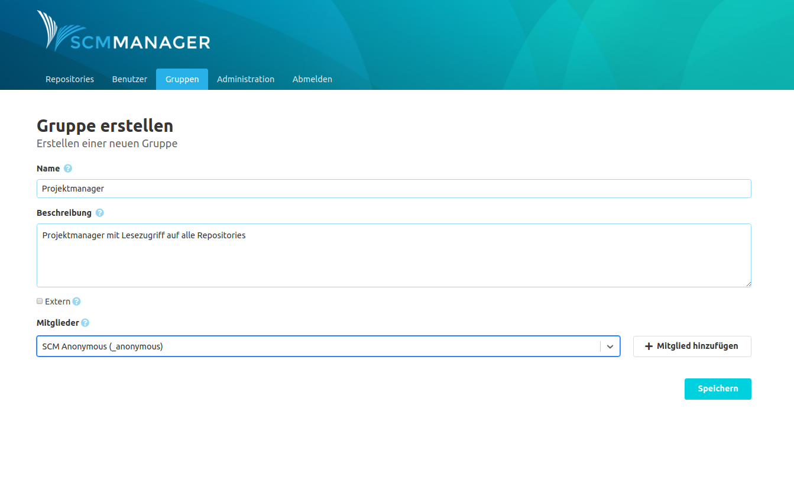
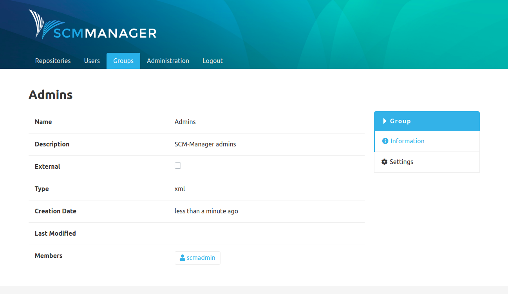

The group area includes everything that can be broken down into a group of several users and their authorizations.

* [External groups (CAS)](external/)
* [Settings](settings/)

It is possible to create groups in SCM-Manager to not authorize each user individually. Groups can be authorized and can contain an unlimited number of users.

### Overview
The groups overview shows a list of all groups that are existing. Groups are distinguished between internal and external groups. Internal groups are groups that were created in SCM-Manager and are indicated by a house icon. External groups were created for [external sources](./external.md) like a connected LDAP instance and have a world icon.

### Create a Group
Groups only require a name. It is also possible to add members to a group directly when they are created. Only the permissions of the group have to be added afterwards.

### Group Information
The information page of a group shows the meta data as well as the members.

### Group for all Users
To apply settings or permissions for all regular users (that is all accounts except anonymous),
one can use the group `_authenticated`. This group is an implicit one and every user account except `anonymous` is a
member of this group.
