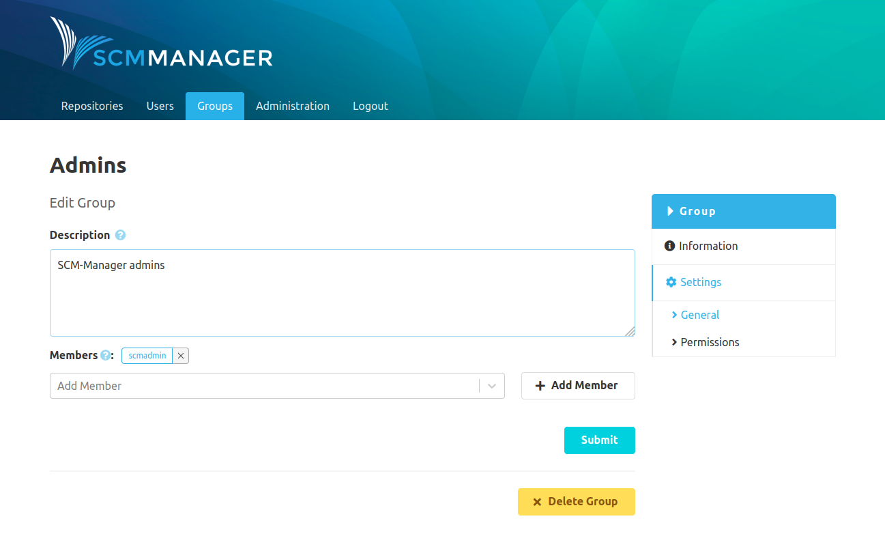
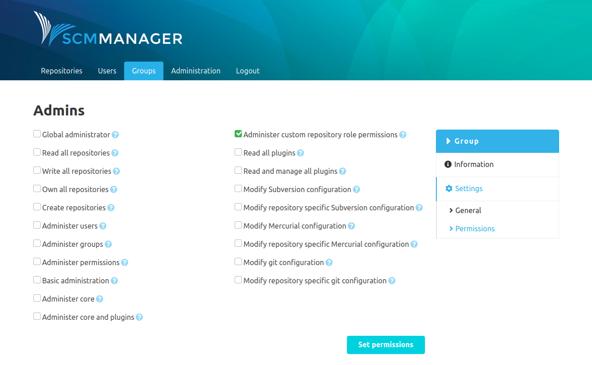

### General
In the general settings page of a group the description and the members can be edited. Also, it is possible to delete a group here. The deletion is irreversible.

### Permissions
Groups can get global and repository-specific permissions. All permissions of a group are valid for all its members. 

