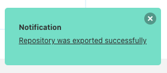
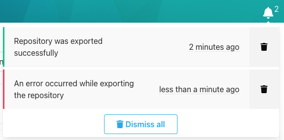

Notifications are used in SCM Manager to indicate the completion of long-running processes
or to alert the user about errors and warnings.

Current notifications appear in the form of a toast notification at the bottom right.

The color of the notification indicates the type of message:

* Error (red): An error has occurred.
* Warning (yellow): A problem has occurred
* Successful (green): An action has been successfully completed
* Information (blue): For informational notifications

The messages refer to a page of SCM Manager, which can be accessed by clicking on the text of the notification.
When you have read the message, you can close it by clicking on the X in the upper right corner.
The messages can also be reviewed by clicking on the bell icon in the upper right corner.

The number next to the bell icon indicates how many messages have been received.
If you move the mouse over the icon, you can read the messages.
The colored border indicates the type of the message, the date indicates when the message was received
and by clicking on the text you can open the page of the message.

The trash icon can be used to delete a single message.
All messages can be deleted by clicking the "Dismiss all" button.

If there are no messages left, the bell icon will not show a counter anymore.

