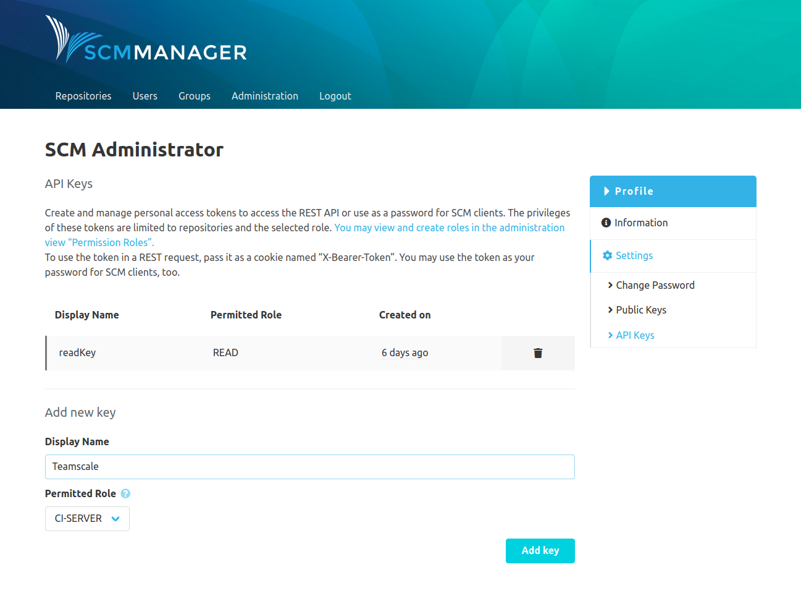

Settings for the active user account can be managed with the link "Profile" in the footer.

## Change password

Here the password for the current account can be changed when it is a local account (when the login is not managed by an
external system). To authorize the change, the current password has to be put first. Then the new password has to be
entered twice.

## Public Keys

To check signatures (for example for commits), gpg public keys can be stored here. Additionally the keys created by
SCM-Manager can be accessed here, too.

## API keys

To access SCM-Manager from other systems like for example CI servers, API keys can be created. They can be used to call
the REST APi and for the access with SCM clients. To create a key you have to specify a display name and a
[role](../admin/roles/). The display name is solely to keep track of your keys. The role limits the permissions granted
when the SCM-Manager is accessed with such a key.

If, for exapmple, an account has write access for a repository and an API key with the role "READ" is created for this
account, this repository can only be accessed read only using this key. Of course it is not possible to extend
permissions. So you cannot create an API key with the role "WRITE" to get write access to a repository, where the
original account has only read access for.



After the creation of a key, it will be displayed **once only**. After the window has been closed, the key cannot be
retrieved or reconstructed again.


### Example for the REST API

To use an API key for the REST API, the key has to sent as a cookie with the name “X-Bearer-Token”. Using curl, this
can be done like this:

```
curl -v localhost:8081/scm/api/v2/repositories/ -H "Cookie: X-Bearer-Token=eyJhcGlLZXlJZCI...RTRHeCJ9"
```

### Access with an SCM-Client

For access with an SCM client like `git`, `hg`, or `svn` the key simply has to be passed as a password.
