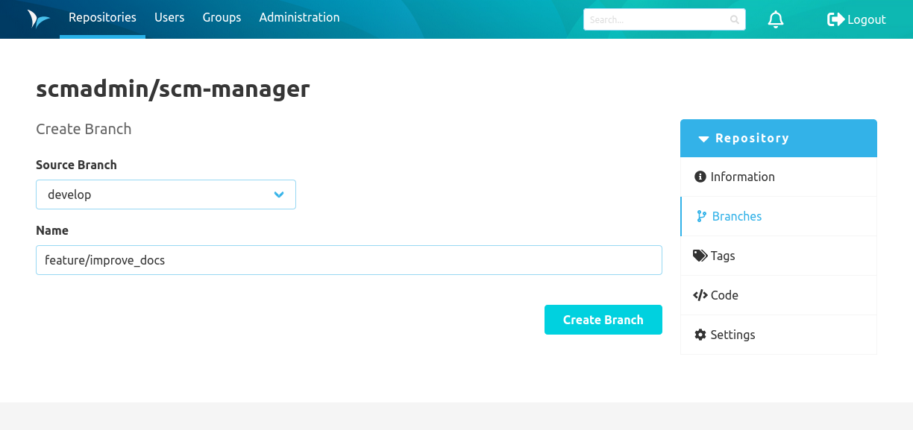
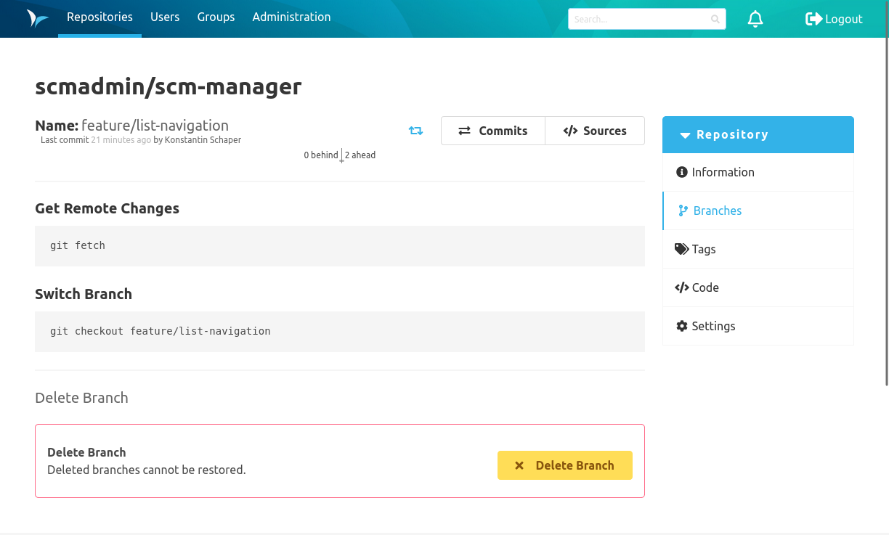

### Overview
The branches overview shows the branches that are already existing. By clicking on a branch, the details page of the branch is shown.
Branches are split into two lists: Branches whose last commits are at most 30 days older than the head of the default
branch are listed in "Active Branches". The older ones can be found in "Stale Branches".
Besides the date of the last change and the author of this change, you will also find the ahead/behind commits related to the default branch.
With this information you can see how far this branch has diverged from the default branch.

The tag "Default" shows which branch is currently set as the default branch of the repository in SCM-Manager. The default branch is always shown first when opening the repository in SCM-Manager.
All branches except the default branch of the repository can be deleted by clicking on the trash bin icon.

The button "Create Branch" opens the form to create a new branch.

### Create a Branch
New branches can be created with the "Create Branch" form. There, you have to choose the branch that the new branch will be branched from and to provide a name for the new branch. It is not possible to create branches in an empty Git repository.

### Branch Details Page
This page shows some commands to work with the branch on the command line. The number of commits the branch is
ahead/behind the default branch can be found directly beneath the name of the branch.

If the branch is not the default branch of the repository it can be deleted using the action inside the bottom section.

