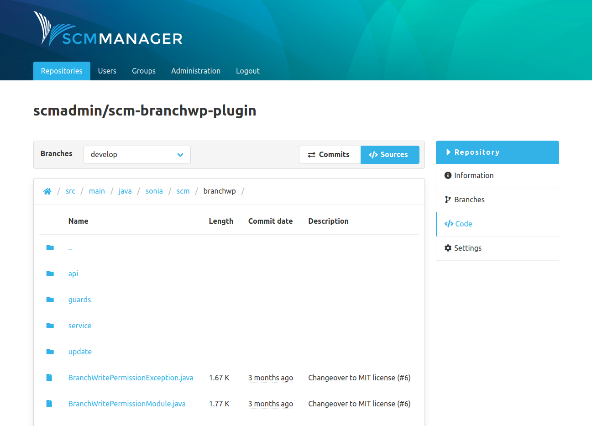
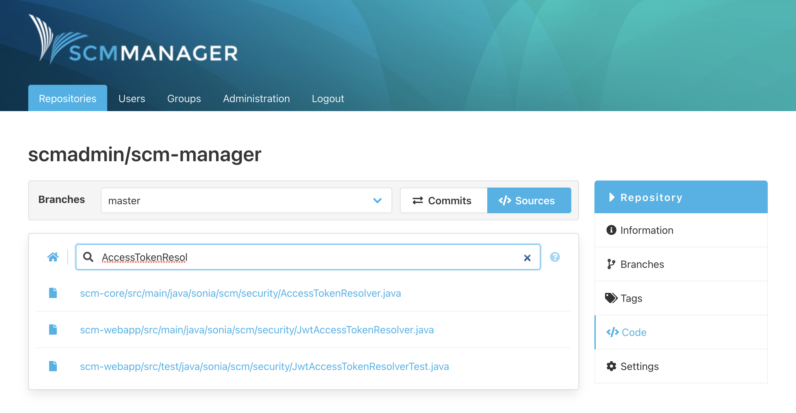
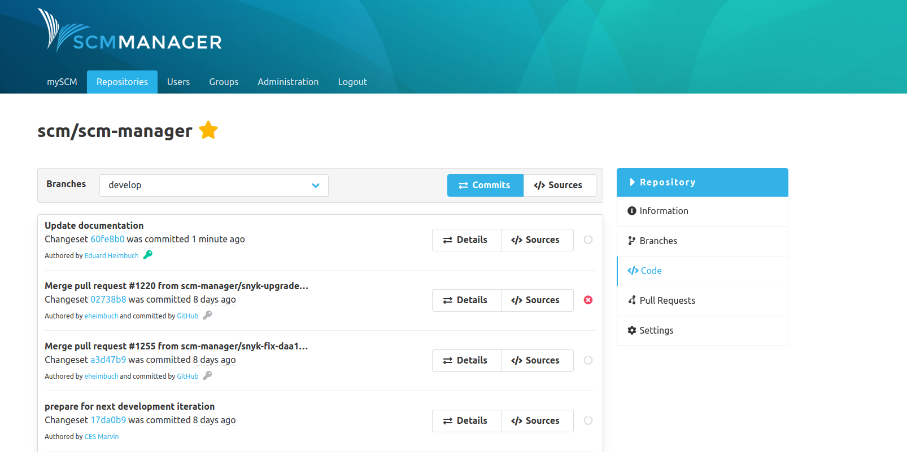
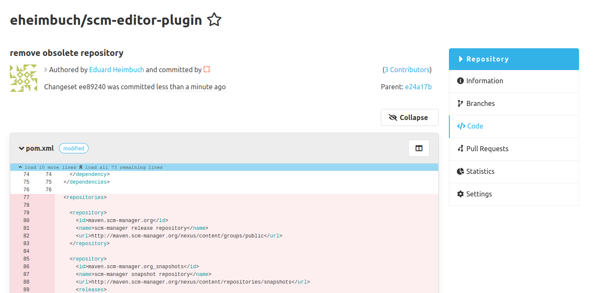
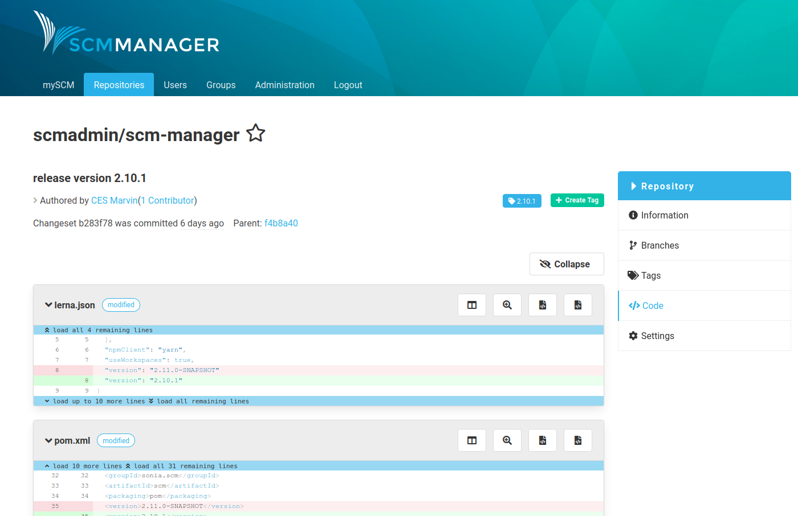
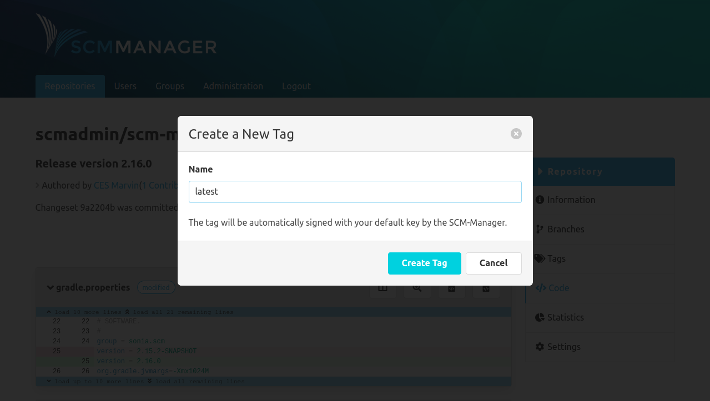
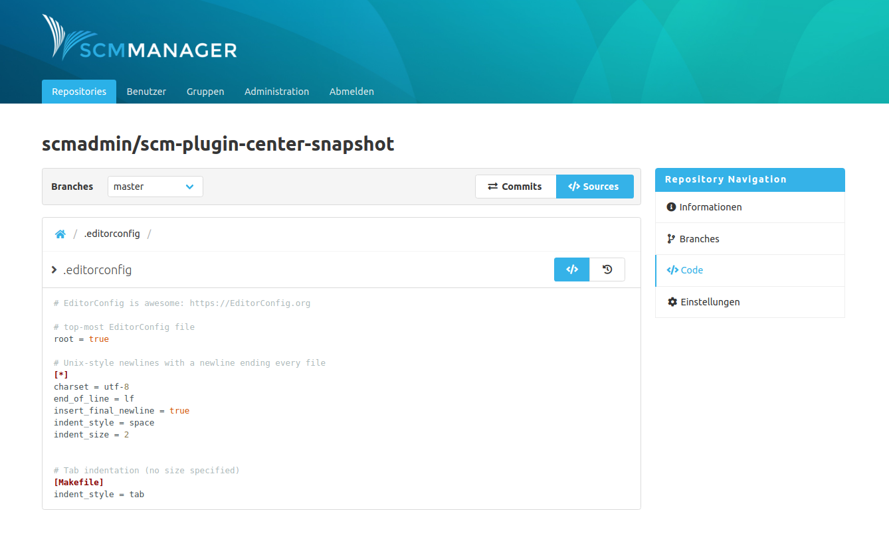
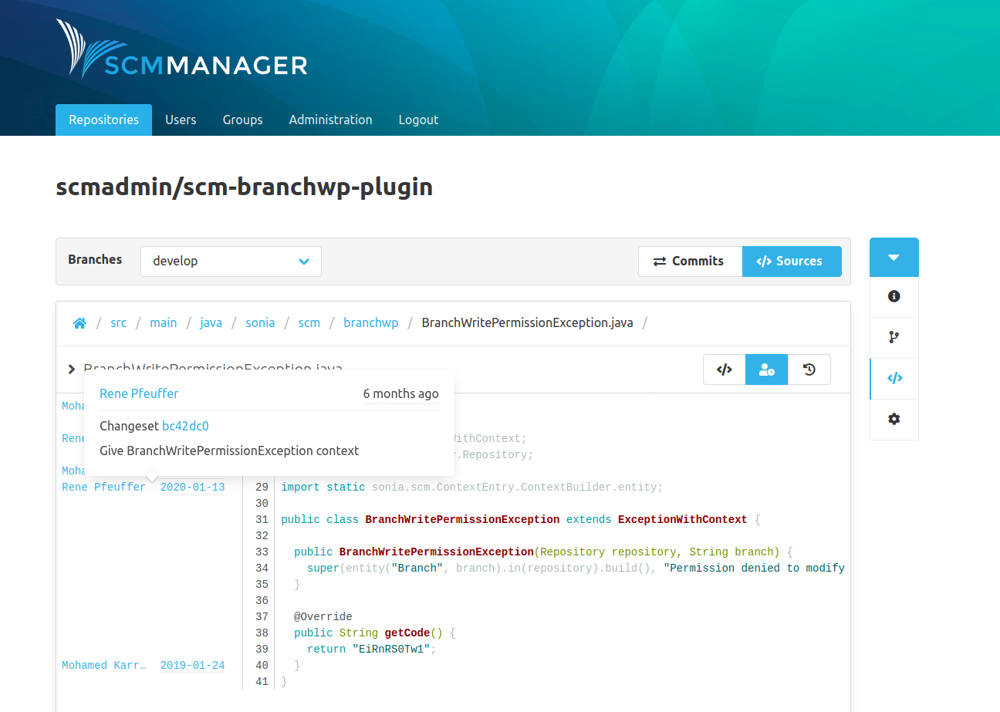
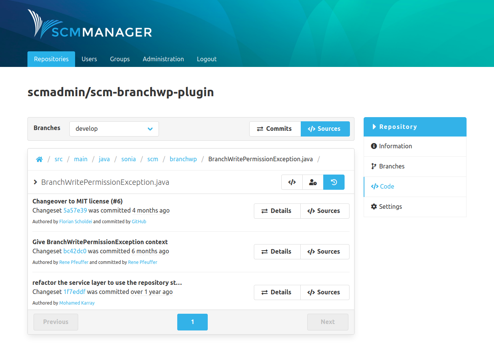

The "Code" section contains all information that refers to the code respectively the content of the repository. At the top of the page is the action bar, which can be used to navigate within the code section.

### Sources
The sources overview shows the files and folders within the repository. If branches exist, it shows the sources for the selected branch.

Below the action bar is a breadcrumb navigation that shows the path of the files that are displayed. By clicking on the different sections of the path it is possible to navigate (back) through the file structure of the repository.

#### Search

To search for a file you can click on the search icon next to the file path.
On the file search page you can enter the text you are looking for.
The search refers exclusively to the file path and
hits in the filename are evaluated higher than hits in the path.
The search starts automatically as soon as more than one character have been entered.
The results are displayed below the text field.

#### Permalink

By clicking the Button on the right-hand side of the breadcrumb navigation, a permalink to the current path is
automatically copied to the user's clipboard.

### Changesets
The changesets/commits overview shows the change history of the branch. Each entry represents a commit. 

The Details button leads to the content/changes of a changeset.

The key icon shows if the changeset was signed. The users can add their public keys to SCM-Manager for signature verification. The green key means that the signature could be verified successfully against an existing public key. The grey key shows that no matching key could be found for the signature. The red key warns you about an invalid (possible faked) signature.

The Sources button leads to the sources overview that shows the state from after this commit.

### Changeset Details
The details page of a changeset shows the metadata (like contributors and the parent changeset) and all changes that are part of the changeset. 
The contributors consist of the authors, co-authors, the committer and the signer. 
The diffs are presented in the well-known format per file with syntax highlighting. 
You can expand the diffs gradually or completely by clicking on the blue bars.

If commit links formatted like "namespace/name@commitId" are used in the changeset description they will be rendered to internal links.
For example the text hitchhiker/HeartOfGold@1a2b3c4 will be transformed to a link directing to the commit 1a2b3c4 of the repository hitchhiker/heartOfGold.

#### Tags

All tags for a changeset are displayed in the top-right corner of the details page.

#### Creating Tags
New tags for a changeset can be created directly on its details page.
Only a name has to be provided that meets the same formatting conditions as branches.

### File Details
After clicking on a file in the sources, the details of the file are shown. Depending on the format of the file, there are different views:

- Image file: The rendered image is shown.
- Markdown file: The rendered markdown is shown. The view can also be changed to a text view that is not rendered. The commit links will also be rendered like in the changeset details view.
- Text based file: The content is shown. If available with syntax highlighting.
- Unsupported formats: A download button is shown.

### File Annotate
Supplements each line of code with the relevant information when and by which author it was last modified. With a hover on the left side a popover with changeset and further information appears.

### File History
In the detailed file view there is a switch button in the upper right corner which allows to switch to the history view. The history shows all commits that changed the file.

