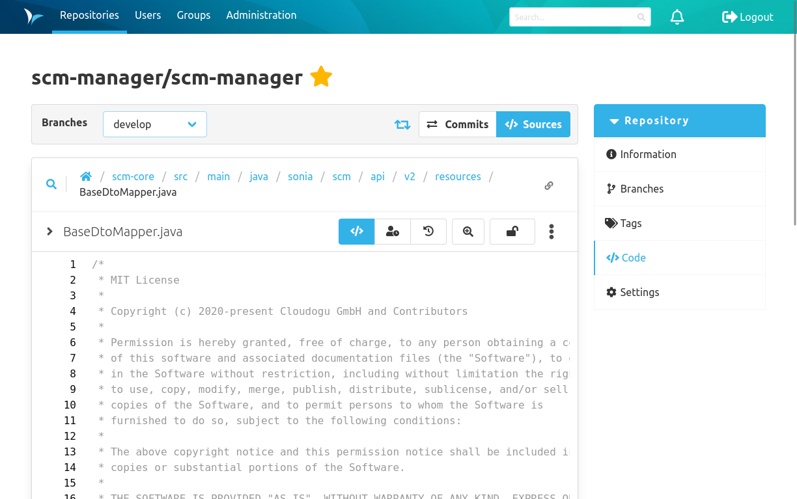
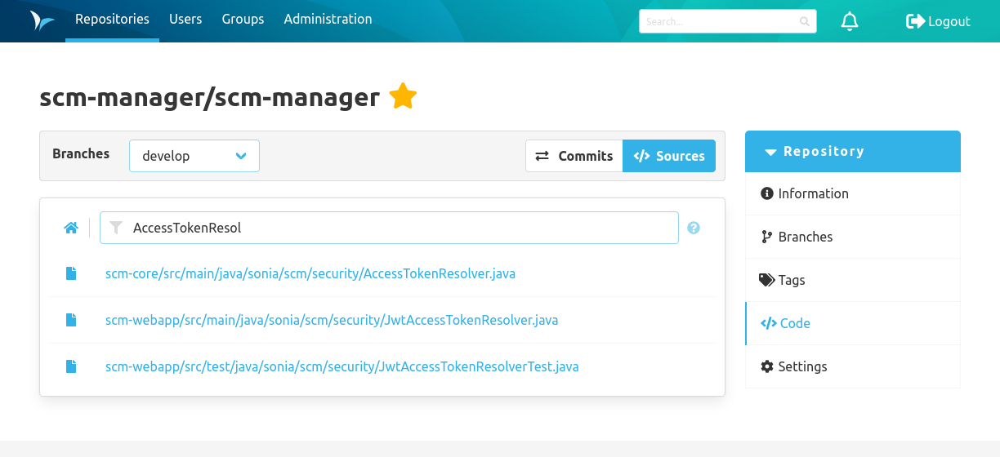
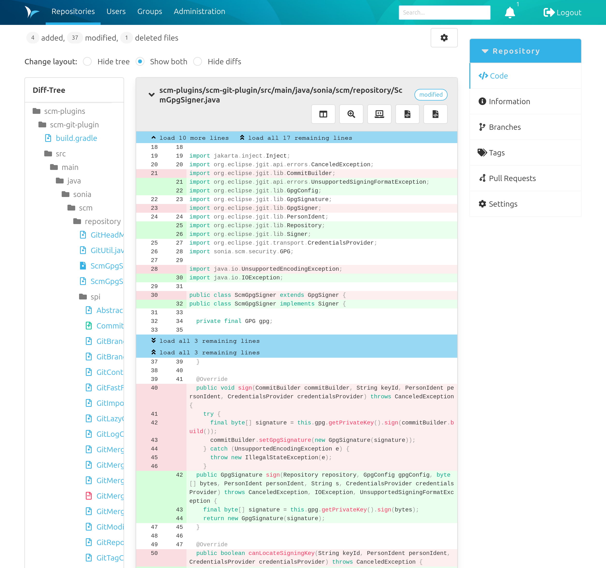
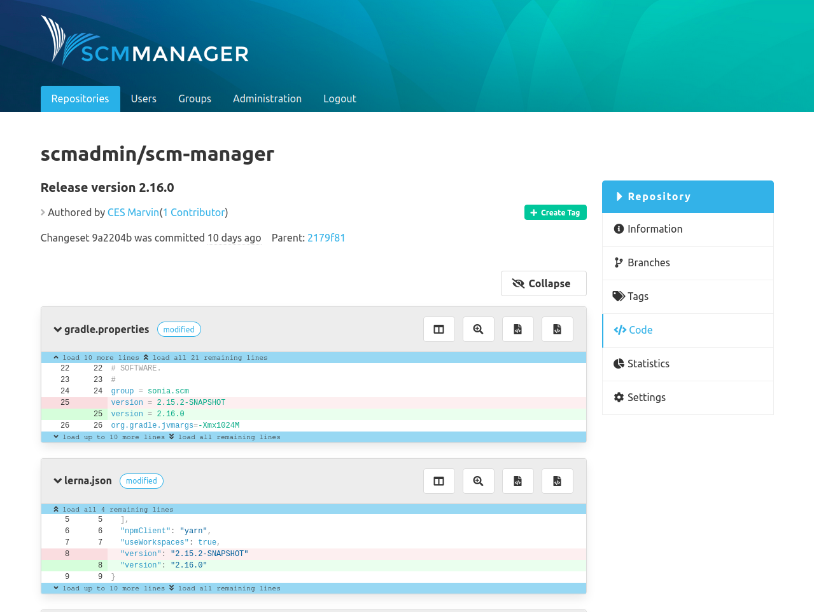

The "Code" section contains all information that refers to the code respectively the content of the repository. At the top of the page is the action bar, which can be used to navigate within the code section.

### Sources
The sources overview shows the files and folders within the repository. If branches exist, it shows the sources for the selected branch.

Below the action bar is a breadcrumb navigation that shows the path of the files that are displayed. By clicking on the different sections of the path it is possible to navigate (back) through the file structure of the repository.

#### Search

To search for a file you can click on the search icon next to the file path.
On the file search page you can enter the text you are looking for.
The search refers exclusively to the file path and
hits in the filename are evaluated higher than hits in the path.
The search starts automatically as soon as more than one character have been entered.
The results are displayed below the text field.

#### Permalink

By clicking the Button on the right-hand side of the breadcrumb navigation, a permalink to the current path is
automatically copied to the user's clipboard.

#### Subrepository

In the code overview, submodules (Git), subrepositories (Hg) and externals (Svn) are marked with an icon of an outlined folder and linked if the url is resolvable.

### Commits
The commits overview shows the change history of the branch. Each entry represents a commit. 

The Details button leads to the content/changes of a commit.

The key icon shows if the commit was signed. The users can add their public keys to SCM-Manager for signature verification. The green key means that the signature could be verified successfully against an existing public key. The grey key shows that no matching key could be found for the signature. The red key warns you about an invalid (possible faked) signature.

The Sources button leads to the sources overview that shows the state from after this commit.

### Commit Details
The details page of a commit shows the metadata (like contributors and the parent commit) and all changes that are part of the commit (diffs). 
The contributors consist of the authors, co-authors, the committer and the signer. It depends on the type of the repository
and installed plugins, what types of contributors will be shown and whether they have additional time stamps (like
for example different times for the initial creation of a commit and a later commit time due to cherry-picking in Git). 

On the left there is a files tree that shows every file that has been changed.
To jump to a specific file it is possible to select this file in the tree.
The diffs are presented in the well-known format per file with syntax highlighting. 
You can expand the diffs gradually or completely by clicking on the blue bars.

If commit links formatted like "namespace/name@commitId" are used in the commit description they will be rendered to internal links.
For example the text hitchhiker/HeartOfGold@1a2b3c4 will be transformed to a link directing to the commit 1a2b3c4 of the repository hitchhiker/heartOfGold.

There is a dropdown menu for the commit:
- With the first checkbox you can show and hide the whitespace changes.
- The second checkbox can collapse all diffs.

There are three radio buttons to change the layout in the commit:
- With the first button, only the diffs are displayed.
- The second button shows the diffs and the file tree.
- With the last button, only the file tree is displayed.

Every commit diff has several buttons:
- The first button on the left allows a direct comparison of the changes.
- With the magnifying glass you can view the changes across the width of the window.
- The next button switches spaces and tabs on and off.
- The last button takes you to the source file.

#### Tags

All tags for a commit are displayed in the top-right corner of the details page.

#### Creating Tags
New tags for a commit can be created directly on its details page.
Only a name has to be provided that meets the same formatting conditions as branches.

#### Reverts
Commits within Git repositories provide a "Revert" button at the upper right-hand corner (beneath "Create Tag").

**Note:** The revert button is only displayed on commits with exactly one parent element.
Commits with multiple predecessors (e.g. merge commits) and initial commits without parent cannot be reverted.

After pressing the button and before reverting a commit, you need to first select the branch where it is applied upon.
This selection is already filled out if you reached the commit by the commit overview of a specific branch.

Furthermore, you may type a commit message for the revert. 
It is filled out with a default message; however, it is recommended to choose a reasonable custom message in order to keep the commit history comprehensible.

By pressing "Revert", you're going to be forwarded to the newly created commit including the revert if no error occurs.

### File Details
After clicking on a file in the sources, the details of the file are shown. Depending on the format of the file, there are different views:

- Image file: The rendered image is shown.
- Markdown file: The rendered markdown is shown. The view can also be changed to a text view that is not rendered. The commit links will also be rendered like in the commit details view.
- Text based file: The content is shown. If available with syntax highlighting.
- Unsupported formats: A download button is shown.

### File Annotate
Supplements each line of code with the relevant information when and by which author it was last modified. With a hover on the left side a popover with commit and further information appears.

### File History
In the detailed file view there is a switch button in the upper right corner which allows to switch to the history view. The history shows all commits that changed the file.

