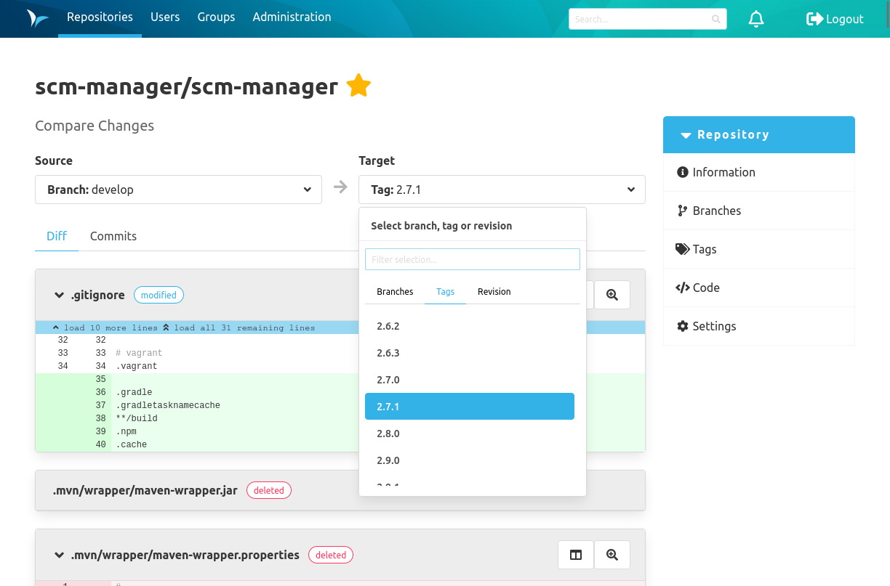

### Compare Branches, Tags and Revisions

In the comparison view, you can see the diffs and commits between two selected repository pointers. Simply select the source and target where you want the comparison to take place.
This is especially useful if you want to see what changes are ahead or behind the default branch in your branch.
You can also see what has changed between two versions.

