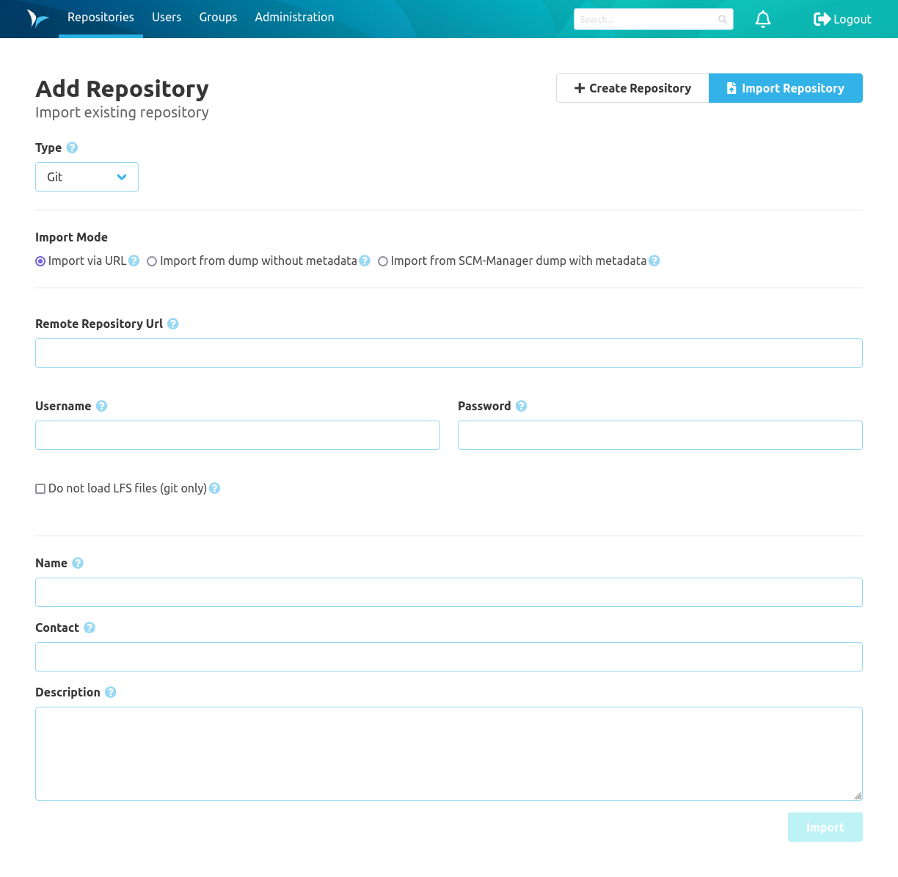

The Repository area includes everything based on repositories in namespaces. This includes all operations on branches, the code and settings.

* [Branches](branches/)
* [Tags](tags/)
* [Code](code/)
* [Compare](compare/)
* [Settings](settings/)

### Overview
The repository overview screen shows all repositories sorted by namespaces.

Using the select box at the top of the page you can restrict the repositories shown for one namespace. Alternatively you can click on one namespace heading to show only repositories of this namespace. The search bar aside the select box can be used to arbitrarily filter the repositories by namespace, name and description.

Clicking the icon on the right-hand side of each namespace caption, you can change additional settings for this namespace. 

### Create a Repository
In SCM-Manager new Git, Mercurial & Subversion (SVN) repositories can be created via a form that can be accessed via the "Create Repository" button. A valid name and the repository type are mandatory.

Optionally, repositories can be initialized during the creation. That creates a standard branch (master or default) for Git and Mercurial repositories. 
Additionally, it performs a commit that creates a README.md. For Subversion repositories the README.md will be created in a directory named `trunk`.

If the namespace strategy is set to custom, the namespace field is also mandatory. The namespace must heed the same
restrictions as the name. Additionally, namespaces that only consist of three digits, or the words "create"
and "import" are not valid. After typing the first characters, existing matching namespaces are suggested which can
be chosen. To create a new namespace, this has to be chosen from the drop down explicitly.

### Import a Repository
Beneath creating new repositories you also may import existing repositories to SCM-Manager. 
Just use the Switcher on top right to navigate to the import page and fill the import wizard with the required information.

Your repository will be added to SCM-Manager and all repository data including all branches and tags will be imported.
In addition to the normal repository import, there is the possibility to import a repository archive with metadata.
This repository archive must have been exported from another SCM-Manager and is checked for data compatibility before
import (the SCM-Manager and all its installed plugins have to have at least the versions of the system the export has
been created on).
If the file to be imported is encrypted, the correct password must be supplied for decryption.
If no password is set, the SCM Manager assumes that the file is unencrypted.

### Repository Information
The information screen of repositories shows meta data about the repository. 
Amongst that are descriptions for the different options on how the repository can be used. 
In the heading you can click the namespace to get the list of all repositories for this namespace.

