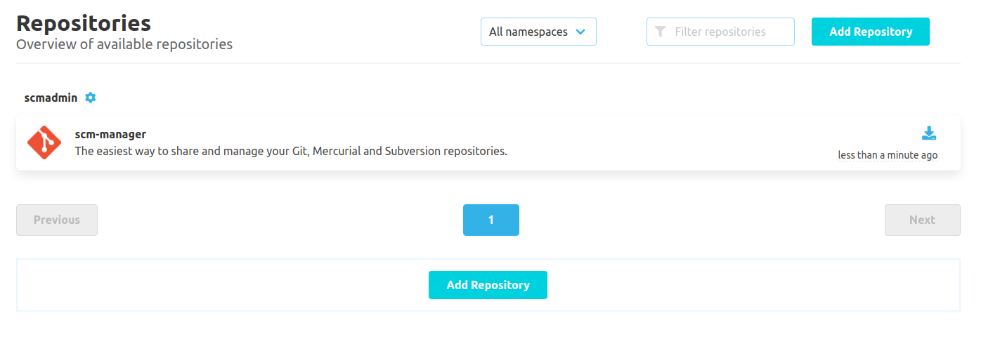
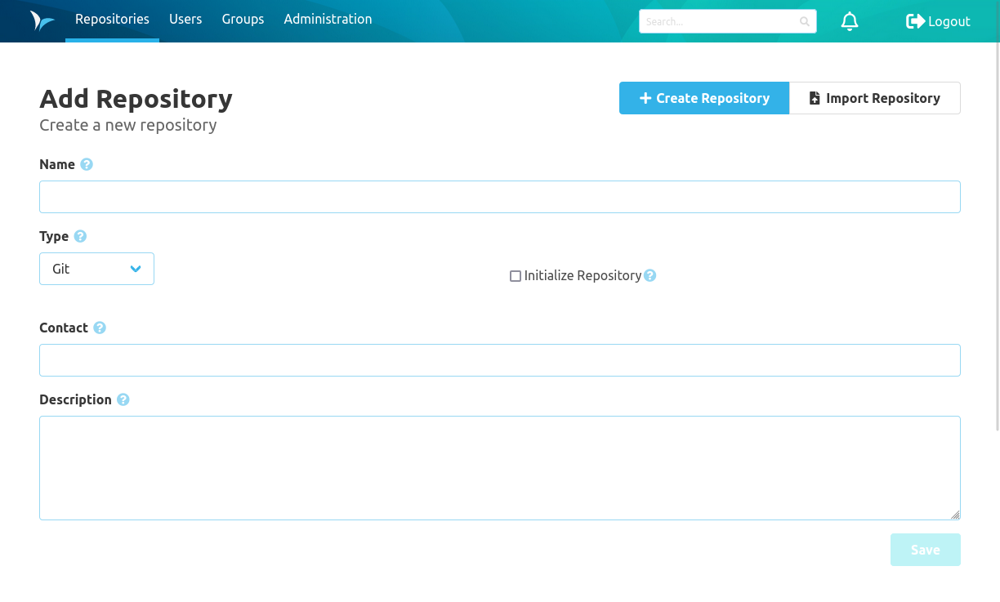

The Repository area includes everything based on repositories in namespaces. This includes all operations on branches, the code and settings.

* [Branches](branches/)
* [Code](code/)
* [Settings](settings/)

### Overview
The repository overview screen shows all repositories sorted by namespaces. Each repository is shown as a tile. After clicking on the tile the readme screen of the repository is shown.

The search bar at the top can be used to filter the repositories. The search uses the name and description of the repositories.

The different tabs like branches, changesets or sources of the repository can be accessed through the blue icons.

Icon             |  Description
---|---
  |  Opens the branches overview for the repository
 | Opens the changeset overview for the repository
 | Opens the sources overview for the repository
 | Opens the settings for the repository

### Create a Repository
In  SCM-Manager new Git, Mercurial & Subversion (SVN) repositories can be created via a form that can be accessed via the "Create Repository" button. A valid name and the repository type are mandatory.

Optionally, repositories can be initialized during the creation. That creates a standard branch (master or default) for Git and Mercurial repositories. Additionally, it performs a commit that creates a README.md.

If the namespace strategy is set to custom, the namespace field is also mandatory.

### Repository Information
The information screen of repositories shows meta data about the repository. Amongst that are descriptions for the different options on how the repository can be used. 

