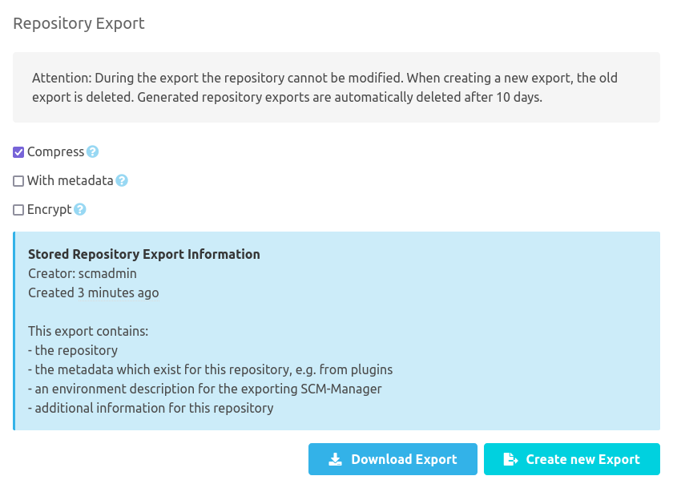
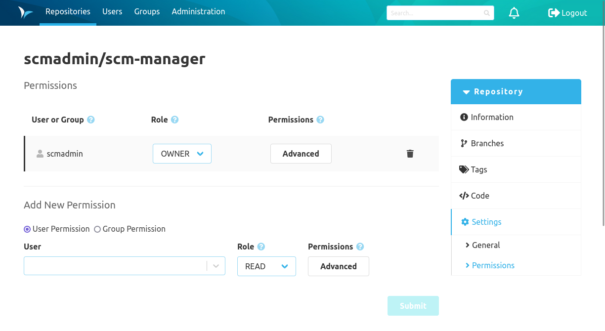

By default, there are two items in the repository settings. Depending on additional plugins that are installed, there
can be considerably more items.

### General

The "General" item allows you to edit the additional information of the repository. Git repositories for example also
have the option to change the default branch here. The default branch is the one that is used when working with the
repository if no specific branch is selected.

In the danger zone at the bottom you may rename the repository, delete it or mark it as archived. If the namespace
strategy in the global SCM-Manager config is set to `custom` you may even rename the repository namespace. If a
repository is marked as archived, it can no longer be modified.

In the "Export repository" section the repository can be exported in different formats.
During the export the repository cannot be modified!
When creating the export, the export file is saved on the server and can thus be downloaded repeatedly.
If an export already exists on the server, it will be deleted beforehand when a new export is created, as there can only ever be one export per repository.
Exports are automatically deleted from the SCM-Server 10 days after they are created.
If an export exists, the blue info box shows by whom, when and how this export was created.

The output format of the repository can be changed via the offered options:
* `Standard`: If no options are selected, the repository will be exported in the standard format.
  Git and Mercurial are exported as `Tar archive` and Subversion uses the `Dump` format.
* `Compress`: The output format is additionally compressed with `GZip` to reduce the file size.
* `With metadata`: Instead of the standard format, a repository archive is exported, which contains additional metadata
  besides the repository. When you use this, please make sure all installed plugins are up to date. An import of
  such an export is possible only in an SCM-Manager with the same or a newer version. The same is valid for all
  installed plugins.
* `Encrypt`: The export file will be encrypted using the provided password. The same password must be used to decrypt this export file.

### Permissions

Thanks to the finely granular permission concept of SCM-Manager, users and groups can be authorized based on definable
roles or individual settings. Permissions can be granted globally, namespace-wide, or repository-specific. Global
permissions are managed in the administration area of SCM-Manager. The following image shows repository-specific
permissions.

Permissions can be granted to groups or users. It is possible to manage each permission individually or to create roles
that contain several permissions. Roles can be defined in the administration area.

Namespace-wide permissions can be configured in the namespace settings. These can be accessed via the settings icon on
the right-hand side of the namespace heading in the repository overview.

To manage permissions individually, an "Advanced" dialog can be opened to manage every single permission.

