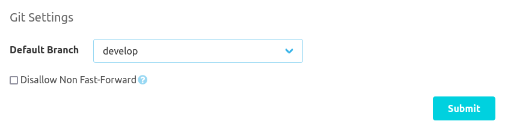
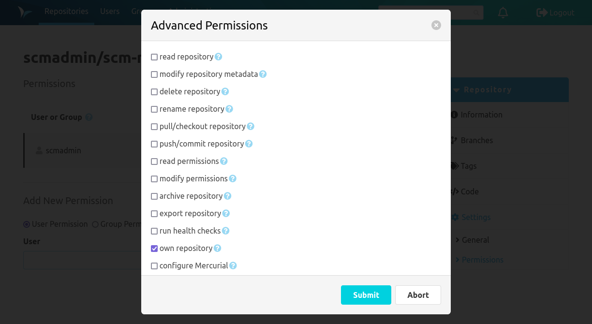

By default, there are two items in the repository settings. Depending on additional plugins that are installed, there
can be considerably more items.

### General

The "General" item allows you to edit the additional information of the repository. Git repositories for example also
have the option to change the default branch here. The default branch is the one that is used when working with the
repository if no specific branch is selected.

In the danger zone at the bottom you may rename the repository, delete it or mark it as archived. If the namespace
strategy in the global SCM-Manager config is set to `custom` you may even rename the repository namespace. If a
repository is marked as archived, it can no longer be modified.

### Permissions

Thanks to the finely granular permission concept of SCM-Manager, users and groups can be authorized based on definable
roles or individual settings. Permissions can be granted globally, namespace-wide, or repository-specific. Global
permissions are managed in the administration area of SCM-Manager. The following image shows repository-specific
permissions.

Permissions can be granted to groups or users. It is possible to manage each permission individually or to create roles
that contain several permissions. Roles can be defined in the administration area.

Namespace-wide permissions can be configured in the namespace settings. These can be accessed via the settings icon on
the right-hand side of the namespace heading in the repository overview.

To manage permissions individually, an "Advanced" dialog can be opened to manage every single permission.

