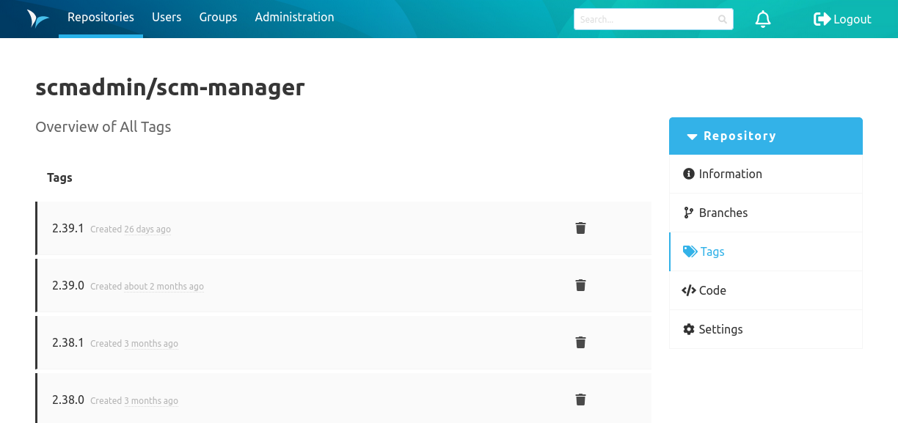

### Overview
The tag overview shows the tags that exist for this repository. By clicking on a tag, the details page of the tag is shown.

### Deleting Tags
Tags can be deleted directly on the tags overview page.

### Tag Details Page
This page shows a command to work with the tag on the command line.

#### Tag Signatures
The signature status of a tag is displayed as a key after its name on its details page.

There can be more than one signature on a tag.

Depending on the status of the individual signatures, the key will have a distinct color indicator:
- if at least one signature on the tag is invalid, the key will be `red` OTHERWISE
- if at least one signature is valid, the key will be `green` OTHERWISE
- the key will be `gray`

If you hover the key icon, a list of all signatures on the tag will pop up.

