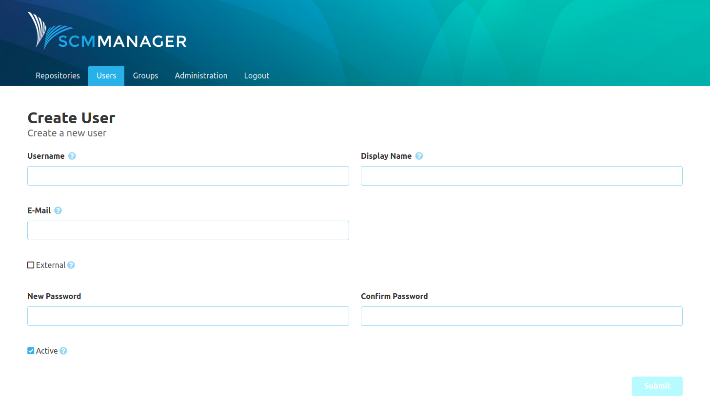

The user area includes everything that can be broken down to a single user and their permissions.

* [Settings](settings/)

### Overview
The user overview shows a list of all existing users. A page with details about a user can be accessed by clicking on the user. New users can be created with the "Create User" button.

### Create User
The "Create User" form can be used to create new users in SCM-Manager. New users don’t have any permissions and should therefore be configured right after they were created.

### User Details Page
The user details page shows the information about the user.

The active box shows whether the user is able to use SCM-Manager. The external box shows if it is an internal user or whether it is managed by an external system.

### Permission Overview
At the bottom of the detail page, a permission overview can be opened.

This overview lists all groups, the user has been assigned to in SCM-Manager. If the user has
been logged in at least once, also groups assigned by external authorization systems (like LDAP or CAS)
will be listed. Groups with configured permissions are marked with a checkmark.
External groups that have not been created in SCM-Manager can be seen in an extra table.

Below, all namespaces and repositories are listed, for whom permissions for the user or any of its groups
have been configured.

The single permission configurations can be accessed directly using the edit icons. Currently unknown
groups can be created directly.

